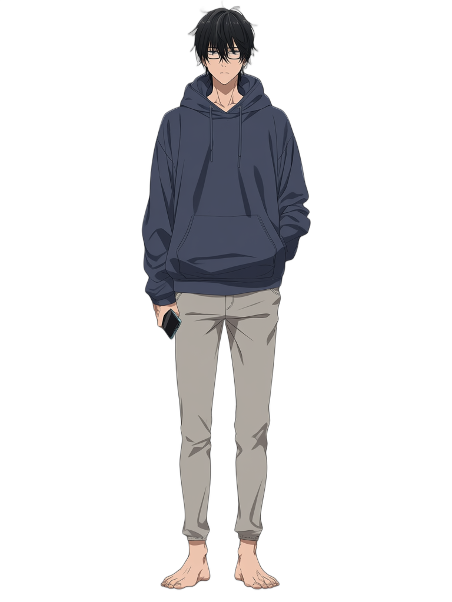
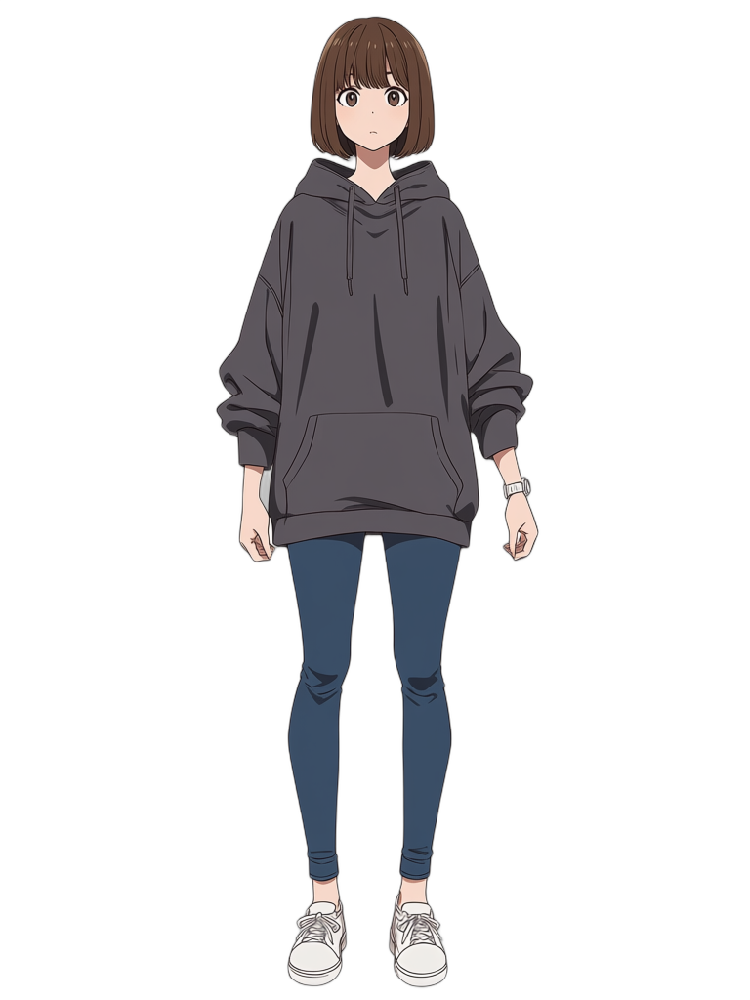
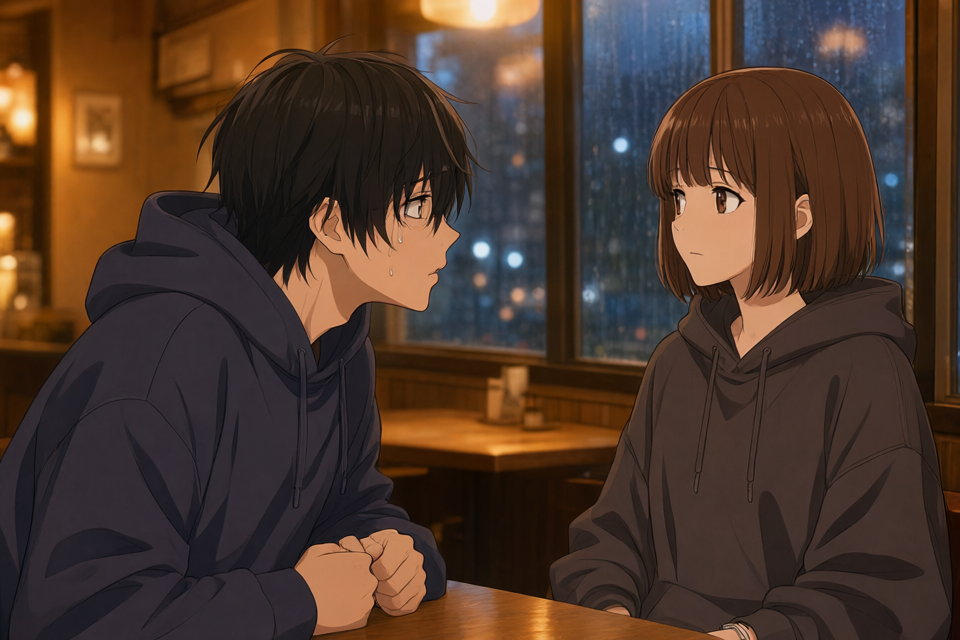
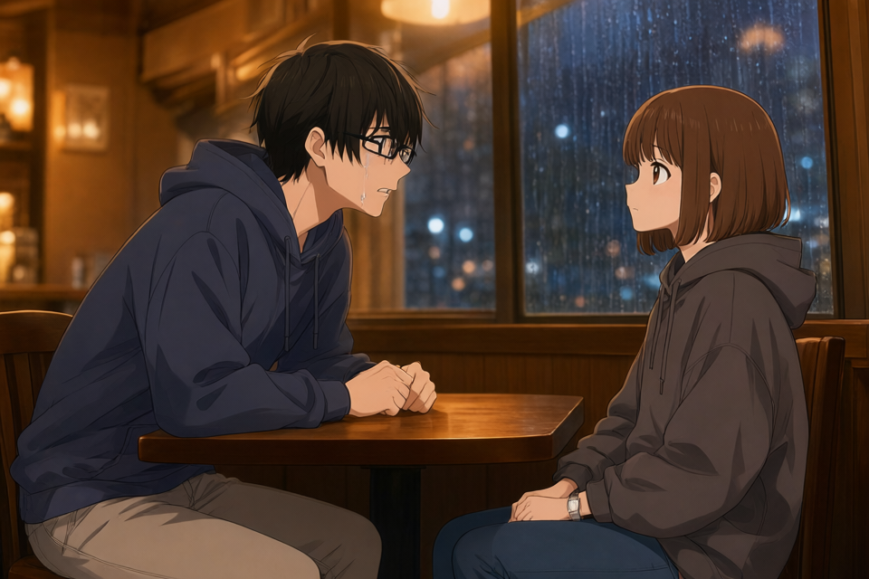
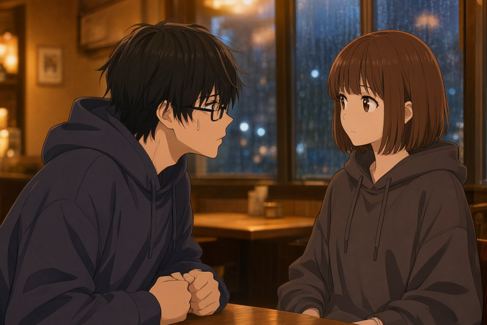
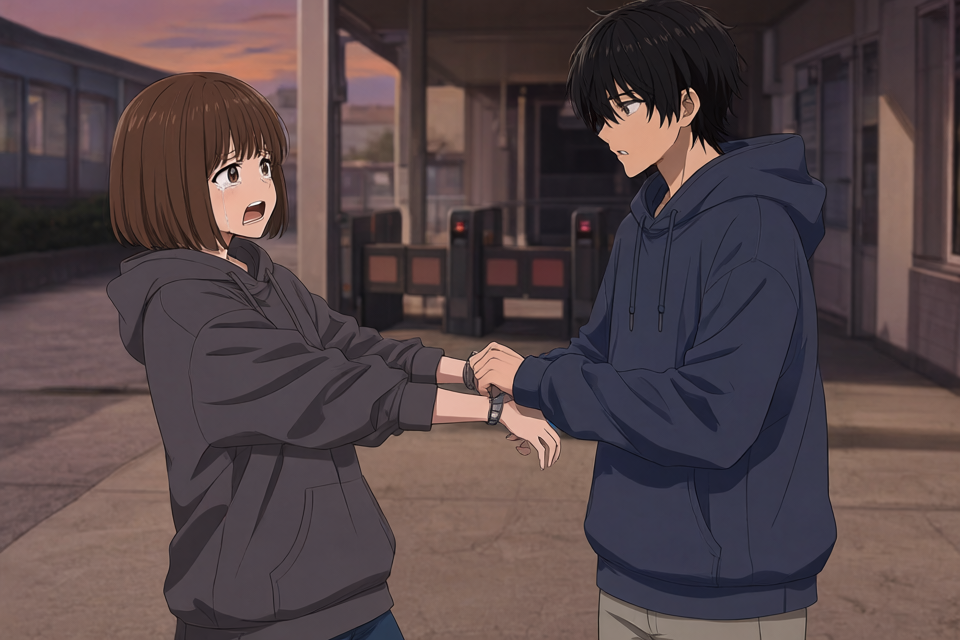
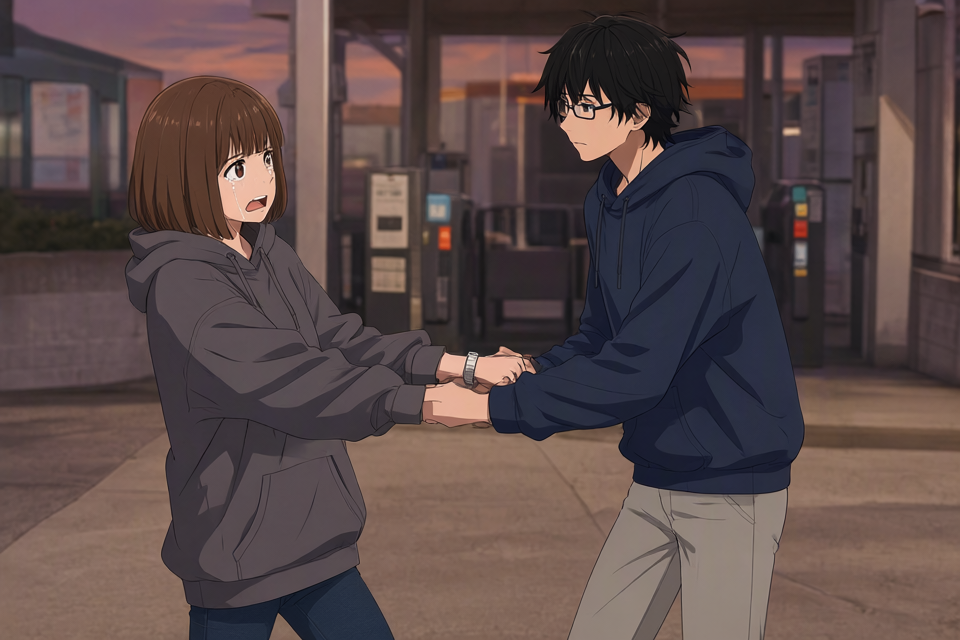
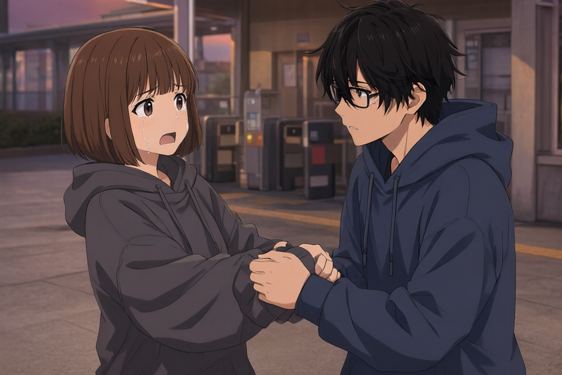

# Qwen-Image-2.1 イベントCGの外見特徴追記実験

記録日: 2026-10-04（日本時間）

『明日の自分から、留守電が届く街』第1章・第2章の基本CGを対象に、立ち絵の参照に加えてキャラクターの外見を文章で指定する効果を調べた。後日、別の構図・キャラクター・seedでも検証を続けるため、元画像、2種類の追記による生成結果、使用した指示と条件を保存する。

**外見を追記して再生成した4枚では、透のメガネが明瞭に描かれた。一方、画角・人物の姿勢・手の動作にも変化が出た。顔周辺だけの追記は第1章では元の構図をよく維持したが、第2章では寄りの構図に変わり、演技にも影響した。** 汎用的な指示や自動的な外見追記の仕様を確定できる段階ではない。

## 目的と今回の範囲

元のCGでは、透の立ち絵にあるメガネが第2章で欠落し、第1章でも枠を明瞭に判読しにくかった。元の画像指示には、顔・髪・服などを参照画像どおりに保つ一般的な指定はあるが、メガネなどの具体的な外見特徴は書かれていなかった。

今回の問いは、具体的な特徴を追加すると再現が改善するか、全身の特徴まで書くと構図に影響するか、追記を顔周辺に絞れば影響を抑えられるか、の3点である。

対象は各章の基本CG1枚ずつ。どちらの実験も、**完成済みCGを編集入力にせず、採用済みの立ち絵2枚だけから生成し直した**。全身特徴版と顔周辺版の間でも画像を引き継いでいない。差分画像は生成せず、作品DB・公開CG・アプリの生成処理は変更していない。

発端となった「CGの表示が短い」「差分が1〜2クリックで切り替わる」という演出上の問題は別課題であり、この実験では調査・修正していない。

## 比較条件と生成設定

| 条件 | 画像指示 | 比較画像の扱い |
| --- | --- | --- |
| 元画像 | 当初の場面指示と一般的な外見保持の指示 | 保存済みの基本CG。今回は再生成していない |
| 全身特徴版 | 元の指示に、髪・メガネ・衣装・ズボン・体格・時計などを追記 | 立ち絵から各章1枚を新規生成 |
| 顔周辺版 | 元の指示に、髪・メガネ・目の特徴と、見える角度で保持する指示を追記 | 立ち絵から各章1枚を新規生成 |

| 項目 | 固定した設定 |
| --- | --- |
| モデル | Qwen/Qwen-Image-2.1 |
| モデルrevision | `d26bb61231c349cf6b7896fa83353113880e1ba3` |
| 実行経路 | 既存のローカルDiffusersイベントCG backend |
| 精度・量子化 | BF16、量子化なし |
| オフロード・KVキャッシュ | CPUオフロード有効、KVキャッシュ有効 |
| 解像度・ステップ | 960×640、40ステップ |
| 第1章のseed | `1524320612` |
| 第2章のseed | `383775884` |
| 参照順序 | 画像1=水瀬 透、画像2=篠原 美緒 |
| 参照の種類 | 2枚とも `character`。基本CG・差分画像の参照なし |

各再生成では保存済み依頼を複製し、`prompt` と、それに対応して再計算する `input_sha256` だけを変更した。参照画像は元のSHA-256と一致することを実行前・結果の生成記録で確認し、4枚とも結果検証を通過した。元の場面指示をLLMに作り直させる処理は行っていない。追記文はこの実験用に手動で作成した。

再生成時のライブラリ記録は、Diffusers `0.41.0.dev0`、PyTorch `2.10.0+cu128`、Transformers `5.17.0`、Accelerate `1.15.0`。詳細は[全身特徴版の生成記録](assets/qwen-event-cg-appearance-20261004/full-appearance-results.json)と[顔周辺版の生成記録](assets/qwen-event-cg-appearance-20261004/face-only-results.json)に保存した。

| 条件 | 第1章の処理時間 | 第2章の処理時間 |
| --- | ---: | ---: |
| 全身特徴版 | 75.2秒 | 74.1秒 |
| 顔周辺版 | 76.5秒 | 74.5秒 |

時間はモデルファイル検証・ロードなどを含むジョブ全体の実測であり、画像推論だけの時間ではない。4枚とも `model_reused=false`。入力文の短縮による速度改善を評価した試験でもない。

## 参照した立ち絵

表内の画像と、その下のリンクから原寸ファイルを開ける。比較用の画像はすべて元ファイルをそのままコピーしており、拡大・切り抜き・再圧縮・補正はしていない。

| 画像1 水瀬 透 | 画像2 篠原 美緒 |
| --- | --- |
| [](assets/qwen-event-cg-appearance-20261004/reference-toru.png) | [](assets/qwen-event-cg-appearance-20261004/reference-mio.png) |
| [透の立ち絵を開く](assets/qwen-event-cg-appearance-20261004/reference-toru.png) | [美緒の立ち絵を開く](assets/qwen-event-cg-appearance-20261004/reference-mio.png) |

透は黒髪と細い黒い四角いメガネ、紺色のパーカー、薄い灰色のズボンが特徴。美緒は茶色のボブと前髪、大きな茶色の目、チャコール系パーカー、濃い青のジーンズ、左手首の明るい色の時計が特徴。身振りを変えてしまうのを避けるため、キャラ設定にあるスマートフォンを持つ習慣などは追記しなかった。

## 第1章の前後比較

夜の喫茶店でテーブルを挟んで向き合う場面。左の透は身を乗り出して机上で拳を握り、必死に訴える。右の美緒は落ち着いて座り、透を見ている、という指示。

| 元画像 | 全身特徴版 | 顔周辺版 |
| --- | --- | --- |
| [](assets/qwen-event-cg-appearance-20261004/chapter-1-original.png) | [](assets/qwen-event-cg-appearance-20261004/chapter-1-full-appearance.png) | [](assets/qwen-event-cg-appearance-20261004/chapter-1-face-only.png) |
| [元画像を開く](assets/qwen-event-cg-appearance-20261004/chapter-1-original.png) | [全身特徴版を開く](assets/qwen-event-cg-appearance-20261004/chapter-1-full-appearance.png) | [顔周辺版を開く](assets/qwen-event-cg-appearance-20261004/chapter-1-face-only.png) |

| 観点 | 元画像 | 全身特徴版 | 顔周辺版 |
| --- | --- | --- | --- |
| メガネ | 目の周囲に線があるが、枠は明瞭に判読しにくい | 四角い枠とつるが明瞭 | 四角い枠とつるが明瞭 |
| 画角 | 顔・上半身が大きく、机の手前側だけが見える | 人物が小さくなり、座った腿や椅子まで見える | 元に近い人物サイズと机の範囲を維持 |
| 動作 | 透が身を乗り出し、拳を机上に置く | 基本動作を維持 | 拳の位置や向きも元に近い |
| 表情 | 透に汗のような滴。美緒は落ち着いている | 透に明確な涙の線が追加 | 元の汗の表現に近い。美緒の目・輪郭などには小さな変化 |
| 時計 | 画面下端に一部だけ見える | 画角が広がり明瞭 | 元と同様に画面下端の一部だけ見える |

この場面では、顔周辺版が「メガネを補い、元の構図と演技を保つ」という狙いに最も近かった。全身特徴版で画角が広がった原因を、ズボンの記述だけに限定することはできない。

## 第2章の前後比較

夕暮れの駅入口で引き止める場面。右の透が美緒の手首を強く掴み、必死に訴える。左の美緒は泣いて叫びながら、腕を激しく引き離して体を遠ざけようとする、という指示。

| 元画像 | 全身特徴版 | 顔周辺版 |
| --- | --- | --- |
| [](assets/qwen-event-cg-appearance-20261004/chapter-2-original.png) | [](assets/qwen-event-cg-appearance-20261004/chapter-2-full-appearance.png) | [](assets/qwen-event-cg-appearance-20261004/chapter-2-face-only.png) |
| [元画像を開く](assets/qwen-event-cg-appearance-20261004/chapter-2-original.png) | [全身特徴版を開く](assets/qwen-event-cg-appearance-20261004/chapter-2-full-appearance.png) | [顔周辺版を開く](assets/qwen-event-cg-appearance-20261004/chapter-2-face-only.png) |

| 観点 | 元画像 | 全身特徴版 | 顔周辺版 |
| --- | --- | --- | --- |
| メガネ | 明確なメガネが見当たらない | 四角い枠とつるが明瞭 | 四角い枠とつるが明瞭 |
| 画角 | 腰付近まで。透の髪が画面上端にかかる | より引き、腿と頭上の余白が増える | より寄り、顔が大きくなる |
| 姿勢と手 | 美緒の腕が伸び、透が手首付近を掴んでいる | 両手を持ち合うような形に変化 | 透が前屈みで近づき、美緒の腕は胸近くで曲がる。手を包む・押さえるように見える |
| 感情と抵抗 | 美緒の泣き顔と開いた口、離れようとする姿勢がある | 美緒の涙はあるが、透の表情が落ち着き緊迫感が弱まる | 美緒の涙は維持。叫びより驚きに寄った顔で、腕を振りほどく印象が弱まる |
| 時計 | 手の重なり付近にあるが形状が不明瞭 | 見えるが、交差した腕の左右まで確証はない | 袖と手に隠れ、確認できない |

この場面では、顔周辺に絞っても画角と演技が変わった。メガネの再現だけを評価すると改善に見えるが、場面の意味を作る動作まで含めると、元の指示への適合には課題が残る。時計が見えない場合は、遮蔽なのか特徴の欠落なのかを区別できないため、不正解とは断定しない。

## 使用した指示

各条件の完全なプロンプトを、文書と同じ保存領域に残した。全身特徴版と顔周辺版の追記は両章で共通。顔周辺版は全身特徴版への追加ではなく、**元の指示に別の追記文を付けたもの**である。

| 章 | 元の指示 | 全身特徴版の完全な指示 | 顔周辺版の完全な指示 |
| --- | --- | --- | --- |
| 第1章 | [元の指示](assets/qwen-event-cg-appearance-20261004/prompts/chapter-1-original.txt) | [全身特徴版](assets/qwen-event-cg-appearance-20261004/prompts/chapter-1-full-appearance.txt) | [顔周辺版](assets/qwen-event-cg-appearance-20261004/prompts/chapter-1-face-only.txt) |
| 第2章 | [元の指示](assets/qwen-event-cg-appearance-20261004/prompts/chapter-2-original.txt) | [全身特徴版](assets/qwen-event-cg-appearance-20261004/prompts/chapter-2-full-appearance.txt) | [顔周辺版](assets/qwen-event-cg-appearance-20261004/prompts/chapter-2-face-only.txt) |

### 全身特徴版の追記

[追記文ファイル](assets/qwen-event-cg-appearance-20261004/prompts/full-appearance-addition.txt)

```text
Character appearance details, tied to the reference image numbers:
Reference image 1 is Toru Minase: a slim young adult man with slightly slouched shoulders, tousled short black hair and longer uneven bangs. He wears thin black rectangular eyeglasses, a dark navy-blue pullover hoodie with drawstrings and a kangaroo pocket, and light gray chinos. His eyeglasses are an essential identity feature: keep them on his face, with visible rectangular lens rims and temple arms in this side view. Do not omit his glasses or transfer them to the other character.
Reference image 2 is Mio Shinohara: a shorter young adult woman with a straight chin-length chestnut-brown bob, blunt bangs and large brown eyes. She wears an oversized charcoal-gray pullover hoodie and dark blue fitted jeans. She wears a simple light silver wristwatch on her left wrist; retain it whenever that wrist is visible. She does not wear eyeglasses.
Preserve these character-specific appearance details while keeping the scene, positions, actions, expressions, gaze and framing described above.
```

### 顔周辺版の追記

[追記文ファイル](assets/qwen-event-cg-appearance-20261004/prompts/face-only-addition.txt)

```text
Character identity details, tied to the reference image numbers:
Reference image 1 is Toru Minase: tousled short black hair with longer uneven bangs, and thin black rectangular eyeglasses. His eyeglasses are an essential identity feature.
Reference image 2 is Mio Shinohara: a straight chin-length chestnut-brown bob with blunt bangs and large brown eyes. She does not wear eyeglasses.
Preserve these character-specific details where naturally visible from the specified camera angle. Keep the scene, framing, body and head orientation, actions, expressions and gaze described above unchanged.
```

「指定された角度から自然に見える特徴を保つ」という文は、特徴を見せるために顔や体を回転させることを避けたい意図で加えた。ただし、今回は後ろ姿での有効性は検証していない。

## 分かったことと比較の限界

- 今回の全身特徴版2枚・顔周辺版2枚では、いずれも透のメガネが明瞭になった。外見を具体的に文章化する方法を引き続き検証する価値はある。
- 髪色・髪型・衣装の色分けは概ね保たれたが、外見追記の影響は対象の特徴だけに閉じなかった。構図・姿勢・手・表情も別々に評価する必要がある。
- 顔周辺だけへの限定によって構図が必ず安定するとは言えない。第1章は元に近く、第2章は寄りに変化した。
- 同じ2人・2場面で、各章1つのseedしか試していない。成功率、別キャラクターへの一般性、後ろ姿・顔の遮蔽・3人以上への適用は未評価。
- 元画像は保存済みの画像であり、今回の実行環境で無追記の指示を再実行していない。同じseedで元画像が再現されるかを確認してから、追記による差をさらに検討する必要がある。
- 全身特徴版と顔周辺版では、特徴の量だけでなく、文の長さ、メガネを強調する強さ、構図を保つ文言も同時に変えた。ズボン指定・顔への言及・保持文など、個々の要因の効果は分離できていない。
- 目視評価であり、画像の自動採点や盲検比較は行っていない。今回の結果を理由に、外見追記を本番の固定テンプレートへ自動導入する判断は保留する。

全身の特徴を列挙すると引きの構図を、顔の特徴を強調すると寄りの構図を促す可能性は、今後調べる仮説である。今回の結果だけで因果関係を確定しない。

## 次回の検証手順

最初から全パターンを生成するのではなく、次の順で検証を進める。以下は計画であり、まだ実行していない。

| 優先順 | 試験 | 確認したいこと |
| --- | --- | --- |
| 1 | 元の2場面を、元の指示・立ち絵・seedで再生成 | 今回の環境での無追記の再現性。比較の基準を揃える |
| 2 | 同じ保持文の下で、無追記、メガネだけ、顔周辺、顔周辺＋上着、さらにズボンを加える条件を比較 | 追加する特徴を段階的に変え、画角や演技への影響を切り分ける |
| 3 | 有望な条件を、同じ複数のseedで対にして比較 | 1つのseedだけで都合のよい結果になっていないか |
| 4 | 正面、横顔、後ろ姿、肩越し、顔が隠れる構図で比較 | 顔・眼鏡を描くために向きやカメラを変えてしまわないか |
| 5 | 寄り、上半身、全身、遠景で比較 | 画角と特徴の記述範囲の関係、小さい顔での再現性 |
| 6 | 接触のない会話と、掴む・振りほどくなどの接触動作を比較 | 外見の再現と、行動・関係性の読み取りやすさを両立できるか |
| 7 | 別キャラ、似た髪型の2人、3人以上、別衣装を比較 | 特徴の混同、衣装の割当、人物が増えたときの一貫性 |

優先順2の最初は、メガネ以外の文言を固定して比較する。構図保持の注意書き自体の有無・表現を変える試験は別に行う。同seedでもプロンプト変更で画像全体が変化しうるため、複数seedを使う段階でも条件間でseedの組を揃える。

後ろ姿では、顔やメガネの正面が見えないこと自体を失敗にしない。場面の指定どおりに背を向け、見える髪・服・メガネのつるなどが矛盾しないかを評価する。「顔を画面内に収める」など、元の場面指示にある別の条件との衝突も確認する。

将来の候補として、キャラの外見設定を全部画像指示へ転載する方法と、LLMがその構図で必要な特徴だけを選ぶ方法を比較する。後者でも、重要な特徴の選び漏れと、顔を見せる構図への誘導の両方を評価する。現時点では実装方式として決定していない。

### 評価時に残す項目

| 項目 | 記録する内容 |
| --- | --- |
| 外見の同一性 | メガネ、髪、目、衣装、特徴的な小物。別キャラへの混同も記録 |
| 可視性 | 見える、自然に隠れている、画角外、判定不能を分ける |
| 構図 | 人物の大きさ、頭上余白、脚の露出、左右位置、顔と体の向き |
| 演技 | 姿勢、掴む場所、手の接触、抵抗、視線、表情の種類と強さ |
| 場面への適合 | 台本が意図する瞬間・感情・人物間の関係を読み取れるか |
| 実行条件 | 完全な指示、参照順序とhash、seed、モデルとライブラリ版、設定、時間 |

## 保存先と再検証の入口

本文中の画像・プロンプト・生成記録はすべて `docs/experiments/assets/qwen-event-cg-appearance-20261004/` にコピーした。通常Git管理の対象になる場所なので、除外対象の `outputs/` を整理しても比較資料を残せる。実際のコミットは別操作となる。

[保存ファイル一覧とSHA-256](assets/qwen-event-cg-appearance-20261004/files.json)でコピー元と一致を確認できる。[元作品とCGの対応](assets/qwen-event-cg-appearance-20261004/source-manifest.json)に、参照元の作品・制作版・ジョブ・artifactの識別子を残した。

元の実行記録は以下にある。これらの `outputs/` 配下はGit管理対象外であり、整理すると再実行スクリプトや完全な依頼JSONは失われる。文書用に残した画像・完全な画像指示・参照・設定・生成記録は引き続き比較に使える。

- [全身特徴版の実行スクリプト](../../outputs/event-cg-appearance-replay-20261004-205136/run_replay.py)と[結果](../../outputs/event-cg-appearance-replay-20261004-205136/results.json)
- [顔周辺版の実行スクリプト](../../outputs/event-cg-face-replay-20261004-210348/run_replay.py)と[結果](../../outputs/event-cg-face-replay-20261004-210348/results.json)

既存の実行スクリプトをそのまま再実行すると同じ実験フォルダへ書き出すため、追加検証では新しい出力先を作り、比較用の元画像を保持する。作品への自動反映や公開CGの上書きは、この検証手順には含めない。

関連: [イベントCGの利用と検証](../setup/event-cg.md)、[Qwen画像編集テスト](../setup/qwen-image-edit.md)、[Animaによる立ち絵差分の調査](../research/anima-portrait-variants-20261004.md)。
