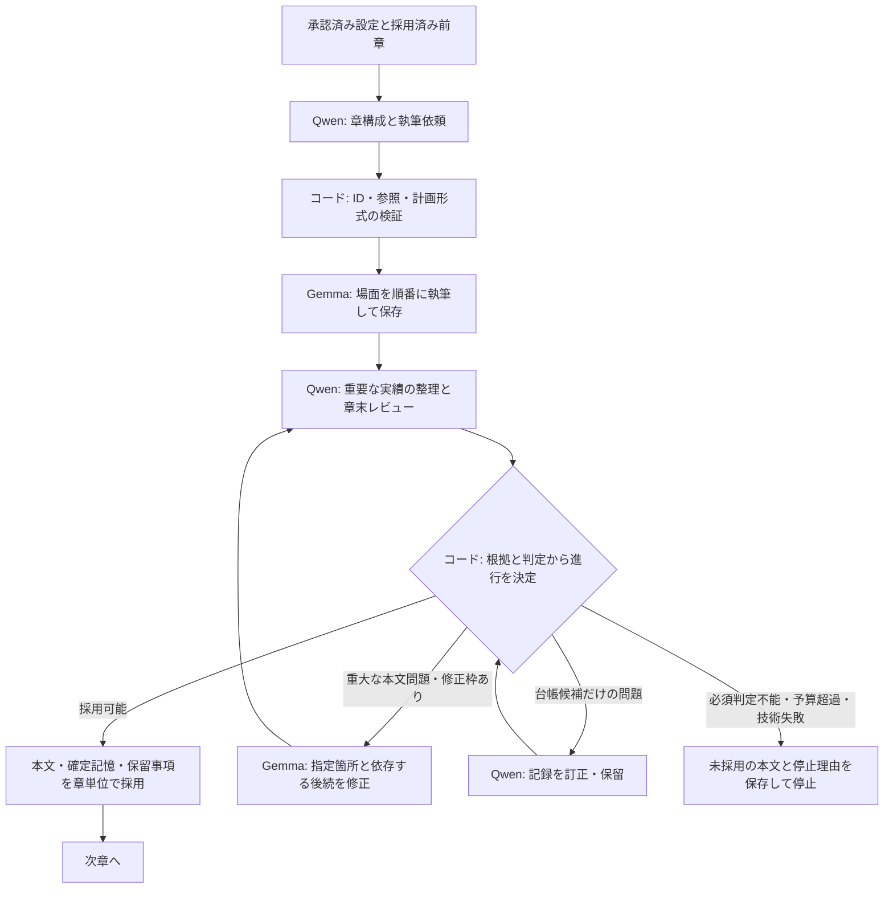

# Qwenによる構成・編集とGemmaによる執筆への変更計画

2026-09-25 改訂：次のPoCは[台本とティラノ出力を維持する章間改善計画](story-first-poc-plan.md)を優先する。人物ID付き台本、場面・人物・場所の定義、発話分離、演出、素材要求、Scriptとティラノ出力は維持する。途中の細かな意味検査・詳細台帳の合格を章継続条件から外し、実台本の引き継ぎと章の進展を改善する。小説へ変更した前案は撤回。ユーザーの追加指示により、構成・章計画もGemmaが担当し、今回はQwenを使用しない。今後使う場合も論理整合性を求める処理に限定する。以下は`chapter_editor_v1`の設計記録として残す。

作成日：2026-09-25  
状態：`chapter_editor_v1` の text-only 実験経路を実装。実モデルで通し生成を試みたが、構成案検査、修正後は第1章の場面計画で停止し、本文生成・通読評価には未到達。

本案は[ストーリー制作ワークフローの再設計](story-workflow-redesign.md)の追加計画である。実装する場合、工程配置、検査の停止条件、未確定情報、修復方針について本案を優先する。元計画の章数・承認条件・公開済み本文の不変性・原文追跡・人物と場所の継続管理は維持する。[研究調査](research/story-consistency-and-overthinking-20260925.md)とr9までの実測を判断材料とした。

## 1. 採る方針

Qwenが全体構成、章ごとの執筆依頼、章末の編集を担当する。Gemmaが実際の本文を書く。コードが工程順、採用、修復範囲、予算、保存と再開を管理する。

まず画像・音声なしの既存デバッグ経路で試す。Tool Callingによる自由な工程選択は初回の実装対象にしない。後から必要性が確認された場合に、過去本文の取得や特定場面の修正など、限定した操作を追加できる境界にする。

実験方針は`workflow_policy=chapter_editor_v1`のような明示値で選択し、初期段階ではtext-only経路だけで有効にする。共有関数やデフォルトroutingの変更によって、通常制作が意図せず新方式へ移行しないようにする。この選択をjob、protocol、実験manifest、cache fingerprint、再開時照合へ含める。

改善したい結果は、章の導入・発見・決断が巻き戻らず、前章の結果によって次の行動や人物理解が変わること。本文にある全ての細部を精密な状態表へ変換することは、採用条件にしない。

| 担当 | 責任 | 最初の実験での設定 |
| --- | --- | --- |
| Qwen・構成 | 承認済み設定の整理、全体構成、前章実績を踏まえた章計画、新しい人物・場所の必要性 | 32k。lowを初期候補とし、思考量と回答取得率を測る |
| Gemma・執筆 | 章計画と直前までの本文から場面を逐次執筆、指定範囲の修正 | 従来どおり16k、reasoningなし |
| Qwen・編集 | 重要な実績の整理、章の進展・接続・重大矛盾の確認、必要な修正指示 | 32k。none/lowを固定資料で比較し、実験ごとに固定 |
| コード | 参照と形式の検証、有限の工程遷移、本文保存、台帳の確定、使用量と再開 | 再試行で予算をリセットしない |

Qwenが創作計画でもGemmaを上回ることは未検証であり、モデルの役割変更そのものを実験対象とする。全体構成を作り直すのは初回か、未公開の将来部分に修正が必要な場合だけとする。

## 2. 生成工程

図の再試行はコード側の回数上限を持つ。モデルが合格するまで循環する処理にはしない。

### 2.1 Qwenが章の執筆依頼を作る

既存の`StoryBlueprint`、`ChapterIntent`、`SceneIntent`を利用する。章計画には次を含める。

- 前章のどの出来事・決断・未解決事項を受けるか。
- 今章で新しく何が変わり、その結果が次章にどう影響するか。
- 既に描いた導入・説明・発見のうち、初めて起きたこととして繰り返してはいけないもの。
- 各場面の目的、障害、行動、期待する変化、開始に必要な条件。
- 必要な人物・場所と、その固定設定・今回の変化。新規追加数のノルマは設けない。

開始条件は「確定済みの過去」と「今章内の先行場面で成立させる予定」を分ける。後者を実績IDとして偽装しない。人物の知識、読者への開示、作者だけの情報の区別を維持する。

計画全体を巨大な1回のJSON生成へまとめる必要はない。章の意図、新しい人物・場所、場面列に分けてもQwenを連続利用できる。計画の各出力直後に別のLLM合否検査を必須化せず、ID・設定の不変条件・実績参照はコードで確認する。

### 2.2 Gemmaが章内の場面を連続して書く

本文は場面単位で逐次生成する。3章を並列・独立に書かせない。入力には、承認済み条件、前章までの確定記憶、今章の目的、直前の実本文、今の場面に必要な過去原文を含める。不変の承認条件は守る一方、変化し得る状態は確認時点のある過去事実として渡す。章内の実本文に新しい変化が描かれた場合はその時系列を優先し、古い確定値で本文を上書きしない。計画や引き継ぎメモも実本文より優先しない。

前の場面に描かれなかった予定を、次の場面で実施済みと扱わない。直前本文に合わせる小さな場面調整はGemmaの執筆指示に含め、毎場面でQwenへ戻らない。全体の到達点・人物・場所を変える大きな調整が必要なら、保存済み本文と未成立の条件を返し、コードが有限の再計画枠を使う。

本文が出た時点で独立した成果物として保存する。発話の分離など本文を変える処理があれば、原稿と処理後本文を別版で保存し、検査・出典は後者の正確な版へ結び付ける。編集失敗で本文保存まで未完了扱いにならないようにする。

章内の引き継ぎメモを作る場合も、検索用の暫定情報として扱う。Gemmaの自己抽出を確定記憶へ反映せず、原文を優先する。本文が予算内ならメモ生成は省略できる。場面ごとのQwen品質検査・状態差分照合・既知情報照合は、通常経路から章末工程へ移す。

### 2.3 Qwenが章を読み、重要な実績と問題を整理する

同じQwen稼働区間で、原文から重要な実績を整理し、章の進展と重大矛盾を確認する。実績整理とレビューは出力仕様を小さく分けてよい。同じモデルの複数呼び出しを、独立した検証者の一致とは扱わない。

レビューの中心は次の問いに限定する。

1. 前章の結果を引き受けた開始になっているか。既知情報を初耳に戻したり、解決済みの導入を再演したりしていないか。
2. 今章で意味のある変化が本文に描かれ、それが行動・選択肢・関係・認識のいずれかに影響しているか。
3. その変化から次章へ進めるか。最終章では、作品の中心的な問いと約束された結末に対応しているか。

心情や関係の静かな変化も進展として認める。場面ごとの変化数や、予定した細部の全達成を要求しない。計画と異なる自然な進展なら、未公開の後続計画を更新する。回想・嘘・新情報による再解釈を、単なる反復・矛盾と混同しない。

Qwenが返す指摘には、対象の本文版、過去と現在の根拠、問題の種類、物語への影響、最小の修正対象を含める。問題がないときは空の指摘を認める。問題点や説明文の件数を埋めさせない。

## 3. 検査結果と停止判断を分ける

| 状況 | 記録する意味 | 工程の扱い |
| --- | --- | --- |
| 重要な確定事実・決断の無説明な巻き戻り、既知情報の再発見 | 根拠のある重大矛盾 | 本文の対象箇所を修正。原因が計画なら未公開部分を再計画 |
| 章が同じ導入を再演し、意味のある変化がない | 進展不足 | 章計画・本文の修正対象。単なる言い換えで解決しない |
| 本文に問題はないが抽出候補が強く言い過ぎている | 記録の裏付け不足 | 確認できる粒度へ記録を訂正するか保留。本文再生成の理由にしない |
| 感情の分類、重要でない枚数や完了範囲が曖昧 | 意味上の未確定 | 原文と保留事項を保存して進行可能。確定事項として後続へ渡さない |
| 次の行動に不可欠な前提が未確定 | 重要な依存条件が未解決 | 関連原文を追加取得して再判定。必要なら未公開本文に明確な行動・橋渡しを追加。解決できなければ未採用で停止 |
| 思考打ち切り・空回答・JSON/参照の不備・通信失敗 | 検査処理が未完了 | 原因に応じた有限の復旧。意味上の未確定や合格へ変換しない |

重大性は単なるLLMの自信の数値で決めない。問題の分類、具体的な影響、原文の根拠を要求する。反証の存在と、裏付けを見つけられないことを分ける。省略や不在を指摘する場合は、無い引用を生成せず、調べた範囲と不足している必須条件を記録する。

引用ID、原文一致、版/hash、因果ID、人物・場所ID、JSON構造はコードで厳密に検証する。この技術的な正確さと、本文の全ての細部が確定することは別の条件とする。

## 4. 台帳の確定と未確定情報

状態を次の三つに分ける。

1. **採用済み記憶**：前章までの本文に基づく確定イベント・知識・状態。既存の`ChapterMemory`を利用する。
2. **章内の下書き情報**：実本文と、必要な場合だけ作る引き継ぎメモ。章末採用前は正式な記憶へ適用しない。
3. **継続する保留事項**：章末に重要な未確定が残った場合、その内容・原文参照・理由・影響する状態や後続条件を保持する。

継続する保留事項は、採用した章の成果物と記憶hashに含める。単なるログへ追い出して次章から消失させない。`ChapterMemory`へ小さな保留情報の契約を追加し、文脈構築で必ず関連する保留事項を取得する。`KnowledgeUpdate.kind="uncertain"`は人物自身の不確かな認識なので、システム側の判断不能には流用しない。

例として、「写真の仮止めに着手」は原文から確認できる一方、「3枚全てが完了」は不明なら、前者だけを確定し後者を保留する。更新を見送った結果、古い「未設置」がそのまま現在の確定状態に戻ることも避ける。影響する状態項目には、最終確認時点と現在値が未確定であることを付け、文脈や表示用の状態投影にも反映する。

保留事項は関連する人物・状態・後続条件を使うときだけ取得し、全件を毎章再検査しない。同じ対象の保留を重複作成せず、自動的に消去したり旧値へ戻したりしない。新しい原文で解消した場合は、解消した版と出典を記録する。次章採用後や途中再開後も、未解消なら現在値を未確定として扱い続ける。

章末に採用するのは、今章の進展、重要な人物の知識・決断、後続が依存する状態・約束を中心とする。全人物・全場面について感情や小物の状態差分を埋める義務は外す。採用した粗い記録から必要な原文へ戻れるよう、出典を保持する。

本文修正時は、その本文版を参照する記録・保留事項・レビュー・演出を無効化する。章全体の原文から記憶を再構成して、旧版の実績を混入させない。

## 5. 文脈、推論、失敗回復

### 文脈の拡張性

16kは全システムの固定上限にはしない。ただし今回の本文モデルはユーザー指定どおりGemma・16k・reasoningなし、Qwenは32kで開始する。モデルごとの実際の利用可能枠から出力と余裕を引き、原文と記憶を選ぶ既存の`ContextPolicy`を利用する。

章レビューが32kに収まらない場合は、Qwenをロードしたまま、場面のまとまりごとの原文確認と章全体の進展確認へ分ける。どの場面・章境界・重要条件を確認したかを集計し、未確認の範囲を確認済みにしない。全事実の総当たり照合や、要約だけで全文確認を済ませる方式には戻さない。

### 推論と出力仕様

- 実際のJSON schemaを生成制約とプロンプトの両方へ提示する。候補IDの定義を共通化し、長い候補表を二重に載せない。
- Qwenの計画と編集に別profileを持たせる。none/lowは実験設定として固定し、不合格のたびに推論量を自動増加させない。xhighは使用しない。
- lowを使う場合は、思考専用の上限と最終回答のための枠を分ける。固定runtimeで正しく回答へ移行できることを小規模検証する。総出力を途中で切るだけの実装にはしない。
- 初期比較の思考枠は1k・2k程度を候補とするが、最適値とはみなさない。構成JSONの回答枠はschemaと章規模から確保する。計画とレビューで同じ予算を強制しない。

### 有限の回復

初期PoCの仮の上限は、意味上の修正が章につき1巡、記録の訂正が章につき1回、技術失敗の復旧が失敗ノードにつき1回かつ章合計2回とする。本文の複数の必要箇所はまとめて直す。再計画も意味上の修正枠を消費する。総呼出数・トークン・経過時間には全てを算入する。上限値は実験manifestに保存し、比較実験の途中で都合よく変更しない。

形式不正なら形式を直す。思考打ち切りなら同じ依頼をそのまま反復せず、事前に定めた範囲分割などで再実行する。通信失敗なら保存済み結果と実行状態を確認する。本文が悪い証拠がない技術失敗では、Gemmaに本文を作り直させない。

必須レビューが成立しなければ章は未採用で停止する。それでも読める下書き、完了工程、停止理由、未解決の論点を残す。再開時も修復回数と使用量を引き継ぐ。

## 6. モデル切替とデバッグ出力

通常の本文実験は、章内で **Qwen（構成）→Gemma（本文）→Qwen（編集）** の2回の切替を目標にする。各区間内では複数回呼び出してよい。修正が必要ならGemma→Qwenの1往復を追加する。計画の初期整理もQwen側へまとめ、最初に不要なGemma起動を挟まない。

モデルの常時同居を前提にしない。現行の「旧モデルを解放してから次をロードする」仕組みを残す。Qwenの構成と編集は同じ物理モデルを共有し、タスク用profileの違いだけで不要な再ロードを起こさないようにする。

現在は章jobが終了するとモデルを解放するので、章末Qwenを次章計画まで保持する最適化は別段階とする。2回という目標は章内のモデル変更数であり、初回ロード・章を跨ぐ再ロード・終了時解放がゼロになる意味ではない。

テキスト実験では発話者と本文対応を保持し、画像・音声用の詳細な演出・感情注釈を毎場面LLM生成することは必須にしない。既存の表示契約に必要な値は「未指定」などを明示した変換で満たし、検査済みの感情を捏造しない。制作経路で演出生成を行う場合は本文採用後の別工程とし、その追加のGemma起動は別に測る。

人が読む出力には、採用済み本文と未採用の下書きを区別して掲載する。章ごとの新しい変化、警告・保留事項、編集回数、モデル別トークン、思考打ち切り、切替・ロード時間も別途確認できるようにする。

## 7. 既存実装の変更範囲

| 対象 | 変更の要点 |
| --- | --- |
| `generation/causal_narrative.py` | `_write_scene`の本文・演出・品質検査を分離。`_chapter`を構成、連続執筆、章末編集、採用へ再配置。全場面の逐次意味ゲートを外す |
| `generation/model_routing.py` | 章構成と場面継続を別purposeにする。`adapt-plan-*`を一括してQwenへ移して場面ごとの切替を再発させない。Qwen構成/編集は既存のQwen物理routeを共有 |
| `generation/narrative.py` | schemaの明示、形式不正と出力打ち切りの区別。旧経路への変更影響も検証 |
| `generation/causal_runtime.py` | ノードのpurposeを明示し、名前の部分一致に依存しない。有限の編集・復旧予算と本文の独立チェックポイント |
| `contracts/story_workflow.py`、`narrative/story_ledger.py`、`generation/causal_context.py` | 暫定情報と確定記憶の分離、継続する保留事項、最後に確認した状態と現在未確定の区別 |
| `narrative/causal_validation.py`等の採用検証 | 新しいレビュー範囲・必須工程を検証。省いた旧ゲートのpass結果を作って旧契約を通す実装にしない |
| 状態比較・既知情報比較・引用モジュール | 原文追跡、候補ID、版と引用の検証を再利用。詳細比較は重要条件の確認や診断へ限定し、全件を通常経路へ戻さない |
| `generation/text_debug.py`、protocol・設定・テスト | 下書きの早期保存、工程別停止理由、方針別実験、再開・旧cacheとの分離 |

coordinator、ジョブキュー、GPU占有の仕組みの全面改修は行わない。新しいprompt・schema・検査方針・routing・予算をprotocolと実験fingerprintへ含める。r9の保存物を新方式の成功cacheとして再開しない。

本文ノードは、前章hash、章計画版、直前本文hash、対象人物・場所、prompt/profileを入力に含める。レビューは本文版・出典表・方針版にも依存する。先行場面を直した場合、依存する後続場面は旧cacheのまま採用せず、初期実装ではその場面以降を保守的に再生成する。無関係な旧章は変更しない。

## 8. 効果を切り分ける比較実験

### A. 保存本文による編集検査

r8/r9の原文、明示的な矛盾を入れた対照、正常な継続、回想・再解釈、枚数や心情の許容できる曖昧さを含む固定セットを作る。原文と期待判定を人が確認し、期待判定をモデル入力に入れない。調整用と最後に確認する未使用例を分ける。

まず出力仕様の提示を両条件でそろえ、同じQwen・予算で旧検査と新しい重要条件中心の検査を比較する。その後、新方式を固定してnone/lowと推論予算を比較する。旧r9の失敗ログは参照資料であり、形式提示まで異なる旧実測を公平な速度比較と扱わない。

明白な重大矛盾の対照は止める、許容できる曖昧さは記録を保留して通す、出力切れは検査未完了として止める、という動作を確認する。少数例で性能を保証しないが、これらの基本例を外す設定で通し生成へ進まない。

技術試験では、未確定の現在値が次章と再開後にも旧値で上書きされないこと、新しい原文で解消した保留が正しい版へ結び付くことも確認する。モデルの判断をモックで再現しただけのテストは、意味検査の精度の証拠には数えない。

### B. Qwenに構成を任せる効果

同じ承認条件・採用済みの前章・文脈・Gemmaの設定を使い、章計画の担当だけをGemma/Qwenで比較する。編集側の方式と予算も固定する。比較には第2章以降の開始条件を含め、第1章だけで章間改善を判定しない。計画単体の見栄えに加え、Gemmaがその指示から書いた本文を読む。

Qwenが計画役として改善しなければ、その役割を固定しない。モデルのベンチマークやTool Calling能力だけを理由に採用しない。

### C. 3章通し

固定資料と章継続の小規模確認を経た設定で、3章を逐次生成する。まず1作品を全て読み、導入の反復、人物の知識、前章の結果の利用、章ごとの意味のある変化、結末への接続を確認する。1回完遂だけで成功とせず、その後に別題材・seedで確認する。

生成が停止したら、原因・保存された本文・使用量を報告して一度ターンを返す。失敗を受けてその場で設定を変更し、別の通し生成まで自動で始めない。

| 観点 | 記録するもの |
| --- | --- |
| 作品品質 | 重大な章間矛盾、導入の反復、章の進展・人物変化・結末の人手評価 |
| 検査品質 | 重大矛盾の見逃し、正常本文を止める率、適切な保留、未完了の検査を合格にしていないか |
| 効率 | モデル別の入力/総出力/思考量、最終判定取得率、呼出数、修正回数、時間、切替とロード |
| 継続性 | 章採用数、停止工程、再開時の旧版混入・予算リセットの有無 |

速度目標は「既存より何倍」と先に約束せず、章内の通常切替2回、意味修正の有限化、判定取得率、通し完遂と作品品質を確認する。Qwenを増やした分の構成時間も含めて比較する。

## 9. 実装する場合の順序

1. 本文保存と検査を分離し、形式提示・失敗分類・purpose指定・有限予算を整える。
2. Qwen構成、Gemma連続執筆、Qwen章末編集をデバッグ経路へ実装する。確定記憶・暫定情報・保留事項と採用検証を同時に整える。
3. 技術契約と工程順のテスト、固定本文での編集比較、章継続での構成比較を行う。小規模な実モデル確認までの結果を先に報告する。
4. 3章通しで品質と実行時間を確認し、結果に応じて役割と方針を変更する。
5. 効果が確認できた後、通常制作と素材・演出生成へ接続する。モデルの章間保持や限定Tool Callingの追加は、測定で必要性が確認されたものから行う。

この計画だけでは改善は実証されていない。既存の厳密な参照管理と再開基盤を利用しながら、検査の対象・実行時期・停止判断を変え、その効果を分けて測る。
