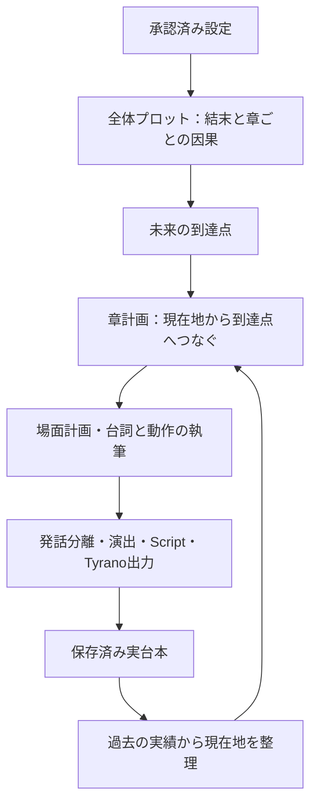

# 台本とティラノ出力を維持する章間改善計画

2026-09-26 最新計画：[コンテキスト配分と章間接続の改善計画](context-and-chapter-connection-plan.md)。r11の第1・2章生成と第3章の容量不足を受けた改訂で、次の実装はこの計画を優先する。以下はそれまでの経緯として残す。

最新方針（2026-09-26）：[章の継続を優先する計画](chapter-continuation-reset-plan.md)を最優先とする。直接的な場面計画と実台本の継承を土台に戻し、以下の番号付き行動の配置・照合を必須にする方針は置き換える。直接場面計画を実装済み（prompt 11 / implementation 12 / contract revision 10）。unit 1,278件成功。実LLM生成と作品品質の評価は未実施。

最新の改訂実装（2026-09-26）：[会話とキャストを中心にした改善計画](visual-novel-dialogue-cast-plan.md)をprompt 10 / implementation 11 / contract revision 9へ実装した。工程ごとの回答量を分け、会話材料を短い項目へ変更。本文の分量と台本形式を維持し、任意切断、再開時の意図しない本文開始、失敗原因を隠す再試行記録を修正。unit 1,279件成功。作品品質・通し生成は未評価。以下の旧記述よりこの改訂を優先する。

実装済みの経緯：revision 8のキャスト・会話改善と章配分修正（prompt 9 / implementation 10 / contract revision 8）により、「境界線のエクリプス」のプロットは保存できた。ただし長い会話欄が残り、第1章計画の容量不足と構造不備で停止し、章本文は未生成。[検証記録](experiments/script-continuation-r8-smoke-20260926.md)を参照。これは今回の改訂実装前の記録。旧出力は変更しない。

分量の基準は1話（1章）約10分であり、少なくともM3当時の鑑賞体験に相当する内容量を確保する。[M3の台本との比較](experiments/m3-r7-length-comparison-20260925.md)を受け、新計画の初版にあった「3章合計約7,000文字」は撤回した。各話の本文量・台詞量を計画段階から扱う。

以下はrevision 7（prompt 7 / implementation 8 / contract revision 6）の実装経緯。[revision 6のレビュー](experiments/script-continuation-r6-review-20260925.md)で見つかった「出来事の経路と人物行動の競合」「章計画で転機が消える」問題に対応した。[当時の確認記録](experiments/script-continuation-r7-smoke-20260925.md)を参照。

- 3章の出来事は開始条件と、人物の行動→具体的結果の順序付き列に統合する。次の行動は直前の結果を受けた選択として作る。経路と人物行動の独立した二重計画を廃止する。
- 章計画は各行動の場面番号を割り当て、元の行動と結果をrequired_eventsへ直接投影する。実台本で済んだことは理由付きで除き、調整が必要なことは理由と変更後の行動を保存する。本文執筆にはその反映後の行動列を渡す。
- 行動位置の欠落・重複・逆順と既存の話者・場所参照だけを技術チェックする。新たな意味検査・修復工程は追加しない。実施済み判断や調整の妥当性そのものは自動合否判定しない。
- 新しい発見を次の開始条件で先取りせず、具体的な調査や試行の結果として描く。核心で完了を掲げるものは最後の行為まで計画する。場面は新しい情報・結果・選択や場所・時間の変化で区切る。
- 比較は元の写真展設定・seed 1を継続する。実装確認では第1章で止まり、3章通し生成の前に報告する。

以下はrevision 6で導入した原則と経緯（経験・行動を別欄で持つ方式は上記へ置換）。

- 3章の全体計画では、核心に初期行動・守る価値観・最後の行動を置き、転機の経験は出来事内の本人の行動と対にして生成する。表示用の転機要約は出来事から機械的に作り、独立した予定として生成しない。後続章の核心入力からこの要約を除き、終わった章の予定を再投入しない。
- 章計画の現在地を、行動・選択の事実と、発言者に帰属する評価・推測に分ける。後者は `attributed_views` に保存し、執筆入力と圧縮時の履歴メモでも区別する。発言内容が真であるとは扱わない。
- 必要な行動は作品の核心から決める。協力・独立・別離・信念の維持を許容し、全作品に相談・和解・成長を求めない。非言語の連携も既知の情報や合図に基づいて描ける。
- 場面数の目安を先に与えず、独立した結果・判断や場所・時間の変化で区切る。一続きの試みと応答はまとめる。既存の8場面上限は容量制約として維持する。

意味検査・修復ループや新たなLLM呼び出しは追加しない。Gemma・reasoningなし、可変のコンテキスト予算、話者ID付き台本・演出・Tyrano契約は維持する。今回の出来事生成方式は引き続き3章PoCを対象とし、3章以外の旧計画経路は保持する。

以下はrevision 5までの経緯と基礎設計。

改訂日：2026-09-25  
状態：revision 5の「出来事の連鎖→3章への配分」を実装（prompt 5 / implementation 6 / contract revision 4）。関連139テストと実モデルの第1章出力まで確認した（[確認記録](experiments/script-continuation-r5-smoke-20260925.md)）。その後、同じプロットから3章を完遂し、[通読レビュー](experiments/script-continuation-r5-review-20260925.md)を実施した。合意を次章で実行する点と、蓮が判断を待つ行動は改善した。双方の認識が変わる経験と、具体的な相談の描写は課題として残る。直前のrevision 4では3章を完遂し、[通読レビュー](experiments/script-continuation-r4-review-20260925.md)を実施。章の状態と予定した出来事は引き継げたが、人物関係の着地と終章の必然性に課題が残る。第4・9節の方式を実験用 `script_continuation_v1` に実装済み（prompt 4 / implementation 5 / contract revision 3）。未来は詳細プロットから、過去は保存済み台本から構成し、章計画で接続する。既存の台本・演出・ティラノ出力を維持する。3章の台本・演出・ティラノ出力まで保存済み。大きな逸脱に対する全体プロットの自動改訂は今回の対象外。

現状：初版とrevision 2はGemma単独で3章の台本・Tyrano出力を完遂し、通読レビュー済み。revision 3は関連125テストと小規模確認を実施したが、人物関係の問題は残った（[確認記録](experiments/script-continuation-r3-smoke-20260925.md)）。その後の[プロット優先の計画試験](experiments/script-plot-priority-probe-20260925.md)では蓮が強引な作業を止める場面が入ったが、改善は部分的だった。revision 4は関連131テストと、第1章の技術出力・固定過去からの第3章計画まで確認した（[小規模確認記録](experiments/script-continuation-r4-smoke-20260925.md)）。その後、新しい詳細プロットから3章まで完遂した。今回の通読評価はこの新しい3章を対象とし、旧作品の本文を使った計画試験とは区別する。

今回の改訂の範囲（revision 5として実装）：

- 今回は3章構成を前提とする。プロット作成の最初から3章に収まる作品として規模を制約し、結末で人物が実際に取る行動と、そこへ至る選択・結果の連鎖を先に考える。その連鎖を3章へ配分する。長さを制限せずに話を作り、後から無理に3等分する方式にはしない。
- 章の役割を「対立→一部合意→最終合意」に固定しない。前章で得た答えを次章の行動へ使い、その実行や結果も進展として扱う。人物の変化を目標にした場合は、変化する本人の選択を具体的な出来事へ組み込む。
- 評価対象は、新方式で生成したプロットと、その同じプロットから生成した3章の台本とする。旧プロットを使う試験は新方式の章間品質の検証を代替しない。
- 可変章数、希望する長さからの章数算出、短編・長編ごとの展開量や密度の基準、長編での全体プロット改訂は後で決める。LLMによる自動章数決定は今回の実装・評価範囲に含めない。今回の3章という制約を、将来の作品全般の固定仕様にはしない。
- 章数を固定しても適切な展開量が自動で決まるわけではない。まず3章の実例で反復・進展・人物の着地を評価し、長編の量的な基準はその結果も踏まえて別途設計する。

今回の変更方針：

- 全体プロットで、章ごとの具体的な試み・結果や発見・人物の選択・次章への影響まで決める。人物の変化を単なる「理解する」「成長する」で済ませない。
- 過去の事実の根拠は実台本、未来の目標の根拠は全体プロットとする。章計画・履歴メモが両方を上書きする構造にしない。
- 章計画は現在地・到達点・その間をつなぐ行動と結果を先に組み立て、場面へ具体化する。直前章の勢いをそのまま結末の方針へ昇格させない。
- 既存の台本とユーザーの固定条件を保って、未執筆の道筋を調整する。核心の未達を隠さず、過去の改変・結末の無言の差し替え・意味検査の再試行ループで埋めない。

従来の土台（prompt revision 3、implementation revision 4、計画契約revision 2。今回の置換前）：

- 履歴メモを作業依頼から分離する。対象章の全文から事実・選択・未決事項のみを記録し、全体構成や次章の提案を混ぜない。容量調整に備えて保存し、本文が全文入る入力にはメモを含めない。
- 全体構成のendingに外的な課題の決着と人物・関係の着地を分け、character_arcsのchangeに開始時の行動・守る価値観・結末で取る行動を具体化する。全員の成長や和解は強制しない。
- 章計画にprogression（既決事項・残る問題・試みと結果・次の選択）とcharacter_actions（当章の人物の行動ときっかけ）を追加し、場面一覧より先に出力させる。required_eventsへ具体化し、全場面の執筆へ章全体の意図も渡す。
- 予定外の言動を起きた事実として保ち、その反応と影響を未執筆部分で扱う。作業の完了を合意と同一視せず、予定した円満な結末に合わせて過去の圧力を尊重と言い換えない。
- 追加の意味検査・LLM工程・モデル切り替えは設けない。旧protocolとの混在を拒否し、台本・演出・Script・Tyranoの出力契約と既存成果物を維持する。

前回の改善（prompt/implementation revision 2）：[初版レビュー](experiments/script-continuation-review-20260925.md)を受け、次の3点を変更した。

- 引き継ぎは、実際の行動と結果、拒んだこと・受け入れたこと、変わっていない価値観、現在の到達点、未実施の予定を区別する。重要な判断には短い原文を添え、人物の過去の立場を成長の説明に合わせて逆転させない。
- 当場面の終了地点、現在の場所の定義、後続場面の計画を必須入力として渡す。後続の結末まで書き切らず、場所の変更は計画された場面と背景へ対応させる。
- 構成・場面計画・執筆で、具体的な試み、相手の反応、その結果から必要になる判断を扱う。主題の説明や同じ議論だけで場面を増やさない。

今回の3章用の全体構成は、出来事の連鎖を作る1回と章境界を決める1回のLLM処理へ分けた。3〜9個の主要出来事は今回の実験用の出力範囲であり、場面数や長編の展開密度を定める基準ではない。出来事を順番通り・一度ずつ割り当てることだけを構造的に確認し、内容の良し悪しで再試行しない。`story-chain.json` と `chapter-allocation.json` を保存し、配分済みの `plot.json` と対応づける。

既存の構成・章計画・執筆・メモ工程を組み替えることを基本とし、意味の合否検査や独立したレビュー工程を追加しない。Gemma単独・reasoningなしを維持する。将来の実装では新しいprotocolで旧版と区別し、小規模確認後に通し生成の前で一度報告する。

## 1. 目的と維持する完成形

目的は、既存のドラマ台本生成で起きた「各章が同じ導入を繰り返す」「前章の結果が次章へつながらない」を改善し、章が進むにつれて行動・関係・状況が変わる作品を、従来のティラノスクリプト用ソースとして完成させること。

問題が確認されていない機能は維持する。ユーザーの「細かい不整合チェックを一旦外す」という指示を、出力形式や制作機能を削減する許可として解釈しない。変更する処理には、確認した問題と変更の必要性を対応させる。

維持するものは次のとおり。

- 人物ID付きの台詞と、NARRATORによる地の文・動作・内心。台本として会話と目に見える行動で展開する。
- 場面の区切りと順序、章ごとの場面・出演者・場所の定義、人物と場所の継続した識別。
- 発話とト書きの分離、表示文・発声文・話者・原文の対応、声の調子や演出データ。
- 登退場、位置、話者強調、背景切り替え、間、暗転など、既存の表現と素材要求への接続。
- 既存のScript中間形式、ティラノのソース生成、再生・送り・バックログ・保存などの既存機能。
- 承認済み設定、指定章数、既存作品と公開済み章の不変性、停止・保存・再開。
- 必要に応じた脇役・場所の追加、同じ人物・場所の状態変化を扱う要件。全章同じ人物・背景へ固定しない。

画像・音声なしモードでは画像推論と音声合成を省く。台本形式、人物・場面情報、演出、ティラノへの変換を省くモードにはしない。

## 2. 前案の撤回と実際の停止原因

前案の「話者ID・発話分離・演出を要求しない」「人物・場所の登録を外す」「日本語本文を保存できれば次へ進む」という変更は撤回する。そこから小説形式の専用経路を実装したことも、今回の要求を満たす改善として採用しない。

現行のstory_draft_v1と小説原稿は実験記録として残す。小説を台本へ後変換して評価対象にせず、次の台本生成では同じ承認設定から生成する。既存作品は変更しない。

確認した停止原因は次のとおり。話者IDそのものが完遂を妨げたという根拠はない。

| 確認した問題 | 変更する箇所 | この問題を理由に変更しない箇所 |
| --- | --- | --- |
| 各章の同じ導入、発見や決断の再演 | 全体構成、章の執筆依頼、実台本の引き継ぎ | 台詞・ト書きの形式、Script、ティラノ出力 |
| 構成案レビューが未執筆本文を要求して停止 | 計画段階のLLM合否レビューを実験の継続条件から外す | 構成、場面、出演者、場所の定義そのもの |
| 場面計画が将来の予定を過去実績として参照 | 予定と実績を分け、実績IDの照合を執筆開始条件にしない | 場面ID、話者ID、場所IDの参照 |
| 拡張した場所台帳の構造説明の欠落で執筆前に停止 | 詳細台帳の完成条件を、下流に必要な技術契約から分離 | 既存の場所定義、背景要求、場面との対応 |
| 状態分類の細かな差、引用参照IDの不一致で停止 | 細かな意味照合・詳細抽出・引用による採否判定を生成ループから外す | 話者の識別、原文保存、発話と演出の参照 |

根拠は[計画レビューの修正記録](experiments/plan-review-fix-20260925.md)、[過去のPoC記録](experiments/story-workflow-poc.md)、outputs/relationship-editor-seed1-full-after-plan-fix-20260925の保存記録にある。引用参照ID、話者ID、コードが付ける発話IDは別の役割を持つ。

## 3. 維持・変更・停止する処理

| 工程 | 今回の扱い |
| --- | --- |
| 全体構成 | 未来の方針を担う。中心課題・人物や関係の着地と、各章の具体的な試み・結果・選択を設計 |
| 当章・場面の計画 | 実台本からの出発点と上位プロットの到達点を接続し、出演者・場所・場面順へ具体化 |
| 台本の執筆 | 既存形式を維持。前章・前場面から先へ進む指示と資料を変更 |
| 発話分離、原文対応、演出付与 | 既存の処理・データを維持。回数削減だけの目的で削らない |
| 人物・場所・素材要求 | 維持。章ごとの使用と継続IDを管理し、必要な追加・変化を禁止しない |
| Script化、ティラノソース生成、技術検証 | 維持。デバッグでも同じ変換処理を使う |
| 全体構成・章計画・場面計画のLLM合否レビュー | 今回の実験では呼ばない。計画の技術的な参照検証は維持 |
| 詳細な出来事・知識・状態差分の抽出、引用照合 | 今回の章継続条件から外す。短い引き継ぎメモと実台本を使う |
| 場面・章末の細かな意味判定と修復ループ | 今回の実験では呼ばない。完遂後に本質的な品質を通読評価 |
| 原文欠落、話者不明、演出・素材参照不正 | 技術的な不備として検出・復旧。検査を無効化して通さない |
| 画像・音声 | 通常経路を維持。デバッグでは生成処理のみ実行しない |

「6回の呼び出し」「1章1回」を必須目標から外す。場面ごとの台本生成、発話分離、演出に必要な処理は残す。工程別に測り、実際に不要な検査・再生成を減らせたかを見る。

## 4. 未来の計画と過去の実績を接続する生成フロー

### 4.1 資料ごとの役割と優先範囲

「本文を優先する」を全領域へ適用しない。過去の事実と未来の方針を別々に扱い、章計画で接続する。

| 資料 | 担当すること | 他の資料へ勝手に持ち込まないこと |
| --- | --- | --- |
| 承認済み設定・ユーザーの固定条件 | 開始条件、世界や人物の制約、作品の要求 | 人物の初期状態を永久に変化できない条件にしない |
| 全体プロット | 未来の中心課題、結末、人物・関係の着地、そこへ至る因果 | 未執筆の予定を過去に起きた事実としない |
| 保存済み実台本 | 実際に起きた行動・発言・選択と、その結果 | 展開の勢いを今後の目標や行動の正当化としない |
| 履歴メモ | 省略した原文を補う過去の記録 | 次章の方針や、原文にない動機・合意を補わない |
| 章・場面計画 | 実際の出発点から、上位の到達点へ進む具体的な道筋 | 過去の事実や、物語の核心を無言で書き換えない |

### 4.2 全体プロットで、何が起きたから変わるのかを決める

Gemmaが承認済み設定と指定章数から、次の二層を順に作る。既存の全体構成工程を拡張し、独立した意味レビューや合否判定を足す方法にはしない。

**物語の核心**には、中心課題とその決着、主要人物・関係の開始時の状態と予定する着地、守る価値観、着地を示す具体的な行動を記す。人物が変わるなら、そのきっかけとなる経験も決める。外的な作業の完了と人物関係の決着は別に扱う。変わらない人物、決裂、失敗の結末も選べるため、全員の成長や和解は必須にしない。

**章ごとの因果**は、各章について「予定する開始条件 → 具体的な試み・出来事 → 結果や発見・相手の反応 → 人物の選択 → 次章へ残る状態」を記す。各章が核心のどの転機を担うかを明らかにする。「対立する」「説得される」「協力する」だけのあらすじで埋めず、何を試し、何が分かったから選択が変わるのかまで踏み込む。合意が済んだ後は、その実行と結果を次章の進展にできる。

例えば展示の物語なら、「仮置きした文章と配置が誤解を生むと分かる → 蓮が固定をやめて相談する → 葵も文章だけで解決せず配置を一緒に考える → 不明な点を不明なまま伝えられる展示を作る」という因果をプロット段階で用意できる。この例は設計の具体度を示すもので、本番プロンプトへ固定の正解として入れない。謝罪・撤回など特定の行動も全作品の必須項目にしない。

台詞・細かな所作・全場面の順序まで最初から固定する必要はない。全体プロットでは転機を生む出来事と選択まで決め、具体的な会話・演出は章と場面の執筆へ残す。脇役や場所は因果上の役割があれば予定できるが、詳細な素材設計をこの実験の前提にしない。

核心と章ごとの因果は、あらすじ用の短いsummaryへ潰さず、別の計画資料として保存・受け渡しする。既存のStoryOutlineや閲覧用あらすじ、Scriptへの互換を維持し、詳細化のために通常制作の契約を一律に変更しない。長編は核心を共通にした章計画の分割生成を使い、前の計画部分は必ず「未来の予定」と表示する。

### 4.3 過去の事実から現在地を整理する

第2章以降の出発点は、前章と必要な以前の実台本から作る。章計画の冒頭で、実際の場所・行動・結果、拒んだこと・受け入れたこと、既に済んだ選択、残る問題・約束を短く整理する。新たな状態抽出の独立工程や詳細な状態台帳は導入しない。

人物が発言したことと世界で確定した事実、相手の要求に従ったことと納得したことを混同しない。内面は台本に書かれた範囲を扱い、不明な理由を成長の説明で補わない。章が終わった、時刻が進んだ、という理由で、描かれなかった発見・合意・転機を実績へ移さない。

履歴メモは対象章の全文から記録し、全体プロット・次章の提案・古いメモを入力へ混ぜない。容量調整に備えて保存するが、本文が全文入る要求へ同じ章の要約を重ねない。メモは補助資料であり、原文と食い違えば原文を使う。原文の所在はコード側の章・場面情報で保持し、LLMが返す引用IDの一致を生成継続条件にしない。

### 4.4 章計画は出発点と到達点を接続する

当章の入力は、承認済み設定、未来の計画、過去の実績、今回の作業依頼を別の区画へ分ける。章計画では次をこの順に出力させ、その後に場面一覧を作る。JSONスキーマの出力順も合わせる。

| 項目 | 内容と出典 |
| --- | --- |
| 出発点 | 実台本に基づく現在地と既決事項。初章だけは承認済みの開始条件 |
| 到達点 | 上位プロットが当章へ割り当てた結果・選択・人物の行動。まだ起きた事実ではない |
| 間をつなぐ行動と結果 | 現在地から何を試し、その結果を受けて誰がどう選ぶか。人物ごとの寄与を場面へ落とす |
| 道筋の調整 | 元の予定から変更する手段や順序、その理由となった実績、後続章へ残る予定。差がなければ追加しない |
| 場面一覧 | 各場面の目的、開始・終了点、required_events、出演者、場所、後続場面の担当 |

出発点の記録と未来の到達点を同じ文章へ混ぜない。前章で決めた方針を再び議論させる場合は、再考を必要にした新しい事情を具体化する。単に強く説得し直すことで章を進めない。既決の方針で進めるなら実行し、結果を描く。

人物の変化に関わる行動はcharacter_actionsの人物評で済ませず、該当場面のrequired_eventsへ具体化する。物理的な完成だけで関係の課題も解決したことにしない。場面ID・人物ID・場所ID・場面順は既存の技術契約を維持する。

### 4.5 予定と実績がずれた場合の調整範囲

既に書いた台本は変更しない。未来の予定は実績へ合わせて接続し直すが、「前章を尊重する」という理由で物語の核心まで追認変更しない。

- **調整できる道筋：** 未執筆の会話、試す方法、場面の順序、転機を描く位置。上位の因果が担う役割を保って具体化し直す。後続章へ予定を移す場合は、承認章数を保ち、何が未実施かも保存する。
- **無言で変えない核心：** 中心課題の決着と、主要人物・関係の着地。過去の問題行動を肯定的に読み替えて達成扱いにしたり、予定していた相互の変化を片方の服従へ置き換えたりしない。
- **核心と実績を両立できない場合：** 実績を偽造せず、到達点との差・理由を計画の調整欄へ記録する。元の核心を上書きせず、残りの章では事実に沿う行動と結果を描き、未達を隠さない。PoCではこれを新たな意味検査の停止条件にせず、通読評価で品質未達として扱う。核心の改定案を記録する場合も未採用の案と区別し、別の結末を元計画の達成と報告しない。

この調整は既存の章計画工程で行い、合否判定や意味修復の反復工程を設けない。人物の言動の不整合を検知したという理由で、過去章を自動で再生成しない。既に変化を描けている場合は再演せず、その実績を前提に残る到達点へ進む。

後続章は元の核心と、最新の未執筆部分の道筋を参照する。旧予定と調整後の予定を同時に有効な二つの指示として渡さない。旧版は履歴として保存し、どの版が現在の道筋かをコード側で明示する。

### 4.6 台本・演出・ティラノ出力へ具体化する

Gemmaは場面を順に執筆する。入力には、実台本に基づく出発点、プロットが担う未来の目標、当章と当場面の計画、直前までの実台本を区別して渡す。章を独立・並列に書かせない。台詞の勢いや説明のしやすさで到達点を変えず、予定する行動・反応・選択を会話と動作として描く。

出力は従来どおり、次の形式とする。

    aoi: その札は、さっき決めたとおり空欄で残そう。
    NARRATOR: 葵は空欄の札を台紙に置き、蓮へ定規を渡した。
    ren: じゃあ、隣の写真との間を決めよう。

人物名への置換、話者の省略、小説形式への変更はしない。発声文とト書きの区別、発話分離、原文対応、演出、登退場、場所と背景、Script・ティラノへの変換を維持する。当場面の終了地点と後続場面の担当を示し、結末を先に描き切った後で同じ説明を足すことを避ける。

執筆直後と発話分離後の原稿を保存し、次章は実際に使用する台本版を参照する。予定を描いたという申告だけで実績へ昇格させず、本文に書かれた結果を次の出発点にする。既存の技術処理が完了した章から先へ進み、内容の合否検査は章継続の条件にしない。

## 5. 人物・場所・素材の扱い

人物IDと場所IDは同一性を保つために維持する。作品全体の登録情報と各章の出演・使用を区別し、必要な脇役や場所は当章の計画で追加できるようにする。素材が既にあるという理由で同じ人物・同じ場所の場面へ戻さない。

同じ場所でも、時刻、照明、物の配置、作業の進み具合が変わる。場面の状態・背景要求を台本と対応させる。既存の素材再利用は同じ要求に対するものとして維持し、全章の一律使い回しを前提にしない。

人物・背景の状態別画像や描画拡張など、先行計画でまだ未実装のものは未実装として残す。今回その全てを新規実装する前提にはしないが、データや接続点を削って対応不能にもしない。ユーザーが指定した「現案をPoCで試し、性能が不足すれば見直す」という方針を維持する。

## 6. コンテキストとモデル

- ユーザーの追加指示に従い、今回の通常フローはGemma単独とする。全体構成、章計画、引き継ぎメモ、台本執筆、発話分離、演出をGemmaが担当する。
- Gemmaは初期16k、reasoningなし。工程が変わるだけではモデルをロードし直さず、同じ実行内では保持する。
- Qwenは、将来必要になった論理整合性の確認など、創作性より論理を求める処理に限定する。今回は細かな意味検査を実行しないので呼ばない。構成・章計画・引き継ぎをQwenに担当させる前案は取り下げる。
- コンテキストはモデル・工程ごとの設定から予算を計算する。16kをシステム全体の固定上限にしない。
- 未来の資料では全体の核心・人物と関係の着地・当章と隣接章の因果を優先し、遠い章の詳細は計画のまま要約または省略する。長編でも核心を保持し、全章の詳細を毎回詰め込まない。
- 実台本が収まる間は原文をそのまま渡す。不足時に限り古い章をメモへ置き換え、直前章・直前場面と関連原文を優先する。
- 未来の予定と過去の実績は別々に容量調整し、資料の種別・版・使用範囲を保存する。両者を一つの要約へ混ぜない。回答枠・JSONスキーマを含めて実要求を計測し、詳細プロットを加えた時の入力増加も比較する。
- 抜粋は話者付きの行や場面の境界を保つ。行の途中から切って話者を失ったり、古いメモで新しい決断を巻き戻したりしない。使用・省略範囲を記録する。
- 台本の形式規則、人物・場所の対応、必要な原文と回答枠が入らなければ容量不足として停止する。話者IDなどを外して収容しない。

任意の章間メモだけが失敗した場合は、保存済み実台本を直接使って当章計画へ進める。人物・場所・場面の必要な定義まで欠けている場合は、その技術処理の復旧が必要である。両者を同じ「メモなし継続」として扱わない。

同じモデルを使う工程は可能な範囲でまとめる。ただし必要な台本処理を削って切り替え回数を減らさない。ロード時間と推論時間で効果を判断する。

## 7. 技術検査と内容評価の分離

維持する技術検査は、台本を正しく保存・再生するためのもの。

- 話者が登録済みで、台詞とNARRATOR行を解釈できる。
- 原文を欠落・重複・順序変更・別話者への付け替えなく、中間形式へ対応づけられる。
- 場面・人物・場所・発話・演出・素材参照が成立している。
- 承認章数、作品IDと前章成果物、原稿版とhash、保存と再開、ティラノ出力の技術条件を満たす。

今回の実験中は、物語の細かな分類・状態値・引用根拠による合否判定を呼ばない。未実行の検査をpassで埋めたり、形だけの実績台帳を作ったりしない。「技術的に出力できた」と「物語として改善した」を別に記録する。

現行の実験ポリシーで分離した技術検証と意味レビューの責任を維持し、未実行の意味検査は引き続き明示する。次のプロット詳細化を理由にNarrativeResultへ意味レビューや詳細台帳の合格条件を戻さない。計画の項目が埋まったことも、その通りに描けた証明にはしない。通常制作の検査方針は、この実験モードの変更だけで自動変更しない。

技術不備は原因の工程に限って復旧する。形式修復や演出の再取得に、別の物語へ書き換える権限を与えない。通信・空回答・形式修復・参照訂正・演出再取得を含め、技術的な再試行は各工程で合計最大1回とし、エラー分類や再開で枠を増やさない。出力上限による続筆も保存済み原稿の末尾から最大1回とする。復旧できなければ、取得した台本と原因を保存して停止する。

## 8. 画像・音声なしでもティラノまで確認する

画像・音声の生成を省略するための差分は、素材の解決方法に限定する。意味検査の省略は、第7節の実験ポリシーとして別に管理する。

- 台本・発話分離・演出・Script変換・ティラノのコンパイルには共通処理を使う。
- 音声合成は実行せず、音声参照は既存契約で許可されている未設定値とする。発声文や声の調子は保持する。
- 画像を必要とする登退場・位置・背景の演出には、固定のテスト用画像を使用する。画像推論を実行せず、演出や人物・場所の参照を削らない。
- 本来の素材要求を保存し、テスト画像を完成した人物・背景素材として登録しない。
- デバッグ専用出力へScriptとティラノのソース一式を保存し、既存のエンジン・プレイヤーで読み込みと操作を確認する。通常の作品DBや公開済みbuildを書き換えない。

成果物は、章ごとのID付き台本、人物・場所・場面・演出の中間データ、Script、ティラノソース、全章の台本表示、構成・引き継ぎ・入出力・使用量の記録とする。Markdown/HTMLは同じ台本からの閲覧用出力であり、ティラノ出力の代わりにはしない。

## 9. 実装箇所と順序

以下を今回実装した。既存の `script_continuation_v1` を基底とし、保存・再開・発話分離・演出・Script・ティラノ変換を作り直す計画にはしない。単に「プロットを重視する」という注意文を増やすだけでなく、詳細な未来計画と現在地の資料を分離して受け渡す。

| 順番 | 作業 | 主な対象と完了条件 |
| --- | --- | --- |
| 1 | 全体プロットの出力を具体化 | `services/worker/generation/script_continuation.py` のoutlineと実験用計画モデル。核心→章ごとの因果の順で生成・保存し、既存StoryOutlineへ互換表示を作る。短いsummaryだけに詳細を閉じ込めない。8章超の分割生成も同じ核心を参照 |
| 2 | 未来・過去・作業依頼を分離 | `script_context.py` とmaterial。上位の核心・当章の因果、原文・必要なメモ、作業指示を別区画として予算調整し、入力した版と範囲を保存 |
| 3 | 章計画を接続の工程へ変更 | `chapter_plan` とChapterScriptPlan。出発点→到達点→行動と結果→道筋の調整→場面一覧の順に出力し、主要人物の寄与をrequired_eventsへ割り当てる。現在地は実台本、到達点は上位計画を根拠にする |
| 4 | 執筆と履歴への受け渡しを限定 | `write_scene`、HANDOFF、PROGRESSION。過去の事実の優先と未来の目標の優先を分け、場面へ割り当てた行動を台詞と動作へ具体化。履歴は生成済み台本から作り、計画や未実施の転機を混ぜない |
| 5 | 計画の版と再開を保存 | 詳細プロット、章の接続計画、未執筆の道筋の調整、入力参照を保存。核心と実績の差を元計画の上書きで消さない。`workflow_version.py`のprotocolを実装時に更新し、旧実験と混在させない |
| 6 | 小規模確認して報告 | 計画・資料の分離、台本/Tyrano互換、再開を確認。実モデルでは新規プロット、固定した過去からの計画、少数場面まで比較し、3章通し生成の前にターンを返す |

既存の全体構成・章計画・執筆・メモ工程を使い、独立した「現在状態の判定」「プロット遵守の判定」「意味修復」のLLM呼び出しは追加しない。長編の分割生成や技術不備の既存の再試行は別に計測する。詳細化の出力時間・入力量は増え得るため、呼び出し回数だけで負荷を評価しない。

実装時の成果物には、詳細プロット、各章の出発点と到達点・接続計画、計画の調整履歴、従来の台本と技術出力を含める。詳細プロットは `plot.json`、互換表示は `outline.json`、章計画は `chapters/chapter-NNN.plan.json`、版・元本文の対応は `draft-state.json`、入力範囲は `requests/` に保存する。実験protocolは更新したが、通常制作の動作は変更しない。

## 10. 検証と受け入れ条件

### 技術的な受け入れ条件

1. 保存済みのID付き台本を使い、話者・台詞・地の文・順序が変わらず、既存のScriptとティラノソースへ変換できる。
2. 登退場・位置・背景・間などがデバッグ素材でも参照切れにならず、ティラノで表示・送り・バックログ・保存を確認できる。
3. 未来のプロット・過去の台本・作業依頼が別区画で渡り、現在地の記録へ予定を自動転記しない。章計画の入力に核心と当章の因果、過去の選択と結果が入る。
4. 細かな意味検査を呼ばずに次章へ進む一方、未知の話者や原文欠落などの技術不備は検出される。
5. 停止・再開しても台本と演出が失われず、既に完了した工程や使用量がリセットされない。
6. 原稿と、それを作った計画・調整・入力資料の版を対応づけられる。遠い未来の計画と古い実績を別々に縮め、容量を拡張すると同じ原文・計画をより多く保持できる。
7. 調整内容・未達の記録を保持し、コードが予定を実績へ自動転記したり、核心を自動上書きしたり、意味修復の反復を起動したりしない。本文の事実改変や予定の捏造の有無は通読評価で確認し、技術テストだけで意味上の正しさを保証したことにしない。人物・場所・発話の技術参照は従来どおり検証する。

技術テストの件数を物語品質の証明にしない。検査器の精度改善を通し生成へ進むための必須作業にしない。

### 実モデルの小規模比較

1. **新規の全体プロット：** 同じ承認設定から生成し、各章に具体的な試み・結果・選択と、人物の着地へ必要な転機があるかを読む。「理解する」「協力する」を言い換えただけなら詳細化の目的は未達とする。この判断を自動合否ゲートにはしない。
2. **固定した過去からの章計画：** 保存済み第2章までの本文と元の核心を固定し、第3章への接続だけを比較する。強引な発言がなかったことにされず、プロットが求める人物の行動へ接続できるかを読む。この試験は新規プロットの品質評価とは区別する。
3. **少数場面の執筆：** 計画の転機・相手の反応・選択が実際の台詞と動作になり、本文の引き継ぎでは実際に描かれた範囲だけを記録するか確認する。場面の最後に成長を説明するだけでは達成としない。

モデル・reasoning・seed・承認設定などを揃え、変更した入力、原文の省略有無、tokens、時間、呼び出し数を記録する。特定作品の正解の台詞や謝罪場面を与えて成功扱いにしない。対象と回数を先に定めた小規模試験で止め、結果が悪い場合も繰り返して成功例だけを選ばない。結果と限界を報告してから通し生成へ進む。

### ユーザーの指示後の3章通し生成

「閉館前の余白」、同じ承認設定・seed 1で一度実行する。新しい詳細プロットを作り、第1章から台本を生成する。小説原稿や旧版の途中原稿の続きを使わず、章数や人物設定、出力形式を成功させるために変えない。

停止・完遂した時点で一度ターンを返し、その場で別設定の再実験を始めない。台本とティラノソース、保存章数、技術出力の完了章数、停止工程・原因、呼び出し・時間・tokenを報告する。本文だけが存在し変換が失敗した場合は、完成した台本作品として扱わない。

完遂後の評価は3章の台本を通して読み、次の具体的な本文を根拠に行う。

- 第1章の出来事や決断が、第2章の行動を変えているか。
- 第2章の結果から、第3章の選択や決着が生まれるか。
- 上位プロットで予定した転機が実際に描かれ、人物や関係の着地を当人の行動から読み取れるか。外的な課題の完了だけで全てを達成扱いにしていないか。
- 予定からのずれを過去の改変や無言の核心変更で処理せず、未執筆の道筋の調整として扱えているか。
- 同じ導入・説明・対立・和解のやり直しになっていないか。
- 台詞と行動でドラマが進み、最終章で中心の問題に対応した結末を描けたか。
- 技術面では従来の台本・演出・ティラノ出力が成立し、既存機能が失われていないか。

細かな時刻・小物の揺れは、本質的な問題を押しのける修正対象にしない。次の変更は、確認した反復・前章の結果の無視・進展不足と、その直前に渡した資料に結び付ける。

一作品の結果だけで方式の有効性を断定しない。その後に別seed・別題材でも評価する場合は、単発の比較や今回の実装完了条件と区別して実施範囲を決める。

実装指示を受けて実装・小規模確認を進め、改訂版の3章通し生成は、その前の報告を経てから実施する。既存原稿の書き換えは行わない。
