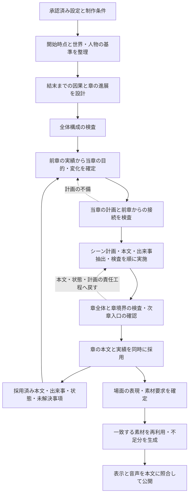

# ストーリー制作ワークフローの再設計計画

2026-09-26 r14：r13通し結果への修正を実装（prompt 14 / implementation 15 / contract revision 13）。最初の新行動を冒頭ScenePlanへ直接組み込み、長い完全一致の章境界転載だけを記録付きで除去する。プロット下書きは先の経験と後の利用、会話は本人の用事と相手の返答から具体化する。[r14実装記録](experiments/script-continuation-r14-implementation-20260926.md)を現行の確認記録とする。以下はそれまでの経緯。

2026-09-26 最新方針：[決着の準備と会話の具体性を改善する計画](story-causality-and-dialogue-plan.md)。r12で履歴を保持して16k・3章を完走した結果を受け、成立条件・会話の応答・短い作例を具体化した（prompt 13 / implementation 14 / contract revision 12）。[コンテキスト配分と章間接続の改善計画](context-and-chapter-connection-plan.md)の土台を維持する。実装前コミットは`461b98e`。新方式の通し生成前に確認結果を報告する。以下はそれまでの経緯として残す。

最新方針（2026-09-26）：[章の継続を優先する計画](chapter-continuation-reset-plan.md)を最優先にする。元の章間反復と継承不足への対策に絞る。以下の初期の検査・修復工程を含む設計全体へは戻さない。

2026-09-25 改訂：次のPoCでは[台本とティラノ出力を維持する章間改善計画](story-first-poc-plan.md)を優先する。未来の展開は因果まで具体化した全体プロットから決め、過去の事実は実台本から記録し、章計画で現在地と到達点を接続する。この方式は実験用script_continuation_v1に実装済み。通し生成は小規模確認の報告後に実施する。既存の台本・演出・Script・ティラノ出力を維持し、Gemma単独で進める。以下の詳細台帳・意味検査・修復ループを含む初期設計は経緯として残すが、現在の実験の要件には戻さない。Qwenは将来の論理整合性用途に限る。

作成日：2026-09-25  
状態：設計案。実装・生成の開始・既存作品の改稿は行わない。

追記方針：本取り組みは実験・PoCとして進める。16kは最低限の設計・検証の目安とし、コンテキスト長に応じて拡張できる構成にする。人物・場所の設計はまず現案を試し、品質・性能が不足すれば随時見直す。初期の作劇実験には画像・音声なしのデバッグモードを用いる計画とする。

追加対策案（2026-09-25）：[Qwenによる構成・編集とGemmaによる執筆への変更計画](qwen-editor-gemma-writer-plan.md)を作成した。実装する場合は、工程配置、検査の停止条件、未確定情報、修復方針について追加案を優先する。場面ごとの細かな検査を全て通す構成から、章単位の編集と有限の修復へ変更する案であり、この追記時点では追加案の実装・生成は行っていない。

## 1. この計画で変えること

制作では、**未来の目的と因果を全体プロットが担い、過去の事実は実台本を根拠にする。章計画は両者を接続する。** 各章を独立した導入から生成せず、実際の現在地から予定する到達点へ進める。過去の展開を尊重することを、その勢いや問題行動を未来の方針として追認することと混同しない。人物や舞台に必要な素材は、この物語の進展を受けて決める。

作品を次の四つに分けて管理する。

1. **承認された設定**：守るべき世界のルール、人物の初期条件、ユーザーの固定条件。
2. **今後の計画**：結末へ至る因果、各章の役割、登場予定人物、伏線の予定。まだ起きた事実ではない。
3. **実際に起きたこと**：採用本文と、その原文を根拠とする出来事・知識・状態の履歴。作者だけが確定している秘密は出所と開示条件を分ける。
4. **場面の表現**：登場人物の見た目、舞台の状態、画像・音声・演出。実際の出来事と矛盾させない。

章が進むことは、新キャラや画像の枚数が増えることではない。出来事の結果によって、人物の選択肢、関係、認識、状況、読者の理解のいずれかが意味を持って変化することとする。同じ場所・同じ人物だけの物語も成立させる。

### 維持する要件

- 世界観・メインキャラの初期承認後は自動進行し、毎章のユーザー承認を追加しない。
- 本文はプレーンテキストで作成し、採用原文と発話の対応を保持する。
- 完成した章から鑑賞でき、公開済みの本文・build・鑑賞中の版は変えない。
- 通常停止、即時中断、再起動、失敗後の再試行、複数ワーカーの保存境界を維持する。
- 16,384トークンは最低限の設計・検証の目安であり、固定上限ではない。利用するモデル・サーバー・実行環境に応じてコンテキストを拡張できるスケーラブルな設計とし、拡張を全利用者の必須条件にはしない。
- 章数はユーザー指定を守る。再生時間の帳尻合わせ、毎章の固定シーン数、新人物数・新背景数のノルマを設けない。
- 未読章の内容は通常の進捗画面・プレイヤーに出さない。詳細な生成・修復記録は別に閲覧できる。

### 今回の設計に含める範囲

全体設計、章計画、シーン計画、本文、出来事と状態、登場人物・場所の管理、素材要求、内容検査、修復、公開、旧データとの共存までを一体で見直す。衣装・身体状態・舞台状態を表示に反映する最小限の描画拡張も含める。網羅的な表情差分、BGM、効果音、リップシンク、汎用カメラ演出は別拡張とする。

## 2. 現行設計から分かった問題

| 現行の構造 | 起きる問題 | 再設計の方針 |
| --- | --- | --- |
| 章のrole/summaryを中心に独立したシーン計画を作る | 全体プロットが進んでいても、具体的な導入や会話を再計画する | 前章の実績と未解決の結果を章計画の必須入力にする |
| 引き継ぎが人物状態と前章末8行に偏る | 過去の導入、説明済み情報、既に行った選択を忘れる。末尾引用を転載する | 出来事の履歴と必要な原文を用途別に渡し、反復を別途検査する |
| 状態要約がプロットのsummaryと同じでも通る | 実本文の接触・回復・約束などが記録されない | 本文から出来事と差分を抽出し、要約はその索引として作る |
| 伏線の予定章から状態を強制する | 予定を満たす状態を作ることが、本文の実在確認の代わりになりやすい | 実際の設置・回収を先に抽出し、その後で予定との不一致を検査する |
| サブキャラ一覧を前章と完全一致させる | 後から必要な人物が登場できず、固定人物の同じ役割を反復しやすい | 恒久的な人物台帳と章ごとの出演を分離する |
| 場所・時刻・雰囲気・画像要求が一体 | 同じ場所の変化と同じ画の再利用を区別しにくい | 場所の同一性、時点の状態、構図を分離する |
| 主役の画像は承認時画像へ固定、1人物1画像 | 衣装・負傷・身体変化が画面へ反映されない | 人物IDを保ってappearanceと画像を切り替える |
| 計画の必須イベントを描けばシーン検査が合格 | 悪い計画を忠実に描いても、そのまま公開へ進む | 計画自体、章の進展、章境界を独立に検査する |
| 意味不合格の再試行位置が計画生成後 | 悪い計画を固定したまま本文だけ作り直す | 不備の責任工程へ戻し、依存する未公開成果物を無効化する |

背景の再利用処理自体は、現行でも同一要求だけを対象としている。問題は、上流の計画が同じ人物・場面へ戻ることと、変化を明示するデータ・描画能力が不足していることである。再利用を一律に禁止する対応は採らない。

実作品では、全章の同じ導入、第1章末7発話の第2章への転載、回復後の再悪化の説明不足を確認した。第2章の反復は入力削減前の生成キャッシュにも存在した。コンテキスト量の拡大だけでこの問題は解決しない。

調査根拠は[章境界の調査記録](../tmp/m4-quality-audit/report.md)と[機械照合の結果](../tmp/m4-quality-audit/evidence.json)にある。現行の技術構成は[M4アーキテクチャ](architecture/m4.md)、元の体験要件は[実装計画](../implementation-plan.md)を参照する。

## 3. 新しい処理の全体像

図の戻り先は概略。実際には第11節の責任工程別ルールで戻す。検査不合格をすべて本文の再抽選へまとめない。

章Nの本文・実績が採用されたら、素材完成を待たず章N+1の本文制作を進められる。下流の素材在庫やcache hit率を章計画へ渡して、物語を既存画像へ誘導することはしない。

## 4. 全体設計：結末への因果を先に作る

### 4.1 物語の開始時点を明示する

承認データを変更せず、物語開始時点の解釈を `InitialCanon` として整理する。

- いつ、どこから始まり、人物同士が既にどの程度知り合っているか。
- 世界に存在する真実と、各人物が知っていることの区別。
- 人物設定に書かれた関係が「開始時点の関係」か「変化の方向・到達目標」か。
- 視点と語りの範囲。人物の知識と読者に開示済みの情報を区別する。
- 固定条件、創作で補える空欄、内部的な予定を分ける。

承認時の記述をすべて永久不変にはしない。永続IDとユーザーが明示した不変条件は固定し、初期の臆病さ、不信、所属、目的、関係などは、経験を根拠に変化できる項目として区別する。口調も、人物を取り違えたような突然の変化と、親密さによる呼称の変化を分ける。外見の同一性を保つことは、成長・変身・負傷を禁止することではない。

既に知り合いの設定を、説明しやすいという理由で初対面へ戻さない。明示された条件に矛盾があれば設計不成立として記録する。曖昧な部分に一貫した解釈を置く場合はその根拠を記録し、以後毎章解釈し直さない。

### 4.2 全体設計の出力

`StoryBlueprint` は章ごとの文章要約だけでなく、次を持つ。

| 項目 | 内容 |
| --- | --- |
| 中心の問いと結末条件 | 何が未解決で、最後に何を選び、何が変われば終われるか |
| 因果の骨格 | 出来事→反応・選択→結果→次の問題。章間の依存も示す |
| 人物の変化 | 欲求、思い込み、選択、代償、変化を示す行動。感情ラベルだけにしない |
| 章の担当 | その章で新しく進む問い・関係・情報・状況と、後続章に残す結果 |
| 伏線・約束 | 設置予定、理解・誤解、回収予定と必要な根拠。予定と実施状態を分ける |
| 人物・舞台の需要 | どの役割や生活圏が必要か、初登場・再登場の予定。全員の素材を先に作らない |
| 変化の配分 | 対立の種類、行動目的、時間、空間、関係の力学、読者が知る情報の推移 |

初期の全体設計では少数の因果案を比較し、成立する一案を選ぶ。その後は各章で作品の根幹を再抽選しない。候補数・比較回数には上限を持たせ、細部の装飾案を無制限に増やさない。

全章を詳細シーンまで先に固定する方法は採らない。全章の役割と主要な因果を設計し、詳細化するのは当章と次章の入口までとする。長編は区間単位の構成を置き、遠い章の全シーンを毎回入力しない。

### 4.3 全体構成の検査

- 同じ導入・同じ問題・同じ解決の並べ直しになっていないか。
- 各章が後続の選択や理解を変えるか。静かな章でも、関係や認識の変化があるか。
- 解決に必要な知識・能力・人物・物品が、都合よく終盤だけ発生しないか。
- 人物の変化が行動として段階を踏み、前章の決断を次章で無説明に初期化しないか。
- 舞台や登場人物の選択に物語上の理由があるか。素材を増やすこと自体を変化の代用にしていないか。
- ユーザー指定の章数・世界のルール・固定した結末条件で完結可能か。

ここで不成立なら全体設計へ戻る。成立していない計画の本文や画像を先に量産しない。

## 5. 章計画：前章の結果を受けて何が変わるか

章の計画は `ChapterIntent` として保存する。ここでいう「意図」は予定であり、実際に起きた事実とは別である。

| 必須項目 | 例・検査観点 |
| --- | --- |
| 入力版 | 前章の本文commit、状態、出来事台帳、採用したblueprintの版 |
| 引き受ける結果 | 前章のどの行動・発見・約束・失敗が当章を必要にしたか |
| 当章の問い | 今回決めること・確かめること・対処すること |
| 入口の接続 | 直後か、翌日か、移動後か。その間に何が変わり、読者へどう伝えるか |
| 当章固有の進展 | 新しい選択、関係の変化、情報の更新、状況の悪化・改善など |
| 再演しない出来事 | 前章までに既に描いた紹介、説明、発見、対立と決着 |
| 必要な出演・舞台 | この場面でこの人物・場所が必要な理由。新規登録の要否 |
| 予定する到達状態 | 必須の変化と許容する幅。出力状態をこの予定に強制しない |
| 次章への結果 | 解決したことと残る問題。最終章なら閉じるべき約束 |

「前回までを読んでいない読者への説明」を毎章の前提にしない。設定は既知として扱い、必要な再言及は現在の行動・葛藤に結び付ける。

当章を通じた意味のある進展は必要だが、新しい事件や大きな逆転を毎回要求しない。関係修復、休息を通じた決意、既知の事実の解釈変更、別視点による理解も進展になる。その変化が本文で読み取れることを確認する。

### 計画段階の章境界検査

本文を書く前に、前章の実績と当章の計画を照合する。

- 同じ紹介・噂話・初発見を再び新しい出来事として扱っていないか。
- 前章末の場所・身体状態・所持品・関係・約束から、入口へ接続できるか。
- 場所や時刻を変えた場合、必要な移動・経過時間を計画しているか。
- 再登場、再訪、リフレインには今回の目的・結果の違いがあるか。
- 次章の役割を先に消化した結果、残りが再演になっていないか。早い回収でも、残り章数で新しい進展と結末が成立すれば採用し、未来の計画を更新できる。

不合格なら `ChapterIntent` またはシーン配置を修正する。未修正の計画をキャッシュで固定しない。

## 6. シーン制作：本文の実績で次の場面を更新する

### 6.1 シーン計画

各シーンは、開始時点、場所、登場・認識できる人物、人物ごとの目的、障害、行動・反応、選択、終了時の変化を持つ。単なる「説明場面」「感動場面」といった雰囲気だけで設計しない。

シーン列には因果上の接続を持たせる。Aが失敗したためBを試す、秘密を知ったため態度が変わる、といった関係を明示する。時間順以外の構成は回想・並行場面などのモードを明示し、現在の状態を誤って巻き戻さない。

既存の1〜3シーンを推奨する定型に全章を押し込めない。シーン数は当章の進展を具体的に描くために決め、処理上の上限に当たる場合は生成単位を分ける。章数や本文を無断で縮めない。

### 6.2 一場面のループ

1. シーン計画に、直前の採用候補シーンまでの実績を反映する。
2. その場面に必要な設定・知識・未解決事項・原文を取得する。
3. 本文をプレーンテキストで生成し、発話・地の文のIDと原文位置を確定する。
4. 本文に実在する出来事、情報開示、状態変化を抽出する。
5. 原文・出来事・状態差分を照合し、会話と行動、因果、口調、知識境界を検査する。
6. 合格した本文と差分を章内の仮台帳へ同時に保存し、その結果を次のシーンへ渡す。

検査は「差分→原文の裏付け」だけでなく、「原文→必要な差分の取りこぼし」も行う。約束、身体の変化、移動、所持品、知識の獲得・訂正、関係を変える選択などを原文側から確認し、台帳に存在する項目だけを検査しない。資料の全範囲を投入したというcoverageと、必要な変化を記録したという意味上の完全性を分ける。

ここでいう仮台帳は未公開章の内部状態であり、章全体の採用前に他の章へ正式な事実として配布しない。

本文が計画より自然で、固定条件と当章の必須の進展を満たす場合は、実績を採用して未実施の計画を調整できる。逆に、計画の必須イベントが本文に存在しない場合は、状態表だけを埋めて達成扱いにしない。

重要な選択や対立の解決は会話・行動・相手の反応で描く。通常の移動や着替えまで全て長い場面にする必要はない。必要な橋渡しは短い地の文でもよいが、物語の核心となる原因を画面外の説明だけで済ませない。

## 7. 記憶：予定ではなく実際の出来事を保持する

### 7.1 データの責務

以下は新契約の設計名。既存schemaにそのままフィールドを継ぎ足すことを決めたものではない。

| データ | 保存する内容 | 正とする根拠 |
| --- | --- | --- |
| `StoryBlueprint` | 全体の予定、章の役割、因果、予定伏線、将来の人物需要 | 承認条件と構成検査。実績とは別 |
| `ChapterIntent` / `SceneIntent` | 当章・当場面が目指す変化と接続 | blueprintと採用済み履歴 |
| `NarrativeSource` | 原文、版、発話ID、文字位置、表示・読み上げの対応 | 採用原文そのもの |
| `ConcealedCanon` | 作者側で確定した過去の秘密・非公開の出来事、成立時点、知る人物、開示条件 | 初期設定または別途検査・採用した作者用記録。本文からの抽出とは区別 |
| `EventLedger` | 誰が何を行い、何を受け、何が変わったか。原因・結果・参加者・目撃者・時点 | 原文参照。秘匿した出来事は採用した作者用記録への参照と出所区分 |
| `StateDelta` | 人物・場所・関係・所持品・身体状態・約束などの変化前後 | 確認済みイベントと、その原文または秘匿記録 |
| `KnowledgeLedger` | 人物ごとの事実・推測・誤解、獲得・訂正の時点と由来 | 発話、発見、観察等の根拠 |
| `OpenThreads` | 未解決の問題、約束、原因不明の変化、未回収の設置済み伏線 | 実績。未来の予定だけでは登録しない |
| `ReaderDisclosure` | 読者に開示した情報と叙述上の制約 | 公開本文・採用候補本文 |
| `CanonSnapshot` | 指定時点の人物・場所・知識等の状態 | 確認済み差分の適用結果 |
| `ContextPacket` | ある生成・検査に渡した資料と、取得範囲・省略範囲 | 上記の版付き参照 |
| `ReviewReport` | 検査した対象、問題、根拠、重大度、資料不足、戻す工程 | 実際に照合した入力 |

台帳は原文の検索・照合を容易にするためのもの。台帳と原文が食い違ったら、台帳があることを理由に原文を無視しない。抽出の誤りか本文の矛盾かを分類して修復する。

### 7.2 証拠と更新のルール

- 参照は章番号だけでなく、物語系列、本文commit、シーン版、発話IDまたは原文範囲とハッシュを特定する。各章で同じ `s1-u1` が発生しても混同しない。
- 出来事には「予定」「候補」「採用」を区別する。未来の章の計画を人物の既知情報へ混入させない。
- 世界の真実と人物の信念を区別する。嘘、噂、仮説、誤解の訂正を扱う。獲得履歴を消さず、現在の信念を更新する。
- 知識を知る前から使ったことにしない。画面外の獲得にも時点・相手・方法の根拠を要する。ただし、作者側に確定した根拠があれば読者への説明は後でよい。秘密の管理は第7.4節による。
- 身体状態は負傷だけでなく、疲労、病気、透明化、拘束、変身など物語に必要な条件を扱う。回復・悪化も変化として残す。
- 約束は相手、内容、期限・条件、履行・破棄を扱う。「また明日」を常に重要伏線にする必要はないが、次章の再会の根拠になる約束は落とさない。
- 伏線の実施状態は原文から抽出する。予定期日になったから `resolved` を強制しない。回収が無ければ、予定との不一致を計画・本文の修復へ戻す。
- 不明は不明として保持し、空配列と確認済みの「存在しない」を区別する。重要な不明点を推測で埋めて合格にしない。

時点は「語る順序」と「作中で起きた順序」を分け、日時が不明なら「翌日の放課後」「直前の出来事より後」のような相対関係を保持する。回想の差分はその過去時点へ登録し、現在の人物状態を上書きしない。並行場面では互いに知り得ない情報を共有させない。知識の獲得時点、読者への開示時点、記録・訂正した版を別々に追跡する。

初期事実は承認設定と `InitialCanon` を根拠にできる。通常の変化は本文を根拠とし、意図して隠す出来事には第7.4節の別の採用手続きを要する。差分がない項目は以前の状態を継承し、「抽出器が今回言及しなかった」を消失・回復・忘却として扱わない。全台詞の全単語を台帳化する必要はなく、後の行動・知識・関係・解決を制約する事実を優先する。

本文から抽出したイベント群と状態差分を検査した後、決定的な処理でsnapshotを更新する。全人物の状態を毎回LLMに丸ごと書き直させる方式はやめる。既存IDと過去の根拠を保持し、変更する項目だけを明示する。

### 7.3 要約の役割

要約は案内・検索用の索引であり、事実の唯一の保存場所にしない。前の要約をさらに要約する連鎖だけで記憶を更新しない。要約からイベントIDをたどって原文へ戻れるようにする。

抽出段階は必要最小限の設定と本文を主資料にし、全体プロットの要約を答えとして写しやすい入力にしない。抽出後の別検査で「予定していた進展」と「実際の進展」を比較する。章の実績要約がoutlineの文章と同じなら警告し、出来事の具体性を検査する。

### 7.4 秘密と、後から明かす過去

犯人だけが知る過去、偽名、嘘の証言、信頼できない語りは扱えるようにする。「読者にまだ説明していない」と「原因や根拠が何もない」を区別する。

- 作者用に確定した真実、人物の信念、読者に提示した観測・証言を別々に保持する。観測や発言を自動的に客観的真実へ昇格させない。
- 開始前の秘密は `InitialCanon` と結び付け、成立時点、知っている人物、読者へ示す手掛かりや開示条件を持たせる。作者用の秘密を、その場にいない人物へ渡さない。
- 開始後の画面外の出来事は、単なるblueprintの予定から実績化しない。作者用の出来事候補として時間・原因・参加者・影響・隠す理由を明記し、既存本文と成立条件を検査して、該当章のcommitで採用する。「本文から抽出した事実」として偽装しない。
- 秘密の開示を遅らせても、読者が観測する変化とその扱いは本文へ反映する。重要な変化を無説明に忘れたり、計画した約束や伏線の未達成を秘密の台帳だけで達成扱いにしたりしない。
- 後から明かす事実は、公開済みの客観的事実と矛盾せず、以前の観測・誤解を説明できることを検査する。事実の初期化を「実は秘密だった」と呼び替えて免除しない。

回想で過去の負傷を描いても現在は治癒したままとし、その回想を読者に見せただけで他の人物の知識を増やさない。終盤では、回収を約束した謎と、意図して残せる曖昧さを分けて検査する。

## 8. コンテキスト長に応じて拡張できる記憶管理

保存量と一度のLLM入力量を分ける。原文・イベント・状態の履歴は全て保存し、LLMには処理に必要な範囲を取り出す。

### 8.1 用途別の入力

| 用途 | 必ず含める情報 | 入れない情報 |
| --- | --- | --- |
| 全体構成 | 固定条件、開始状態、結末条件、章数、主要な人物変化 | 画像の在庫、全台詞、素材ファイルの情報 |
| 章計画 | 前章の実績、当章に影響する過去イベント・未解決事項、現状態、章の役割 | 遠い過去の無関係な全文、全画像プロンプト |
| シーン本文 | 視点、登場人物の現在の知識と目的、必要なルール、直前の接続、当場面の課題 | 未読の全章本文、全人物の私的情報を無差別に列挙したもの |
| 出来事抽出 | 対象の原文、安定したID、必要な直前状態 | 全体の予定を実績として書き写すための誘導 |
| 章境界の検査 | 両側の該当原文、出来事、変化の根拠、計画した橋渡し | 全二章の注釈付きJSONを一括投入したもの |
| 素材要求 | 採用シーンの表示要件、人物・場所の同一性と時点状態 | 全体プロット、他人物の画像生成用外見情報 |

### 8.2 取得と不足検出

1. 登場人物、場所、所持品、約束、伏線、原因イベントから、必須の関連記録をIDで取得する。
2. 初対面・再会・再発見・反復の候補を、全履歴の索引から取得する。直前章だけに限定しない。
3. 関連する原文を証拠として添付する。単なる類似検索結果だけで、必須の約束や負傷を落とさない。
4. 取得した記録、対象の時点・版、検査済み範囲を `ContextPacket` に保存する。
5. 資料が足りない場合は `insufficient_evidence` とし、追加取得または検査の分割を行う。資料不足を合格と扱わない。

計画に挙がっていなかった人物・物品・過去の出来事へ本文候補が言及した場合も、抽出した参照先から資料を取得し直す。事前の取得だけで本文全体を検査できたことにしない。過去原文は「既に起きたことの証拠」として渡し、続編へ転載する文例とは区別する。

全履歴の構造化索引と未解決事項をコードで保持する。検索モデルの導入を前提とせず、ID・関係・状態変化・文字列一致で開始できる構成にする。意味検索を追加する場合も補助候補の取得に使い、必須参照の代わりにしない。

### 8.3 入力予算

現在と同様に、使用モデルのチャットテンプレート・schema込みで実トークンを計測し、`入力 + 回答枠 + 安全余裕 <= その実行で有効なコンテキスト長` を満たす。16,384を処理へ固定値として埋め込まない。工程ごとに出力枠を変え、すべての呼び出しに同じ値を課さない。16k環境での初期profile例は、狭い抽出・検査では出力3,072・余裕512・入力12,288以下、長い本文生成では出力6,144・余裕512・入力9,728以下とする。生成が長さ上限で途切れた候補は完成本文として採用しない。

これらは16kで検証を始めるための例であり、より広いコンテキストでは工程別に取得範囲・入力枠・出力枠を再計算できる。出力枠にはモデル・サーバー固有の上限も適用する。本文の回答枠を削って必要な会話をダイジェストへ追い込まない。

超過した場合は、重複・表示用メタデータの除去、無関係資料の除外を行った上で、許可されたコンテキスト範囲内での拡張、または対象人物・論点・場面ごとの分割を選ぶ。拡張と分割の選択は、必要な情報を一緒に見る意義と実測コストから判断する。必須の根拠を切り捨てる、回答枠を黙って削る、本文を短縮する対応はしない。

一場面が長い場合は、会話・行動の区切りと境界の状態を保持して分割し、各部分の検査範囲と接続部を照合する。全件を見たことを示すcoverageを持ち、一部を検査した結果を章全体の合格へ拡大しない。

UUIDなどの反復が大きい場合は、ContextPacket内だけの短縮IDと厳密な対応表を利用できる。保存される人物ID・証拠参照を変更せず、未定義の短縮IDは拒否する。

許可された最大コンテキストでも分割できない判断が収まらなければ、対象・必要量・保持した成果物を示して停止する。資料取得・拡張・分割にも第11節の共通予算を適用し、別工程への移動で無限に再試行しない。利用者が設定した資源上限を超えて、自動で要求スペックを上げない。

### 8.4 スケーラブルにする境界

- モデルが対応する長さ、サーバーに実際に設定された長さ、利用者・実行環境が許可する長さを区別する。有効値はそれらの範囲内で決め、公称の最大値だけで予算を計算しない。取得できない値は検証済み設定を使い、推測で拡張しない。
- 制作profileで目標値・許可上限・拡張方針を指定できるようにする。16kで始めても、対応環境では32k等へ設定を変更することで同じworkflowを動かせる。自動選択を行う場合も、事前に許可・検証された範囲内に限る。
- ContextPacket構築、分割、出力枠、検査範囲の集約は共通の予算計算を使う。記憶の保存形式や工程構造をコンテキスト長ごとに作り直す必要がないようにする。
- コンテキストが広がった場合は、関連する過去原文や複数場面をまとめて照合できるようにする。全履歴を無差別に投入することは必須にせず、証拠参照・知識境界・資料不足検出は維持する。
- 実際のコンテキスト長と解決後のprofileを入力・実行記録・cache識別へ含める。ローカルサーバーの起動設定変更が必要なら、実行境界で変更し、旧設定のまま予算だけ増やさない。既に採用した本文は設定変更だけで再生成しない。
- 16kと、環境で実行可能な拡張設定を別条件として評価し、品質・分割回数・修復回数・所要時間・VRAMを比較する。16kですべての題材が必ず成立するとも、大きくすれば必ず品質が向上するとも仮定しない。

### 8.5 モデルの使い分けと引用IDの対策（追加方針）

本文生成と本文修復はGemma・思考なし・16kを維持し、検査側のQwenは32kまで利用可能とする。入力コンテキストと、思考・最終回答が共有する出力枠は別に設定する。過去/現在の引用に二種類のIDを提示していた問題については、LLMへ渡すsource_idを一種類に統一し、完全な原文参照への解決をコードで行う案とする。

決定事項、implementation 14で実装した範囲、検証順序は[引用ID対策とモデルの使い分け](reference-id-and-model-routing-plan.md)を参照。モデル切り替え回数の最適化は依存順と採用境界を維持して追加し、検査前に後続の本文をまとめて生成する構造へは戻さない。

## 9. サブキャラと舞台を物語に合わせて変える

この節はまず現案のままPoCで検証する。現時点で章数・メインキャラ数から人数や場所数を決める追加の算定規則は導入しない。単調さ、役割の重複、人物過多、舞台の不足などが出た場合は、その観察を根拠に計画方法や制約を随時変更する。

### 9.1 人物の台帳と出演

全体構成で必要な役割を見積もり、詳細な人物設定は初登場の計画時に確定する。後続章でも必要性が検査された新しいサブキャラを追加できる。

| 概念 | 内容 |
| --- | --- |
| 人物の同一性 | 永続ID、名前・別名、識別特徴と基準デザインの履歴、明示された不変条件 |
| 人物の状態 | 現在地、知識、関係、負傷・身体条件、所持品、約束、現在の目的 |
| 章・場面での出演 | 画面内、画面外、言及のみ、不在、初登場、退場、再登場 |
| 見た目 | 衣装、装備、汚れ、髪の状態、可視の負傷・身体変化と有効時点 |
| 声の同一性 | 基準音声とその参照本文。章や衣装ごとには作り直さない |

既存人物の不在は削除ではない。死亡・退場も履歴に残し、再登場には時間・移動・帰還などの根拠を確認する。新しい人物は既存人物の別名・代用品でないか検査する。将来登場予定の人物や秘密の正体は作者用計画と、登場人物・読者の認識を分ける。

本文制作中に新しい人物・場所が必要になった場合は、追加提案→役割・既存対象との同一性の検査→必要設定の作成→影響するシーンの再計画を行う。登録候補は章内の仮台帳に置き、本文と同時に正式採用する。破棄したシーンの新人物を確定済みの世界へ残さない。台詞のない群衆や背景の通行人に、主要人物と同じ設定・専用画像・声を一律に要求しない。

全サブキャラを毎章完全一致させる制約を撤廃する。全作品の人物数、章内の出演数、画面上の同時表示人数は別の制約として扱う。現行の左・中央・右という表示能力は当面維持できるが、作品全体を3人に閉じ込める理由にはしない。

### 9.2 場所と背景

`PlaceIdentity` は建物・地理・構造・特徴物を表し、`PlaceState` は時点ごとの天候・光・破壊・修復・重要物の配置等を表す。`BackgroundShot` は画角・距離・向き・人物を重ねる空間を表す。

同じ教室の昼と夜は同じ場所で、異なる背景要求になる。同じ場所の構図変更も新しい場所IDを必要としない。逆に、別の部屋へ移動した本文を、同じ背景定義のまま曖昧に処理しない。

人物・場所の同一性を保つことと、全く同じ画を出すことを切り離す。前章の画像プロンプトをそのまま再利用する指示を、章の創作指示に混ぜない。

## 10. 素材生成は採用本文と場面需要から始める

### 10.1 素材要求の確定

本文・出来事・状態を採用した後、`PresentationPlan` と `AssetDemandManifest` を作成する。章計画時には必要量を見積もるが、本文が未確定の段階で正式な台詞音声や大量の画像生成を始めない。

素材要求には、何を表示・再生するためかという場面・発話・状態の参照を付ける。要求が確定してから既存素材を照合し、不足分を生成する。本文を既存画像に合わせて書き直す逆流を禁止する。

| 素材 | 同一要求の判定に使う要素 |
| --- | --- |
| 人物画像 | 人物の同一性・基準デザインの版、見た目、必要なポーズ・画角、画風、参照画像 |
| 背景 | 場所の版、可視の物理状態・時刻・天候・光、構図、画風、参照画像 |
| 基準音声 | 声の同一性・参照本文・生成仕様 |
| 発話音声 | 基準音声hash、正確な読み上げ本文・読み、感情・話し方、合成仕様 |

cache keyには正規化した生成仕様全体、モデル・変換器の版、実効プロンプト、解像度、seed等を含める。利用する章番号だけでは分断しない。意味上似ているという理由だけで、昼の画を夜の場面へ代用しない。同一素材需要には安定した生成仕様・seedを割り当て、章をまたいでも一致を判定できるようにする。

共有するのは素材要求と成果物で、特定の章のjobを無期限に待つ仕組みにしない。共有元の失敗・中断を依存章へ伝え、再試行可能な要求として管理する。利用箇所の一つが無効になっても、他の公開章の素材を削除しない。

### 10.2 描画契約の変更

- 同じ人物IDと声の同一性を維持しながら、指定発話の前後でappearance画像を切り替えられるようにする。話者の表示名・読みは別に持ち、「謎の声」「偽名」「本名」を読者への開示時点に合わせる。内部IDや素材名から正体を画面へ漏らさない。
- 画像ごとの外接範囲・配置を持たせ、衣装変更で身長や画面位置が不自然に跳ねないようにする。
- 背景切替をSceneSettingと結び付け、場面途中の停電・破壊等も必要なら切り替える。
- 重要な可視状態と、実際の画像・効果の対応を確認する。身体が透明なのに通常画像のまま公開するような不一致を防ぐ。
- 保存・再開で、正しい画像の版、表示人物、背景、位置を復元する。中間脚本・compiler・playerのschemaを同時に検証する。

現在の画像生成経路では、別衣装でも同じ人物、別時刻でも同じ場所の構造になることを保証できない。基準画像を使った編集・条件付けの能力検証を実装初期に行う。テキスト指示だけで不十分なら対応経路を追加する。未対応の能力を実装済みとして計画を進めない。

網羅的な表情差分は今回の必須範囲にしない。物語の事実を伝える衣装・身体状態・舞台の変化は必須範囲とし、装飾的な差分と分ける。既存画像と決定的な描画効果で正確に表現できる場合は、その能力を明示して利用できる。

### 10.3 素材を検査する能力

PNG/WAVが開けることと、人物の同一性・衣装・身体状態・発話内容が正しいことは別である。現行のファイル検査だけで後者も確認できたとは扱わない。

| 検査の層 | 確認内容と手段 |
| --- | --- |
| 機械的な対応・描画 | 本文/要求/素材の版とhash、参照音声、読み上げ原文、画像切替時点、解像度・音声形式、検証済み効果の適用をコードで照合 |
| 実素材の内容 | 人物・場所の同一性、重要な可視状態、台詞音声の欠落や内容の違い。画像・音声を扱える検査経路が必要で、テキストLLMにファイル名を渡すだけでは代替しない |
| 開発時の通し評価 | 実際の画像・音声・再生を人が確認し、上記の意味検査の見逃し・誤検出と生成profileの適用範囲を評価 |

W0で、条件付けによる生成能力と自動検査能力を対にして実測する。必要な検査アダプターとモデルの有無、逐次実行・モデル解放で収まるVRAM、時間を確認し、標準環境で採用できる経路を決める。追加の大規模モデルや常時同時ロードを前提にはしない。初期段階で実現できない場合は、能力不足として計画・対応範囲へ明記する。

実行時には検証済みの能力とprofileだけを使う。物語上重要な表現を確認できなければ、検査未完了または未対応として公開を止める。正常生成・検査ができることを確認せず、全自動で任意の画像変化に対応できるとは約束しない。開発時の人手評価を、毎章ユーザーに確認させる運用へ置き換えない。

### 10.4 制作予算との関係

明示的な「少人数の密室劇」等は上流の作品条件にできる。一方、暗黙の素材節約を物語の条件にしない。必要素材を作れない場合は本文採用済み・素材待ちとして止まり、採用本文や公開版を自動で節約版へ置き換えない。

未生成の待機、再試行可能な失敗、依存先の失敗、予算不足、未対応の表現・検査能力を別の状態として表示する。未対応の要求を通常の生成キューへ戻し続けない。再試行可能な失敗にも回数上限を置き、原因と再開条件を記録する。

同一人物や同じ部屋の再利用が多くても、物語上正しければ問題はない。新素材の多さやcache hit率を物語品質の評価指標にしない。

## 11. 検査と修復を責任工程へ結び付ける

### 11.1 検査ゲート

| ゲート | 判断対象 | 合格に必要なもの |
| --- | --- | --- |
| 全体構成 | 結末までの因果、人物変化、章の役割 | 固定条件を守って完結でき、章同士が再演にならない |
| 章・シーン計画 | 前章からの接続、既実施イベントとの差、当章の進展 | 因果と目的の変化、時間・場所・状態の接続が具体的 |
| シーン本文 | 行動・会話・反応、口調、知識、実際の変化 | 原文に出来事が存在し、必要な転換を要約だけで済ませていない |
| 事実・状態 | 抽出の正しさ、獲得時点、原因、根拠 | 不明点を捏造せず、前後差分を原文へ照合できる |
| 章境界・章全体 | 再演、転載、前章との因果、当章の到達 | 前後の原文と履歴を照合し、進展を具体的に指せる |
| 表示・公開 | 画像、音声、演出、参照版、再生 | 採用本文・時点状態と一致し、必要素材が揃う |

文字列の連続一致、ID、参照、時系列上の参照可能性、検査範囲は機械で検証する。意味の反復、行動の説得力、身体変化の説明、人物の一貫性は原文を使う内容検査で扱う。

反復候補は長い一致やイベントの類似から拾い、正当な回想・引用・リフレインと区別する。「反復を意図した」という生成側の一言だけで免除しない。今回の目的・意味・結果の違いが本文にあるか検査する。

検査結果は `passed` だけにしない。対象ID・入力版、重大度、問題箇所、前後の根拠、期待する修復、資料不足、検査済み範囲を保存する。生成側とは別のリクエストで検査するが、同じモデルの別呼び出しを独立した品質保証と見なさない。

項目ごとに `pass / fail / insufficient_evidence / not_applicable` を区別する。根拠の存在しない説明不足を指摘する場合は、無い引用を作らせず、検索・照合した範囲を記録する。必須項目の未判定が残る候補は採用しない。

### 11.2 修復先

| 不備 | 戻す工程 | 保持するもの |
| --- | --- | --- |
| 結末へ到達できない、全章が同じ役割 | 未公開範囲の全体構成 | 固定設定と公開済み実績 |
| 同じ導入の再計画、章の進展不足 | 章意図・シーン配置 | 適切な過去章、人物・場所の同一性 |
| 接続に必要な場面・時間説明がない | 接続計画と影響するシーン | 影響しない採用済み場面 |
| 本文の知識漏れ、原因のない変化、ダイジェスト | 問題の本文とその後の依存範囲 | 固定条件、正しい直前状態 |
| 出来事・状態の抽出だけが不正 | 抽出・対応付け | 本文、正しい注釈、過去の根拠 |
| 入力超過・資料不足 | ContextPacketの取得・分割 | 本文と事実。内容の再抽選はしない |
| 画像要求が本文と違う | 表現・素材要求 | 本文と出来事 |
| 要求は正しいが生成画像・音声が不正 | 対象素材の生成・検査 | 本文、要求、他の有効素材 |
| 通信断・lease失効 | 実行または返却処理 | 完全一致した成功応答・成果物 |

修復時には指摘と根拠を入力に残す。seedを変えるだけのやり直しにしない。変更の影響を受ける後続の計画・本文・状態・素材要求をstaleにし、異なる版の混在を防ぐ。

初期の上限案は、一つの構造化出力の形式修復1回、同じ意味上の不備に対する修復2回、1章全体の意味修復6回までとする。全体構成の再設計も別に有限回数を持つ。計測に基づきprofileで調整するが、無限ループや「上限に達したから合格」を許可しない。上限到達時は失敗理由・対象・保持した成果物を示して止める。

章と作品に共通の追加呼び出し数・トークン量・経過時間の予算も置き、系列・章に紐づけて永続化する。構造修復、資料取得、計画の新版、シーン分割、プロセス再起動を跨いでも共通予算を復活させない。通信再送と内容変更は別に計数するが、どちらも全体の実行予算へ反映する。取得・分割で資料の充足が進まない場合も停止する。同じ問題が再発する場合は責任工程を再判定し、同じ指示を繰り返すだけにしない。

## 12. 採用・公開・再開の境界

### 12.1 採用する単位

シーンの本文と差分は章内の仮成果物として保存する。章全体の検査と前後の接続確認後、本文・出来事台帳・状態・必要な台帳更新を一つの `ChapterCommit` として原子的に採用する。

章N+1の本文生成は章Nのcommitを入力として固定する。章Nの媒体生成は並行できる。章N+1の暫定計画は先読み可能だが、本文採用前の結果を確定した過去として扱わない。

公開前に次章の入口計画を軽く照合し、前章を公開した途端に続きが成立しない状態を減らす。ただし、最終章までの本文完成を最初の章の公開条件にはしない。最終章では、未解決事項と結末条件の検査を行う。

素材が先に完成しても、章の公開順序は入れ替えない。章Nの公開条件は、それ以前の全章が同じcommitの系譜で公開済みであること。本文採用のtransactionでは入力commit、現行系列、停止・修復世代、本文・台帳・レビューの版を原子的に照合する。公開のtransactionでは、採用commitが引き続き有効であり、素材manifest・素材検査・buildも同じ版を参照していることを追加照合する。公開済みの後章が依存する先行章を、未公開扱いで修復できる状態を作らない。

### 12.2 予定の変更

ユーザーが明示的に固定した世界・人物の不変条件・結末条件は内部判断で変えない。人物の初期傾向や関係の成長は第4.1節の区別に従う。内部の未実施blueprintは、実際の本文から生じた妥当な変化を理由として改訂できる。改訂理由、変更前後、影響する未公開章を保存し、公開済みの出来事を新しい計画に合わせて上書きしない。

予定と実績が違う場合は、本文の不備か、有効な進展かを判定する。後者なら未来を再計画し、公開済みの客観的事実を改変して帳尻を合わせない。秘匿した真実の開示、人物の誤解の訂正、信頼できない語りの再解釈は第7.4節の条件で許容する。

### 12.3 ジョブとキャッシュ

現行の単一 `m3_narrative` の内部に全工程と再開点を隠す構造から、全体計画、章計画、シーン制作、事実抽出、検査、章採用、素材計画を版付きの成果物・実行単位へ分ける。細かい変換処理まで全てLLMジョブにする必要はない。

各jobは入力成果物ID・hash、workflow/schema/prompt/profileの版、対象系列・章・シーン・修復試行を固定する。チェックポイントはリクエスト番号だけでなく、意味のある工程と入力版で識別する。通信再試行と創作上の修復を分離し、成功キャッシュは完全一致の場合だけ再利用する。

生成結果の採用時には入力commitが現行かを再確認する。停止・修復・履歴切替で古くなった試行の遅延結果を拒否する。staleにした成果物は履歴として残し、公開buildや共有素材を削除しない。

依存上の並行実行と、同じGPUへの同時ロードは分ける。鑑賞可能な次の章を公開するための仕事を優先し、資源が限られる場合はLLM・画像・音声・検査モデルを順に実行する。通常制作では本文の先行量に上限を設け、初期案は公開準備中の章から1章先までとする。素材の未対応や失敗を残したまま全章を先行生成しない。素材を使わない開発時の本文評価は別profileとする。

### 12.4 旧作品と新しい系列

旧schemaと旧プレイヤーは読み込みを維持する。既存作品の本文や台帳を、更新しただけで新workflowへ変換・再生成しない。

旧作品からの継続を将来提供する場合は、必要な既存本文から実績を再抽出・検査し、旧作品自体にある矛盾を新状態表で隠さない。継続できない場合は理由を示す。既存作品の改稿は明示的に選んだ新しい制作系列へ分岐し、元の作品・公開URL・保存位置を保持する。

公開済み本文の抽出記録だけに誤りがあった場合も、過去の記録を上書きしない。同じ不変本文を根拠とする訂正版を追加し、後続章がどの注釈版を使ったか追跡する。訂正によって公開済みの本文同士の矛盾が判明した場合は、記録だけを直して解決済みにせず、継続を止めるか明示的な改稿系列で扱う。

現行の `rebuild` は採用本文と素材の再組み立てであり、物語の作り直しには使わない。将来の改稿操作では、開始章・保持する公開prefix・失効する後続範囲を具体的に示す。今回その操作は行わない。

## 13. 変化のある進行の具体例

以下は設計の評価例であり、既存作品の改稿案ではない。

| 章 | 前章の結果から生まれる行動 | 人物・舞台の需要 | 実績として残る変化 |
| --- | --- | --- | --- |
| 第1章 | 放課後に異変を発見し、二人が一度だけ危険を試す | 主人公二人、噂を話す同級生、旧資料室 | 初遭遇、実験結果、軽い身体症状、翌日調べる約束 |
| 第2章 | 約束に従って原因を調べ、隠していた事実をめぐり対立する | 必要なら資料を扱う先輩が初登場。翌日の資料室・雨の通学路等 | 仮説の否定、知識差の解消または拡大、信頼の亀裂、次の試行の条件 |
| 第3章 | 第2章の失敗から方法を変え、代償を伴う選択をする | 必要な人物だけ出演。異変の痕跡が残る場所へ再訪 | 検証された解決、残る症状、更新された関係、約束の扱い |

第2章は「また噂を聞く」から始めず、第1章で交わした約束への行動から始める。第3章の身体状態は、第2章で何が回復し何が残ったかに接続する。新しい先輩や屋外が不要なら加えない。同じ資料室だけで成立する構成でも、各章の目的・行動・結果が異なればよい。

## 14. 品質を判断するための評価計画

### 14.1 回帰用の短い対照資料

実作品から確認した不備は、匿名化した短い固定資料として保存する。作品本文やモデル出力を「正しい例」としてそのまま固定しない。

| 不合格にすべき例 | 誤って落としてはいけない対照例 |
| --- | --- |
| 同じ噂を初耳として何章も聞く | 以前聞いた噂を別の証拠で検証する |
| 前章末の7発話を説明なく転載する | 引用と明示し、現在の解釈が変わる回想 |
| 回復した次の場面で理由なく重症化する | 回復が一時的だった原因と経過が本文にある |
| 準備室だった舞台が同じIDの普通教室へ変わる | 移動が示され、別の場所として扱う |
| 初対面へ戻る、約束を忘れる | 関係の変化や約束を破る選択が描かれる |
| 新人物が秘密を根拠なく知っている | 情報伝達・観察の場面がある |
| 予定の章だから伏線を回収済みにする | 予定変更を記録し、実際に回収した時点で更新する |
| 通常画像で重大な身体変化を黙って代用する | 対応画像または検証済み描画効果で正確に表す |
| 同じ目的・対立・決着を言い換えて再演する | 同じ場所でも関係・判断・結果が進む |
| 本文の約束や回復を抽出が落としたまま通す | 原文からの取りこぼし検査で検出し、抽出だけを修復する |
| 回想を読んだため現在が負傷状態へ戻る | 過去の負傷と現在の治癒を別の時点で保つ |
| 秘密を無関係な人物が根拠なく知る | 犯人の確定した過去を根拠に知り、読者への開示は遅らせる |
| 人物の初期の不信を永久固定する | 描かれた経験を通じて、条件付きの協力へ変化する |

文字列・参照・版の違反を確実に検出するテストと、意味を判定するモデル評価を分ける。既知の不合格だけでなく、正しい再訪・不在・再登場・回想も検証する。

### 14.2 実モデルによる通し評価

実装後の最小評価は、3章の関係劇、3章の調査・謎解き、5章の移動を伴う物語の3条件とする。同じ承認設定・モデル・profileを使う現行baselineを保持し、改訂版と比較する。調整用とは別の設定も含め、今回の教室の例だけに最適化しない。

初期の本文検証は各1seedで11章。採用候補の最終評価は各2seedで計22章を通読対象にし、章境界を抜き出すだけでなく最初から最後まで読む。固定seedは比較のためであり、一つの当たり出力だけを完成根拠にしない。

題材・seed・モデル・予算は評価開始前に固定し、最終評価6作品の開始・停止・失敗・修復・完走をすべて分母付きで報告する。指定した6作品が修復上限内で完走し、その22章が品質基準を満たすことを初期の受入条件とする。失敗した作品を別seedへ交換して同じ評価の成功に数えない。方式を修正して再評価する場合も、以前の失敗記録を残す。

開発時の受け入れでは、人が次を評価する。生成器の自己採点を先に見せず、可能な範囲で方式名も伏せて比較する。作品生成中のユーザーに毎章の採点を求める機能にはしない。

- 何が前章から変化し、その原因がどこに描かれたかを本文から説明できる。
- 章ごとの問いと到達点が異なり、前の章を忘れた導入になっていない。
- 人物の判断・関係・知識・身体状態と、その変化が納得できる。
- 重要な転換が会話・行動として展開され、結末へ積み重なる。
- 人物・舞台の追加や再訪が必要性を持ち、画像・音声でも同一性と変化が伝わる。

受け入れの基準案は、評価対象内で重大な時系列・知識・身体状態・場所の破綻0件、説明のない長い転載0件、各章の進展を根拠付きで確認できること。5段階の作劇評価では、連続性・進展・人物の説得力を各平均4以上、いずれの章にも2以下を残さない。基準を満たさない場合、単体テストが通っていても制作workflowの完成とはしない。少数作品の合格で未知の全作品の品質を保証するものではない。

### 14.3 素材・運用・負荷の評価

- 本文品質が成立してから代表場面の画像・音声と全章再生へ進む。画像があることで本文の粗を見落とさない。
- 新人物の登場・不在・再登場、同一人物の衣装/身体変化、同じ場所の昼夜/損傷、変化のない正当な再利用を実生成で確認する。
- cacheが空の場合と多数の旧素材がある場合で、物語・素材需要が不当に変わらないことを確認する。
- 章内の画像切替前後で保存・再開し、公開済み章が後続生成や改稿の影響を受けないことを確認する。
- 長い履歴、遠い過去の約束、長い一場面、資料不足、入力超過を検証する。正常な分割と、無言の情報欠落を区別する。
- 工程別の入力/出力トークン、LLM呼び出し数、修復回数、所要時間、VRAM、画像枚数、無効化した素材量を記録する。追加検査の費用対効果を実測して調整する。

### 14.4 画像・音声なしのデバッグモード

今回の主な成否である、章の進行、因果、人物の記憶、状態の継続、導入の反復は、LLMが生成した本文・計画・実績記録から評価できる。PoCの早い段階で `text_only` 相当の実行モードを設け、画像・音声を待たずに全章を読む。最初は開発用の実行オプションと通読レポートで足り、専用の鑑賞演出は要求しない。

| 項目 | 方針 |
| --- | --- |
| 入力 | 承認済みのテキスト設定のスナップショット、または評価用の同等な設定。本文に必要な設定・関係性の検査は通常どおり行う。画像・基準音声がないことだけで実験開始を拒否しない |
| 実行する工程 | 全体構成、章・シーン計画、本文、原文対応、実績抽出、状態更新、内容検査、修復、章採用。通常制作と同じ実装・プロンプトを使う |
| 実行しない工程 | 人物・背景画像、基準音声、台詞音声の生成と実素材の検査、Tyranoへの組み立て・公開。素材用モデルもロードしない |
| 人物・場所 | テキスト上の設定、登場・退場、場所や外見の変化は通常どおり生成・検査する。画像がないことを理由にキャストや場所を減らさない |
| 素材要求の調査 | 素材要求の生成工程が実装された段階で、そのLLM出力も任意に確認できるようにする。初期の本文実験を、この後段機能の完成待ちにしない |
| 完了状態 | 「本文検証完了」と「素材を含む作品公開」を区別する。素材を未生成のまま通常公開に成功した扱いにせず、素材待ちで実験が止まることも防ぐ |
| 次章への進行 | 採用した本文commitを条件に進める。画像・音声なしでも最終章まで実行でき、通常制作の素材先行量制限は適用しない |
| 出力 | 全章の通読用Markdown/HTML、章・シーン境界、計画と実績の対応、状態差分、検査・修復記録、モデル/profile/seed、トークンと時間の集計。本文と作者用の秘密・検査資料は分けて閲覧できるようにする |

実行モードは実験開始時に固定し、実験系列・job・成果物で追跡する。ダミー画像・無音ファイルや偽の素材成功結果で通常公開の条件を迂回しない。通常制作と同じ生成・採用経路を通しつつ、実験出力の完了地点を変える。

後で同じ本文に素材を付ける場合は、本文の版を固定したまま通常制作の初期素材条件と検査条件を満たし、後段から開始する。モードを切り替えたという理由で、評価済みの本文を勝手に作り直さない。

このモードで物語品質を評価できる一方、画像の同一性、音声の品質、画像切替、鑑賞・保存再開の成否は判定できない。それらは本文側のPoCが成立した後に別途確認する。

### 14.5 モデルのロード時間と、常駐化の扱い

現行の `services/worker/generation/m3_pipeline.py` は、本編の `m3_narrative` job内で `LocalLLM` を開き、その中の計画・本文・検査リクエストをまとめて実行する。`services/worker/generation/llm.py` はその開始時にローカルサーバーを起動し、終了時に解放する。したがって、LLMリクエストごとの再ロードではないが、章のjobをまたぐ再ロードは残る。

画像・音声なしモードは、素材生成そのもの、素材モデルへの切替、素材待ちを省ける。LLMのロード・推論・検査は残るため、短縮率は計測して判断する。ロード時間、入力処理・出力生成時間、検査・修復時間、待機時間、cache再利用を分けて記録する。

同じローカルモデルを連続利用する間の常駐化は、デバッグモードとは別の最適化として扱う。初期の本文実験を常駐機構の完成待ちにせず、再ロードが支配的なら以下の設計で追加する。

- job・チェックポイント・章採用の境界を維持したまま、モデルプロセスの寿命だけを分離する。新workflowの工程分割によって、各シーン・各検査のたびにロードし直す構造を固定しない。
- モデル本体・版・コンテキスト長・起動設定が一致し、GPU資源を確保できる間はプロセスを再利用する。常駐のON/OFFとidle期限を設定でき、model/context変更・別のGPU仕事・終了・異常時は解放する。
- 再利用するのはモデルプロセスであり、作品の会話履歴ではない。jobごとの入力、seed、出力先、trace、cache、期限、キャンセル状態を分離する。現行の `LocalLLM` インスタンスをそのまま複数jobで使い回さない。
- GPUの排他所有、lease失効、即時中断、旧jobのキャンセル通知、ワーカー終了を扱い、古いjobの終了処理が次のjobのプロセスを誤って止めないようにする。常駐化によって複数モデルの同時ロードを必須にしない。
- 同じ設定で常駐あり/なしを比較し、ロード回数と所要時間の改善、出力・履歴の混入がないことを確認する。常駐そのものは物語品質改善の根拠にしない。

## 15. 実装する場合の段階計画

以下は既存M0〜M5とは別の再設計用工程番号。この文書の作成時点では設計のみだったが、その後の実装指示を受けて本文PoCを開始した。現在の実装範囲と未達条件は[実験記録](experiments/story-workflow-poc.md)へ記録する。物語品質の再確認を、新しいモデルや装飾機能の追加より優先する。

| 段階 | 主な作業 | 完了条件 |
| --- | --- | --- |
| W0：基準と実現性 | 既知の不備と正例、baseline、評価表を固定。画像・音声なしで現行LLM経路を通す最小デバッグモードと時間計測を用意。画像の同一性・描画・意味検査の能力検証は独立に進める | 素材を生成せず全章の本文と記録を取得でき、現行品質と時間の内訳が分かる。画像側の調査は本文実験を止めない |
| W1：契約と履歴 | 計画/実績分離、人物・場所台帳、原文参照、差分、commit、可変コンテキスト予算とcontext取得、schema版を設計・実装 | 原文から根拠をたどれ、状態更新・知識訂正・未実施予定を混同しない。コンテキスト長を固定値に依存させない |
| W2：全体・章計画 | 因果設計、章意図、変化の配分、計画ゲート、動的な出演・場所需要 | 同じ導入の再計画を本文生成前に検出し、計画から修復できる |
| W3：本文と意味検査 | シーンごとの本文/差分、章境界、反復検査、16kを基準とする予算・分割と拡張設定、責任工程別修復 | デバッグモードで11章評価と既知の回帰例を通過し、物語の進行が成立。利用可能な拡張設定でも同じworkflowを確認 |
| W4：素材・描画 | 場面需要manifest、厳密cache、appearance/背景切替、必要な条件付け、画像検査 | 本文の変化が素材と再生に反映され、在庫に物語を合わせない |
| W5：制作制御・共存 | job分割、採用transaction、依存無効化、停止/復旧、公開prefix、旧schema読込、将来の改稿系列 | 版混在・遅延結果・共有待機・保存再開の回帰試験を通過 |
| W6：通し受け入れ | 22章の本文評価、代表素材と全章再生、負荷と修復経路の比較 | 第14節の品質・運用基準を満たし、限界と実測を記録 |

W1には採用・版管理の最小機構を含め、運用上の完成をW5で検証する。W4の画像能力調査はW0から並行できるが、大量の素材生成による評価はW3の本文品質成立後とする。W2・W3が不合格なら、素材機能の追加で完成扱いにしない。

PoC中は、短い失敗例と1作品の通読で仮説を確かめてから評価範囲を広げる。11章・22章は各段階の判断基準案であり、すべての小変更のたびに全件を生成するものではない。効果が出なければ、人物・場所の計画方法を含めて設計を随時変更し、仮説・変更点・結果を記録する。モデル常駐化は時間計測に応じて独立に追加し、画像・音声なしモードの導入を遅らせない。

### 変更対象の対応表

| 現行の領域 | 将来の主な変更 |
| --- | --- |
| `packages/contracts/m3.py`, `m4.py` | 新版の計画、台帳、差分、人物/場所参照、検査結果。旧契約は読込用に保持 |
| `packages/narrative/` | 原文証拠、時点・知識・因果、差分適用、重複候補、coverage、採用条件 |
| `services/worker/generation/narrative.py`, `continuity.py` | 構成・計画・本文・抽出・検査の分割、context構築、責任工程別修復 |
| `services/worker/generation/llm.py`, `m3_pipeline.py` | 版付き工程単位のcacheと可変token予算、分割・取得記録、ロード/推論時間、必要ならモデル寿命とjob状態の分離 |
| `services/coordinator/m3_service.py`, `m4_service.py` | ChapterCommit、動的人物・場所、素材需要、依存無効化、版付き制作系列、画像・音声なしの実験完了と次章進行 |
| `packages/contracts/script.py`, `packages/tyrano_export/` | appearance参照・切替、状態に合う表示、保存復元、旧script互換 |
| `apps/web/` | 計画/本文検査/素材待ちの区別、修復先と停止理由、任意の詳細・将来の改稿導線 |
| `tests/`, `docs/` | 不合格/正例、実モデル評価資料、通読・試聴記録、運用手順 |

## 16. 設計上の決定と、実測が必要な点

この計画の推奨決定は、計画と実績の分離、イベントと差分による記憶、章計画の事前検査、動的な出演と場所状態、物語の後段での素材再利用、16kを最低限の目安とするスケーラブルなコンテキスト設計、公開済みprefixの不変性である。画像・音声なしの実験を早期に可能にし、設計の有効性はPoCの結果で判断・更新する。

実装前後に実測する事項は、現在のモデルによる出来事抽出・資料不足検知の精度、適切な検査粒度と呼び出し数、同一人物・同一場所の画像差分の品質、長い履歴の取得精度、表現上の反復の誤検出である。これらを未検証のまま「JSONが通るので破綻しない」と扱わない。

ユーザーから後で追加される制作上の考えは、固定条件・優先順位・評価基準としてこの計画に反映する。実装着手や既存作品の作り直しは、この文書の作成とは別に扱う。
