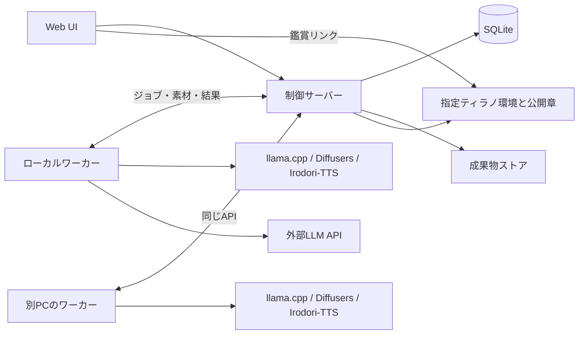

# AIオートドラマ 実装計画

2026-09-26 アプリ統合：現状を `327a84f` にコミット後、通常アプリで新規に承認・開始する制作を現行の `script_continuation_v1`（r14）へ接続した。章ごとのジョブへプロット・実台本・メモ・使用量をチェックポイントで引き継ぎ、既存の画像・音声生成、Script、Tyrano公開につなぐ。既存制作は保存済みの方式で継続する。[利用・実装記録](docs/setup/script-engine.md)を参照。以下にある「実験経路のみ」「通常UIは変更しない」は過去の実装範囲であり、この更新以降の新規制作には適用しない。

2026-09-26 r14修正：[r13の通しレビュー](docs/experiments/script-continuation-r13-review-20260926.md)を受け、最初の新行動を第1場面へ直接渡す接続、章境界の長い完全一致転載の除去、先の経験と後の利用を対にしたプロット下書き、用事と応答を起点にする会話を実装（prompt 14 / implementation 15 / contract revision 13）。詳細と小規模確認は[r14実装記録](docs/experiments/script-continuation-r14-implementation-20260926.md)。本文・台詞の分量目安とVN出力を維持し、3章通し生成の前に報告する。

2026-09-26 r13：[決着の準備と会話の具体性を改善する計画](docs/story-causality-and-dialogue-plan.md)の作劇部分を実装（prompt 13 / implementation 14 / contract revision 12）。実装前の状態はGit `461b98e`に保存した。同じプロット生成内の成立条件の下書き、会話の働きかけと返答、短い作例を使う。作劇のLLM工程・意味検査・再試行を増やさず、VN形式・各話の分量・32k/64k等への設定拡張を維持。[実装・確認記録](docs/experiments/script-continuation-r13-implementation-20260926.md)と、その後完遂した通し生成のレビューを参照。

2026-09-26 r12完了：[コンテキスト配分と章間接続の改善計画](docs/context-and-chapter-connection-plan.md)を実装し、同じ承認設定で3章を生成した。prompt 12 / implementation 13 / contract revision 11。[通しレビュー](docs/experiments/script-continuation-r12-review-20260926.md)に、章の継続・容量と残る作品品質の課題を記録した。

2026-09-26 方針の立ち戻り：[章の継続を優先する計画](docs/chapter-continuation-reset-plan.md)を最優先にする。M3型の直接的な場面計画へ、実台本の継承と当章の目的を加える。番号付き行動の配置表・照合を修正し続ける方向を中止し、同じ導入の再演と前章結果の消失への対策に絞る。直接場面計画を実装済み（prompt 11 / implementation 12 / contract revision 10）。第1章は直接計画、第2章以降は短い接続メモと実台本を使う。台本・演出・Tyrano出力と分量目安を維持。その後の実生成結果と次の改善は冒頭リンクを参照。

作成日：2026-09-22

2026-09-26 改訂実装：[会話とキャストを中心にした改善計画](docs/visual-novel-dialogue-cast-plan.md)の短い会話材料・工程別指示を実験経路へ実装（prompt 10 / implementation 11 / contract revision 9）。章配分2,048・章計画6,144・執筆8,192 tokensを既定とし、設定で変更可能。配置schemaを種別別に分け、文字位置での入力切断を撤去、plot-onlyを作品同一性から分離した。未送信失敗は修正回数から分け、具体的な検証例外を保存する。各話の本文・台詞量と台本・Tyrano出力は維持。unit 1,279件成功。通し生成は未実施。

2026-09-26 章配分修正：実験経路はprompt 9 / implementation 10 / contract revision 8。3出来事・3章の境界をコードで確定し、LLMからの重複番号で停止する問題を解消した。4個以上では出来事番号・総数を明示する。関連253テスト成功。その後プロット生成は完了したが、第1章計画は容量不足、暫定対応後は構造エラーで停止し、本文は未生成。上記再計画を優先する。

2026-09-26 revision 8：[会話とキャストを中心にした改善計画](docs/visual-novel-dialogue-cast-plan.md)を実験経路へ実装した。プロット前のキャスト設計、会話・日常の場面、1話ごとの分量方針を追加し、台本・Tyrano出力を維持する。ユーザー指定で検証設定を「境界線のエクリプス」へ変更。小規模生成は章配分の構造エラーで停止し、本文・通し生成は未実施。[検証記録](docs/experiments/script-continuation-r8-smoke-20260926.md)を参照。

2026-09-25 追記（revision 7）：3章PoCの出来事を順序付きの人物行動→結果へ統合し、章計画を場面への配分・実績に基づく調整へ変更した。通常の行動を再生成せず、場面執筆へ直接引き継ぐ。実験用 `script_continuation_v1` はprompt 7 / implementation 8 / contract revision 6。[実装・小規模確認記録](docs/experiments/script-continuation-r7-smoke-20260925.md)を参照。元の写真展設定で比較し、通し生成前に一度報告する。

2026-09-25 追記（revision 6）：人物の転機を出来事内の経験・行動として生成し、表示用の転機要約を機械的に導出する。人物の評価・推測を実際の選択から分離し、場面数は進展から決めるよう変更した。相談や和解など特定の解決手順を全作品へ固定しない。実験用 `script_continuation_v1`（prompt 6 / implementation 7 / contract revision 5）で、台本・演出・Tyrano出力を維持する。[実装・小規模確認記録](docs/experiments/script-continuation-r6-smoke-20260925.md)を参照。3章通し生成は別途行う。

2026-09-25 追記：3章固定の改善として、出来事の連鎖を先に作り、その同じ出来事を3章へ配分する方式を実験用 `script_continuation_v1` に実装した（prompt 5 / implementation 6 / contract revision 4）。人物本人の行動も出来事とともに章計画へ渡す。可変章数と長編の展開量の基準は後で検討する。小規模確認後、通し生成の前に報告する。

2026-09-25 改訂：[台本とティラノ出力を維持する章間改善計画](docs/story-first-poc-plan.md)を、未来は全体プロットからトップダウン、過去の事実は実台本からボトムアップで構成する方針へ修正した。全体プロットを具体的な試み・結果・選択まで詳細化し、章計画で実際の出発点と予定する到達点を接続する。詳細化・接続方式を実験用 `script_continuation_v1` に実装した（prompt 4 / implementation 5 / contract revision 3）。既存の `script_continuation_v1` は履歴と依頼の分離等を実装済みだが、物語品質の課題は残る。人物ID付き台本・発話分離・場面/人物/場所・演出・素材要求・Script・ティラノ出力を維持し、細かな意味検査や修復ループは復活させない。全工程Gemma単独・reasoningなしとし、Qwenは将来の論理整合性用途に限定する。小説形式へ変更した前案は撤回済み。小規模確認で一度報告し、通し生成はその後に実施する。通常UIと既存作品は変更せず、以下の過去計画より新計画を優先する。

2026-09-25追記：実作品で確認した章の導入反復・章間の因果不足・人物と素材の固定化を受け、[ストーリー制作ワークフローの再設計計画](docs/story-workflow-redesign.md)を追加した。第5〜8節の本編制作とM3/M4の物語品質に関する後続設計は、この再設計案を参照する。現行実装の技術的な検証記録と、物語品質の完成判定は区別する。計画作成後の実装指示を受け、現状をGit `386130d` に保存して本文PoCの実装・検証を開始した。既存作品の改稿は行わない。[実験記録](docs/experiments/story-workflow-poc.md)と[画像・音声なしの実行手順](docs/setup/story-debug.md)を参照。

再設計の実験方針：16kは最低限の目安とし、利用可能なコンテキスト長に応じて拡張できる設計とする。人物・場所の計画はまず現案をPoCで試し、結果に応じて変更する。初期検証用に画像・音声なしモードとロード/推論時間の計測を計画し、モデル常駐化は測定に応じた別の最適化として扱う。

この文書は、会話で決めた条件を実装へ落とすための計画案です。作成時点ではアプリの実装・モデルの実機検証は未着手でした。現在の環境と進捗は `DEVELOPMENT.md`、M0の実機検証結果は `docs/setup/m0.md` に記録します。

## 1. 実装する体験と範囲

ユーザーが世界観・主人公などを大雑把に指定すると、システムが設定、メインキャラの画像・声を作成する。ユーザーが世界観とメインキャラを承認すると、プロット、サブキャラ、脚本、背景、音声、演出を自動生成する。完成した章から鑑賞でき、鑑賞中も後続の章を生成する。最終的に中間JSONとティラノスクリプト用のソース・素材を出力する。

| 項目 | 計画に反映する条件 |
|---|---|
| 承認 | 世界観とメインキャラをまとめて指示し、世界観の確定、メインキャラの確定、本編の制作・鑑賞へ進む4段階のウィザード形式。キャスト承認後にSTEP4で本編制作を開始し、プロットや素材には追加承認を挟まない |
| キャラ作成 | 主人公以外のメインキャラは全自動でもよい。メインキャラは最大3人。気に入った項目の固定と部分再生成を用意する |
| 人物と関係性 | 人物単体の設定と人物間の関係性を分離する。関係性の指示は任意とし、LLMが全組み合わせを設定する（2人なら1組、3人なら3組） |
| キャラの台詞 | 自己紹介と代表的な台詞3つを生成する。自己紹介を基準音声に使い、その音声を元に任意の台詞をボイスクローンで試せる |
| 入力の自由度 | ジャンル・雰囲気は自由入力を必須とし候補は補助にする。キャラの名前・年齢層・性別・役割はすべて任意、別に自由記述欄を設ける |
| キャラ修正 | 自然言語で設定・外見・声それぞれを修正でき、全体を横断する修正もできる。立ち絵・音声だけのリテイクと区別し、固定項目は保持する |
| 確認画面 | 一つの完成した生成結果を先にHTMLとして読ませる。設定の追加入力は求めず、納得できない場合にのみ修正を開く。直接編集は修正ボタンから、自然言語の修正指示は結果の下に初期状態で閉じたアコーディオンとして置く |
| 発案 | 階層的な候補生成と乱数Toolを使用。乱数の使いどころをLLMが選び、実行と記録をプログラムが管理する |
| 章数・分量 | 章数はユーザー指定。分量感の目標は1話（1章）約10分。少なくともM3当時にオート約7分あったとユーザーが評価した内容量を確保する。2026-09-25の[M3台本比較](docs/experiments/m3-r7-length-comparison-20260925.md)を踏まえて各話の本文量・台詞量を計画し、無音検証と実音声付きの時間確認を区別する。厳密な尺への自動収束や待機による水増しは行わない |
| 台本品質 | シーン単位で会話・行動・反応を展開し、重要な出来事のダイジェスト化を防ぐ |
| 出力形式 | プロット・演出は構造化出力。台詞・地の文の生成はプレーンテキスト。中間脚本はアプリ側でJSON化する |
| 感情 | 場面の雰囲気、人物の内心、声に出す感情を区別する。TTS用絵文字は音声生成時に付与する |
| 立ち絵 | 各キャラの基準画像を生成して背景除去。クリックで拡大表示する。表情差分は今回の実装対象外 |
| 画像エンジン | Diffusers。Anima系を先行し、当初要件のSDXL系対応は後段で追加する |
| モデル取り込み | 検証可能な単体チェックポイントをモデル系列ごとに変換し、変換済みデータを再利用する |
| 音声 | Irodori-TTSによるボイスデザイン、基準音声からのクローン、台詞の感情指定 |
| LLM | ワーカー内蔵のllama.cppと外部API。用途別にモデル、パラメータ、文字列の推論レベルを設定する |
| 実行 | 一時停止・再開、アプリ再起動後の復旧、完成章の先行閲覧、複数PCワーカー |
| 出力先 | ティラノ本体のインストール先を設定。生成UIにプレイヤーへのリンクを表示。本体をAI生成ツールの配布物へ同梱しない。完成作品への実行エンジン同梱は別扱いとする |

今回後回しにする機能は、表情差分の自動生成、BGMの自動選択、固定カタログからの効果音・環境音の選択。これらがなくても作品を完成できる構造にする。

## 2. 計画上の仮定

- 初期の動作検証はWindowsを中心に行う。複数PCは同一LAN内を想定する。OS固有処理はランチャーとランタイム管理へ閉じ込める。
- 初期版は個人利用の単一ユーザー・単一制御サーバーを想定する。複数作品を保存できるが、最初は一作品ずつ生成する。
- 初期の作品は選択肢のない鑑賞型。分岐・複数エンディング・視聴中のユーザー操作による物語変更は拡張項目にする。
- 初期のGPU検証環境は実装開始時に確認する。特定のVRAM容量や生成速度を、この段階では要件として保証しない。
- 外部LLM APIは、まず設定可能な互換Chat APIを一系統実装する。互換性を実際に検証した接続先を対応対象とし、独自APIはアダプター追加で対応する。
- 生成環境とモデルの組み合わせは検証後に固定し、自動的に最新版へ追従しない。

## 3. 推奨する構成

| 部分 | 技術案 | 責務 |
|---|---|---|
| Web UI | [React + TypeScript](https://react.dev/learn/typescript) + [Vite](https://vite.dev/guide/) | 設定入力、初期承認、進捗、モデル・ワーカー管理、任意の編集、閲覧リンク |
| 制御サーバー | Python + FastAPI | API、設定、承認、生成フロー、ジョブ割り当て、検証、公開判定、書き出し |
| メタデータ | SQLite + マイグレーション | 作品、版、ジョブ、依存関係、試行履歴、ワーカー、モデル登録情報 |
| 成果物 | 制御PCのファイルストア | JSON、原文、画像、音声、manifest、生成ログを保存 |
| ワーカー | Pythonの常駐サービス | 能力申告、ジョブ取得、素材取得、各エンジンの実行、成果物返却 |
| LLMランタイム | llama.cppの同梱実行ファイル | ローカル推論。必要時に自動起動・停止する |
| 画像・音声ランタイム | Diffusers / Irodori-TTSの独立環境・プロセス | Python依存とGPUメモリのライフサイクルを分離する |
| プレイヤー | ユーザー指定のティラノ環境 | 生成した章と素材を再生する |

「内蔵」は、ユーザーが各エンジンを手動で起動する必要がないことを意味する。制御サーバーと全推論ライブラリを同じプロセスへ詰め込むことはしない。



制御サーバーがDBと成果物の採用を一元管理する。ワーカーからSQLiteを直接開かず、共有フォルダー上にDBを置かない。SQLite WALは複数ホストからネットワークファイルシステム越しに使う構成に適さないため、LAN接続もHTTP APIで行う。[SQLite公式文書](https://sqlite.org/wal.html)

ジョブの永続化・再試行・復旧は専用のジョブ管理で扱う。HTTPリクエストの生存期間やFastAPIのBackgroundTasksだけに生成処理を依存させない。FastAPI公式も重い計算には別プロセス等の仕組みを検討するよう案内している。[FastAPI公式文書](https://fastapi.tiangolo.com/tutorial/background-tasks/)

初期版ではRedis等の追加サーバーを必須にせず、単一スケジューラーがDBトランザクションでジョブを確保する。負荷が増えた段階でジョブストアを交換できる境界を設ける。

## 4. 最初に定義するデータ

### 4.1 管理データ

| データ | 最低限保持する内容 |
|---|---|
| project | ユーザー指示、章数、制作方針、現在の設定版 |
| generation_run | 対象設定版、物語の版系列ID、生成方針、開始・停止状態、予算 |
| approval | 承認した世界観・メインキャラ・画像・基準音声の版と日時 |
| generation_profile | 用途、プロバイダー、モデル、パラメータ、推論レベル、テンプレート版 |
| model_registration | 系列、モデルのハッシュ、各ワーカーの所在、必要部品、変換情報、推奨設定、対応能力 |
| job / job_dependency | 種類、入力成果物、前提ジョブ、設定スナップショット、優先度、状態、再試行上限 |
| job_attempt | 実行ワーカー、試行番号、リースID・期限、エラー種別、開始・終了、使用量 |
| artifact | 論理ID、内容の版、種類、ハッシュ、保存先、生成元、schema版、モデル・seed等の来歴 |
| chapter_build | 章、採用脚本版、前章の脚本版・終了状態ハッシュ、参照素材のmanifest、検査結果、ティラノ生成物、公開状態 |
| worker | 能力、登録モデル、ロード中モデル、空き資源、最終通信時刻 |

画像・音声などの大きなデータはファイルとして保持し、DBには参照を保存する。最初から版とschema_versionを付ける。APIキーは通常の生成設定・エクスポート・ログに含めず、接続用の秘密情報として分離する。

### 4.2 作品データ

- World：世界の固定ルール、場所、組織、用語。
- Character：固定ID、外見、欲求、弱点、価値観、口調、呼称、基準画像、基準音声。
- StoryOutline：結末、人物の変化、章の役割、伏線と回収先。
- StoryState：場所、関係性、所持品、負傷、約束、人物ごとの知識、内面感情。
- ScenePlan：開始状態、登場人物、各人の目的、描くべき出来事、終了時の変化、場所、時間帯、雰囲気。
- SceneText：プレーンテキストの原文、段落・発話への対応情報、改稿履歴。
- Script：発話・地の文・演出を並べた中間JSON。
- AssetManifest：脚本が要求する立ち絵・背景・音声と、それぞれの採用版。

固定設定と進行状態を分ける。人物Aだけが知っている秘密を人物Bが話してしまう問題は、人物ごとの知識と公開時点を参照して検査する。

### 4.3 中間脚本の方針

発話には、安定したID、話者ID、表示本文、読み上げ用本文、voice_emotion、任意のdelivery、音声成果物IDを保持する。演出イベントはその発話IDに対して「前」「開始時」「終了後」などの位置を指定する。章全体の秒単位タイムラインは必須にしない。

ここでJSONに格納することと、LLMに本文をJSONで生成させることは分ける。原文はプレーンテキストで保存し、構造化工程で話者・段落・演出を対応付ける。対応付け後、表示対象本文が原文から欠落・重複・意図せず改変されていないことを検証する。

原文の区切りは、話者を明示する軽いテキスト書式を試す。自由な段落が混ざる場合は構造化抽出を追加する。文字位置や本文の再入力をLLMだけに任せず、抽出した原文断片をプログラムで照合してIDを発行する。対応付けが失敗した場合は、その工程を再試行し、原文を勝手に書き換えない。

演出は実装済みの列挙型から選ばせる。初期対応は背景切替、登退場、左右中央の立ち位置、発話者強調、暗転、間。任意のJavaScriptやティラノタグをLLMから受け取って実行しない。

## 5. 生成パイプライン

| 工程 | 主な処理 | 出力・次へ進む条件 |
|---|---|---|
| A. 入力補完 | 世界観、主人公、ジャンル、雰囲気、視点、章数、避けたい展開を補完 | 制作方針と未固定項目 |
| B. 階層的な発案 | 上位のテーマから世界の制約を提案し、ユーザーが修正・確定。その世界でメインキャラの任意指示を受け、人物の欲求や葛藤を掘り下げる。乱数Toolを利用 | 世界観の確定、キャラ候補、採否、設定 |
| C. メインキャラ素材 | 外見説明から画像生成・背景除去。声の説明から基準音声を生成 | 基準立ち絵、試聴用音声、設定一覧 |
| D. 初期承認 | 先に確定した世界観を参照し、メインキャラ・設定・基準画像・声を確認・修正 | 最終承認版を固定。ここから自動進行 |
| E. 全体設計 | 結末、章ごとの役割、主要人物の変化、伏線を設計。必要なサブキャラを生成 | 全体プロットとキャスト・場所の一覧 |
| F. 章・シーン設計 | 各シーンの開始状態、目的、対立、具体的な出来事、終了状態を設計 | ScenePlan |
| G. 本文生成 | シーン単位にプレーンテキストを生成。直前の本文と関連設定を参照 | SceneText |
| H. 構造化・内容検査 | 発話者・地の文・演出・感情を対応付け、整合性とダイジェスト化を検査 | 採用脚本、状態更新、必要素材一覧 |
| I. 素材生成 | サブキャラ素材、背景、台詞音声を必要順に生成。共通素材を再利用 | 画像・音声成果物 |
| J. 章の組み立て | 参照整合、再生可能性を検証し、JSONからティラノ用ソースへ変換 | chapter_buildとmanifest |
| K. 公開 | 検証済みの章を鑑賞画面へ公開 | 閲覧可能。後続章の生成は継続 |

2026-09-22のM2完了時点では、生成結果が毎回似た方向へ偏ることを継続課題として残す。現行にも「上位方針の候補・採用→具体案の候補・採用→完成結果」の階層はあるが、多様性が十分に得られるとは限らない。今後、要素ごとに掘り下げる階層型ブレインストーミングや、生成済みメインキャラと明確に異なる方向性を求める処理を検討する。追加呼び出しによる生成時間の増加があるため、強化の実装は後続調整とし、M2完了の条件には戻さない。

重い候補探索・差別化処理の対象はメインキャラとし、サブキャラへ一律には適用しない。サブキャラは登場場面・役割に必要な設定を軽量に生成する。差別化のための既存キャスト参照は人物設定の発案で行い、画像プロンプト変換には対象本人だけを渡す境界を維持する。参考実装は `private/reference/wizmy/src/core/character_generation/`、具体的な参照箇所と注意点は [M2の引継ぎ](docs/setup/m2.md#m2完了時の引継ぎと継続課題) に記録する。

実際の実行は一本の直列処理に固定しない。内部検査を通過した全体プロットから共通背景を先行生成するなど、確定した入力を持つ素材処理は並行してよい。後続の本文は、先行する採用脚本とその状態更新に依存させる。

章の脚本が内部検査を通れば、素材完成を待たずに次章の本文生成を開始できる。その場合も依存する脚本版を固定し、前章を改稿したら後続の依存関係を無効化する。公開済みの章がある場合、その採用版を物語上の正とする。

## 6. ダイジェスト化を防ぐ実装

1. 全体プロットとシーン本文に別の生成プロファイル・プロンプトを用意する。
2. ScenePlanに「画面内の会話・行動として描くべき出来事」を指定する。
3. 本文はシーン単位で生成し、出力上限に収めるため章全体を要約させない。
4. 出力上限で途切れた場合は未完了として扱い、接続点を確認して続きを生成する。途切れた文章を完成稿として採用しない。
5. レビューは文字数よりも出来事の展開を見る。「説得して和解した」で終わっていれば、反発、応答、態度が変わる契機をその場面へ追加する。
6. 長すぎる傾向には、同じ説明・同義の応答・不要な寄り道の削除で対応する。規定時間に合わせるための短縮や水増しはしない。

場面転換、過去の説明、重要でない移動などの短い要約まで禁止しない。必要なところを具体的に描くことを評価する。章のシーン数や新規登場人物数には柔らかい制作予算を設けるが、分量を合わせるためだけに増やさない。

受け入れ用の脚本例として「対立→反発→説得→判断の変化」を含むシーンを用意する。自動検査の誤判定も開発中に確認し、作品生成時の追加承認にはしない。

## 7. LLM・画像・音声の実装境界

### 7.1 LLM

用途別プロファイルは、世界観、キャラ、全体プロット、シーン設計、本文、構造化、演出、品質レビュー、画像プロンプトで持つ。初期は同じモデルを既定値として共有し、必要な用途だけ上書きする。

この分離は、用途ごとに生成の多様性・品質と待ち時間を調整するための要件である。特にメインキャラとサブキャラで生成戦略・探索量を分け、reasoningの有無・レベルも用途ごとに選べる設計とする。候補数・段階数などの発案戦略と、温度・出力上限・推論レベルなどのLLMパラメータは区別し、共通既定値から必要な用途だけ変更できるようにする。実装時には呼び出し回数、生成時間、利用可能なトークン使用量と出力品質を比較し、推論や段階の追加を一律の既定動作にはしない。

現行M2は `config/m2-generation.json` の共通LLM設定を使い、固定ローカルランタイムは `reasoning_level: none` のみ対応している。用途別設定画面・用途別の設定解決・reasoning切り替えは未実装で、今回の完了後も後続対応とする。設定キーの存在だけで切り替え対応済みとは扱わず、後続実装で対応能力の検証、実リクエストへの変換、生成条件の保存まで揃える。

プロファイルに保持するのは、provider、model_id、temperature等の対応パラメータ、最大出力、context方針、reasoning_levelという文字列、プロンプト版。未指定とnoneは区別する。未指定は接続先の既定値、noneは対応モデルで推論を無効化する要求とする。

llama.cppは使用ビルドとチャットテンプレートを検証し、reasoning_levelを実際のリクエストへ変換する。現行の公式サーバー文書ではreasoning_effortのnoneとreasoning_formatのnoneは別の意味を持つため、混同しない。[llama.cpp公式サーバー仕様](https://github.com/ggml-org/llama.cpp/blob/master/tools/server/README.md)

Tool呼び出し、構造化出力、推論の切り替え、コンテキスト上限は能力情報として保持し、用途と合わない設定を実行前に検出する。本文生成では構造化出力を使用しない。

乱数Toolは整数、一様選択、重み付き選択、重複なし選択を実装する。作品・対象ID・用途・試行に基づくシードとTool呼び出し結果を保存する。同じジョブの通信再試行では同じ抽選結果を再利用し、意図した別案生成では新しい試行を作る。LLMのTool呼び出し回数には上限を設ける。

### 7.2 画像

共通の画像要求データは、人物の可視特徴、場所、構図、画風、光、用途、画像サイズとする。モデル別のプロンプト変換器が自然言語やタグへ変換する。

Animaは自然言語とタグの併用を前提にしたプロファイルを用意する。Base・Aesthetic・Turboや派生モデルごとに推奨設定を分離する。Animaの公式説明はこれらの入力方式とバージョン別の設定差を案内している。[Anima公式モデルカード](https://huggingface.co/circlestone-labs/Anima)

品質タグ（ポジティブの接頭辞）とネガティブプロンプトは、将来のモデル設定画面でモデルごとに編集できるようにする。M2では先行して `config/m2-generation.json` の `image.positive_prompt_prefix` / `image.negative_prompt` で管理し、LLMが作成した人物描写へ生成直前に適用する。実効プロンプトとモデル設定は生成記録に残し、同じジョブの再試行では保存した設定を保持する。

M2の画像プロンプト変換v4では、対象キャラ一人の確定済み外見を、体格・肌・髪・瞳・衣装・小物などの可視特徴へ整理する。「透き通るような白い肌」のような比喩を物理的な透明性へ直訳せず、明示された半透明の身体や特殊な肌色は維持する。未指定の特徴を補完せず、最低語数を設けない。共通の構図はコード側、品質タグ・ネガティブはモデル設定側で付加し、変換した特徴と実効プロンプトを画像ごとに保存する。確認画面には立ち絵の下に折り畳みの「生成の詳細」を設け、その画像で実際に使用したプロンプト・ネガティブ・seed等を表示する。追加の入力・承認工程は設けず、将来のモデル設定画面で編集できる方針を維持する。

単体Animaチェックポイントの取り込みは、同じ構造の通常精度モデルから始める。公式変換スクリプトを基に、キー・形状・必要部品を確認し、変換後の再読み込みと試験生成を行う。元ファイルと変換結果のハッシュ、変換器の版を記録する。Qwen3エンコーダー、VAE、トークナイザーもモデル登録の依存部品として管理する。[公式変換スクリプト](https://github.com/huggingface/diffusers/blob/main/scripts/convert_anima_to_diffusers.py)

変換処理はモデル登録時のジョブとして実行し、作品を生成するたびに変換しない。LoRA・量子化形式・構造改変版は通常チェックポイントと別の対応項目にする。汎用のsafetensors対応という表現で無制限の互換性を約束しない。

背景除去も専用の処理として切り出す。候補モデルは初期技術検証でアニメ絵の髪・小物を確認して選定する。出力の透過、外接範囲、画像サイズ、基準位置を検査する。表情差分は生成しない。

SDXL系追加時は、同じ画像要求データをタグ中心のプロンプトへ変換する経路と、SDXL用のチェックポイント取り込み経路を追加する。対応は実際に検証したモデル構成から広げる。[Diffusersの単体ファイル対応](https://huggingface.co/docs/diffusers/api/loaders/single_file)

### 7.3 音声・感情

キャラの基準音声をボイスデザインで作成し、採用した音声を後続のクローンで再利用する。声の参照を毎回作り直さない。ナレーターの声と読み上げ範囲も作品設定に保持する。

感情は次のように扱う。

| データ | 更新単位 | 用途 |
|---|---|---|
| scene_mood | シーン | 雰囲気、演出、将来のBGM |
| character_state.emotion | 状態が変わる箇所 | 内心と行動の一貫性 |
| voice_emotion / delivery | 発話 | 声に出す感情と話し方 |

Irodori用アダプターが声の感情を絵文字等へ変換する。強度は必要になった時点で弱・中・強の演出上の区分を追加し、精密な数値制御として扱わない。未対応の指定は既定の変換規則か通常音声へ落とす。絵文字とcaptionの使用範囲は採用モデルで検証する。[Irodori-TTS公式README](https://github.com/Aratako/Irodori-TTS)

表示本文、固有名詞の読みを補正した読み上げ本文、実際にTTSへ渡した入力を区別して保存する。音声は意味と演技がまとまる発話を生成単位とし、文字数だけで機械的に細切れにしない。

音声ファイルのデコード、無音、途中切れや読みの問題を確認する処理は、再生品質のために設ける。章の総再生時間を測って10分に合わせる処理には使わない。TTSが内部で必要とする音声長推定と、作品の尺合わせも区別する。

## 8. ジョブ・停止・公開・再生成

### 8.1 ジョブの状態と採用

基本状態は、blocked、queued、running、succeeded、failed、cancelled、staleとする。プロジェクトの停止状態は別に持ち、待機ジョブの内容を失わない。

実行中のジョブには期限付きのリースと試行IDを付ける。ワーカーは更新を送り、制御サーバーは期限切れを検出して再割り当てする。古い試行から遅れて届いた結果は自動採用しない。

成果物は一時ファイルへ保存し、整合検査後に確定する。DB上の採用は、対象の入力版と試行がまだ有効か確認して一度だけ行う。ファイル確定とDB更新の間で落ちた場合に備え、未登録ファイルと欠損参照を起動時に検出する。

再試行時は、通信失敗、モデル実行失敗、構造不正、内容不備を分ける。外部APIで送信後の応答だけが失われた場合は、再実行による重複処理を区別して記録する。

再試行・修正回数と一作品の生成予算には上限を設定する。上限到達後の軽微な品質指摘は制作画面に記録し、任意の演出は簡略化できる。原文対応不正、解消しない重大な設定矛盾、必須素材の欠落などは当該章を失敗状態にし、その結果に依存する処理を止める。完成済み章の閲覧と独立した処理は維持する。失敗の通知と再実行操作は用意するが、新たな創作内容の承認工程にはしない。

### 8.2 一時停止・再開

- 通常停止：新しいジョブの割り当てを止め、実行中のジョブを終了・保存して停止する。
- 即時中断：中断可能な実行を終了し、未完成ジョブを再開時に再実行する。推論内部の任意の時点からの復元は初期版で保証しない。
- 復旧：DBと成果物を読み直し、完成済みジョブは再利用する。停止時のGPU常駐維持・解放はランタイム設定で選べる構造にする。

生成停止とプレイヤーの一時停止は別操作にする。生成を止めても公開済み章を閲覧できる。

### 8.3 章公開と閲覧

本文・演出・必要素材・ティラノ生成物の参照検査が完了した章を、manifest単位で一括公開する。制作画面では本文完成と閲覧可能を区別する。

公開した版のファイルを上書きしない。プレイヤーは開始した章のbuild_idを固定する。新しい版の採用は章の開始時など明示した境界で行う。

章manifestには依存する前章の採用脚本版と終了StoryStateのハッシュを保存し、公開時・次章遷移時に物語の版系列との一致を確認する。第1章の改稿版から改稿前の第2章へ進ませない。新版の後続が未再検証なら待機し、旧版で開始した閲覧セッションは旧版の系列を維持する。

未完成の次章への遷移は待機画面へ誘導し、現在のセーブや再生位置を保持する。生成完了した次章を取得する仕組みを作品側に設ける。静的エクスポートでは、書き出し時点で揃った章と明示的な終端を含める。

セーブは作品版・chapter_build・イベントIDと結び付ける。再生成された章へ旧セーブを無条件で適用しない。旧版を保持して再開するか、修正版の章頭から開始する。

### 8.4 変更の伝播

| 変更 | 主な再生成対象 |
|---|---|
| 声の基準音声 | 該当人物の音声、参照する章build |
| 読み辞書 | 該当語を読む発話の音声、参照する章build |
| 背景の画像だけ | 背景成果物、参照する章build |
| 画像生成プロファイル | 対象画像、新しい画像を採用する章build |
| 台詞 | 構造化・内容検査、関連音声・演出、必要なら後続の物語状態 |
| 世界観・人物の固定設定 | 関連するプロット・本文・素材・後続状態の再検証 |

再生成操作の前に対象範囲を表示し、ユーザーの実行操作で開始する。通常の自動生成に別の承認工程を追加するものではない。

## 9. 生成順序と複数PC

最初のスケジューラーは、依存関係が解決している仕事から次の優先順で選ぶ。

1. 第1章を閲覧可能にするために必要な仕事。
2. 次に読む章を完成させるために必要な仕事。
3. ロード済みのモデルで実行できる仕事。
4. 先の章や共通素材を準備する仕事。

未視聴の完成済み章が1〜2章ある状態を目標に、余裕があるときは同じモデルの仕事をまとめる。これは生成スケジュール上の目標であり、再生より速く生成できることを保証するものではない。閲覧開始優先と一括完成優先を設定で切り替えられるようにする。

1台のGPUでは、モデルを解放してから次のランタイムをロードする。複数PCでは、対応モデル、必要メモリ、ロード中モデル、空き状態を見て割り当てる。モデル切替・ジョブ実行にかかる時間は最適化のために記録してよいが、章の鑑賞時間を調整する指標にはしない。

ワーカーは初回に登録用トークンで接続し、以後は自身のジョブと必要素材だけを取得する。モデル本体は最初は各PCへ登録し、共通モデルIDとハッシュで同一性を確認する。画像・音声等の素材はハッシュでキャッシュし、毎回転送しない。別PCの絶対パスをそのまま使わない。

## 10. ティラノ連携とWeb UI

### 10.1 ティラノ

制御PCにあるティラノのインストール先を設定する。必要ファイルと対応バージョンを検出し、ユーザーの環境を参照して作品ごとのプレイヤーURLを生成する。複数PC利用時も、どのPC上のパスかを明確にする。

作品データは生成物用の領域に配置する。指定インストール先の原本を直接書き換えず、配信時に参照するか、ローカルの作品用作業領域で組み合わせる方式を技術検証で決める。

配布条件の確認（2026-09-22）：[公式の作品出力手順](https://tyrano.jp/usage/studio/export)と[スタジオの利用規約](https://tyrano.jp/studio/)は、制作したゲームのパッケージ化・配布を認めている。完成作品に実行エンジンを含めて配布することと、AI生成ツールへ汎用の実行エンジンを同梱して配布することを区別する。後者を許す明示的な例外は確認できず、[ティラノスクリプトのLICENCE.txt](https://github.com/ShikemokuMK/tyranoscript/blob/master/LICENCE.txt)は本体の再配布を禁止し、該当時の事前相談を求めている。初期実装はユーザー指定の環境を利用する。完成作品のパッケージ出力は、採用バージョンの規約・必要なクレジットを保持する前提で別途追加可能とし、初期の脚本・素材出力には必須としない。

中間JSONからの変換は決定的なコンパイラーとして実装する。話者、背景、音声、登退場等を対応タグへ変換し、本文の特殊文字を適切に扱う。LLMに最終タグ列を書かせない。

エクスポートには、シナリオ、生成画像・音声、中間JSON、manifest、再編集に必要な公開設定を含める。APIキーやローカル絶対パスを除外する。ティラノ本体は含めない。[ティラノ公式README](https://github.com/ShikemokuMK/tyranoscript)

### 10.2 画面

| 画面 | 内容 |
|---|---|
| 環境設定 | ティラノ場所、モデル登録、外部API、用途別プロファイル、ワーカー |
| STEP1：世界観とメインキャラの指示 | 世界観・方向性、ジャンル・雰囲気、任意の作品名・章数・こだわり、最大3人の人物像・関係性を同じ画面で入力。人物の名前・年齢層・性別・役割は任意 |
| STEP2：世界観の確認・確定 | 完成した世界観を見出し・本文などのHTMLで表示。修正ボタンからのみ直接編集し、必要な場合に結果下の自然言語修正欄を開く。確定してからキャラ設定へ進む |
| STEP3：メインキャラの確認・確定 | 人物設定・立ち絵・声の生成結果を先に表示。各設定の修正ボタンで編集し、結果下のアコーディオンから全体・部分の自然言語修正を行う。項目固定、立ち絵・音声のみのリテイク、最終承認 |
| STEP4：本編の制作・鑑賞 | 制作工程と失敗時の再試行、任意に開くプロット、公開済み章のプレイヤーリンク、脚本・素材の書き出し。後続の章別状態・次章待機もこの画面で扱う |

生成履歴と承認の記録は各画面末尾の閉じた折りたたみに置く。進行中・失敗中の初期設定生成は作業画面に表示し、再試行できる。承認後はSTEP4へ進み、設定を後から編集しても既存の完成章を鑑賞できる。

STEP4のプロットは折りたたみを開いた場合だけ取得し、全章の題名・役割・要約、結末、人物変化、伏線を人名付きで表示する。プロット・本文が検査を通って採用されるまでは待機表示とし、開いたままなら採用後に更新する。プレイヤーの未読情報非表示は維持する。

制作状況はSSE等のイベント配信で更新し、再接続時にはサーバーの状態を再取得する。画面を閉じても生成は制御サーバーで継続する。

鑑賞画面には未読章の題名・プロット・生成ログを出さない。再生、オート送り、途中保存、音声付きバックログ、文字サイズ、音量を検証対象にする。ティラノの既存機能を利用できる部分は利用する。

## 11. 実装順序と完成条件

### M0：技術の接続確認

実装内容：llama.cpp、外部LLM API、Anima公式Diffusers版、代表的な単体チェックポイントの変換、Irodoriの声デザイン→クローン、背景除去、ティラノ再生を小さく接続する。画像→TTS→LLMと切り替えたときのモデル解放も確認する。

2026-09-22のユーザー指定により、今回はローカルLLMを先に検証し、外部LLM APIの設定・接続検証は後続作業へ延期する。

完成条件：代表設定で本文・画像・音声を生成し、指定ティラノ環境で一場面を再生できる。ランタイムの依存バージョンとモデルを固定した手順が残る。

この段階で決めるもの：GPU対応範囲、Python環境の分割、背景除去モデル、Diffusersの固定版またはcommit、Irodoriチェックポイント、ティラノ配信方式。生成速度やVRAM不足を憶測で決めない。

### M1：基盤・保存・最小の出力

実装内容：リポジトリ構成、データschema、DBマイグレーション、成果物ストア、永続ジョブ、ローカルワーカー共通API、最小Web UI、中間JSON→ティラノ変換器。固定の短い脚本と素材でもよいので出力を先に通す。

完成条件：ジョブと成果物が再起動後も残り、固定の中間JSONから再現可能にティラノソースを作れる。中途ファイルを完成扱いしない。

2026-09-22：M1実装済み。SQLiteマイグレーション、版付き中間脚本、成果物ストア、永続ジョブと試行・依存管理、ローカルHTTPワーカー、最小Web UI、固定脚本からのティラノソースZIP出力を追加した。使い方と完成条件の検証は `docs/setup/m1.md`、保存境界は `docs/architecture/m1.md` に記録する。

### M2：初期設定と承認

2026-09-22：実生成との接続に先立ちUIプレビューを作成。その後、ユーザー指定により、世界観の指示→確認・確定→メインキャラの任意入力→確認・自然言語修正の4段階へ変更した。固定ジャンルの候補切替を廃止し、自由入力・修正指示の保存・キャラ全体と部分の修正・素材のみリテイクを用意した。UI設計と当時の検証記録は `docs/setup/m2-ui.md` を参照。

2026-09-23：世界観が未提示の人物設定を先に決める不整合を減らすため、入力を統合し「世界観とメインキャラを指示 → 世界観を確定 → メインキャラを確定」の初期設定3段階へ変更した。世界観は最初から人物・関係性の指示も参照する。人物生成は世界観の確定後に開始し、世界観と人物を同時に確定する方式には戻さない。実モデルで統合入力から世界観・人物設定・立ち絵・声まで確認し、Pythonテスト330件、画面の状態遷移テスト6件、Ruff、TypeScript・Viteビルドが成功した。

制作画面の整理：初期設定にSTEP4「本編を制作・鑑賞」を加えた4段階にし、承認後はSTEP4へ移る。制作状況・鑑賞・書き出しをSTEP4へ分離し、生成履歴と承認の記録は各画面末尾の折りたたみに移した。既存の制作済み作品は、設定を再編集した後もSTEP4から鑑賞できる。

確認画面のUIは、完成した結果のHTML表示を先頭に置く構成へ変更した。直接編集は修正ボタンでのみ開き、自然言語の修正指示は結果下の初期状態で閉じたアコーディオンに置く。外観確認用の結果サンプルは通常の下書きと分離する。

実装内容：階層的な発案、乱数Tool、世界観・メインキャラ、基準立ち絵と声、項目固定・部分再生成、初期承認。

完成条件：短いユーザー指示から候補を作れ、承認版が記録される。固定済みの画像や設定を保持したまま別項目を再生成できる。承認前に本編の自動制作を開始しない。

2026-09-22：M2を実装し、ローカル実モデルで完成条件を確認した。Gemmaの階層候補・採用・乱数Tool、Anima＋isnet-animeの透過立ち絵、Irodoriの基準音声を永続ジョブへ接続。入力と結果を分離し、直接編集・自然言語修正・固定保護・素材リテイク・承認スナップショットを実装した。実機では世界観→人物→画像→音声→外見固定後の全体修正→承認を約203秒で完了し、固定画像の版の維持と音声の版更新を確認した。別のブラウザー操作による生成で乱数Toolの実呼び出し・採用・記録も確認。再起動後も成果物と承認版を復元できる。自動テスト112件、Ruff、TypeScript・Viteビルドが成功。使い方と記録は `docs/setup/m2.md`。本編制作はM3、外部LLM APIは既定どおり後続作業とする。

2026-09-22（追加要件）：メインキャラを最大3人に制限し、人物単体の設定と全組み合わせの関係性を分離した。関係性は任意の指示を受け、未指定の組もLLMが生成する。自己紹介と代表台詞3つを生成し、自己紹介を基準音声に使用。任意台詞のボイスクローンと試聴履歴、立ち絵のクリック拡大、生成中の完成済みキャラ閲覧を追加した。実モデル3人・3組・クローン生成、ブラウザー操作、再起動後の復元と既存作品の保持を確認。自動テスト161件、Ruff、TypeScript・Viteビルドが成功。追加契約は `docs/architecture/m2-cast-contract.md`。

2026-09-22（完了判断）：ユーザー確認によりM2は一旦完了とする。関係性のID順序、画像プロンプトの人物取り違え、Animaの品質タグ・ネガティブ、外見の比喩の変換を修正済みで、画像ごとの生成詳細表示も追加した。最終の軽量テスト193件、Ruff、TypeScript・Viteビルドと実モデル比較を確認済み。生成結果の類似傾向、多様性と生成時間の調整、用途別LLM設定は未解決の継続課題として引き継ぎ、今回のセッションでは追加実装しない。M2完了は生成品質の調整終了を意味しない。

### M3：一章の自動制作を完成

実装内容：全体プロット、サブキャラ、章・シーン設計、プレーンテキスト本文、構造化・演出・感情、内容検査、背景・音声、章build、プレイヤーリンク。

サブキャラ生成では軽量な経路を用意し、メインキャラ向けの多段発案をそのまま全員へ適用しない。将来の用途別LLMプロファイルを選択できる境界を保ち、用途別設定UIや多様性強化を先に完成させることはM3着手の前提にしない。

完成条件：初期承認後、追加承認なしで一章を最後まで生成・再生・書き出しできる。重要場面が具体的な会話と行動で展開し、表情差分なしで成立する。本文と話者・素材の対応が検証を通る。

ここを最初の利用可能版とする。複数PCや全画像系列の対応を待たずに、作品としての問題を確認できる。

2026-09-23：M3を実装し、ローカル実モデルで第1章の制作・再生・書き出しを確認した。承認版から全体プロット、軽量サブキャラ、シーン設計、原文本文、演出・感情・内容レビュー、背景と台詞音声を生成する。原文の文字位置・本文・話者・重要イベントの根拠と素材を検査し、不変の章buildを公開する。Webから進捗・失敗工程の再試行・鑑賞・ZIP書き出しを利用できる。鑑賞ではオート、途中保存・復元、既読本文と音声再試聴、文字サイズ・音量に対応した。

実機では既存承認版の複製を使い、3シーン・73発話・44台詞音声、2背景、2サブキャラを51ジョブで制作した。メインキャラの承認済み素材を再利用し、49素材を含むZIPを公開。ブラウザーで章末まで自動再生し、73発話と44音声の既読表示、途中保存からの復元を確認した。再起動後も同じ公開buildとZIPを保持し、現行コードからの再コンパイルでもZIP全体が一致する。自動テスト275件、Ruff、TypeScript・Viteビルドが成功。使い方と実生成記録は `docs/setup/m3.md`、制作・公開境界は `docs/architecture/m3.md`。第2章以降の継続生成はM4、生成結果の多様性・音声表現などの品質調整は継続課題とする。

同日の別作品で発生した人物IDの誤記・登場人物外の話者と、内容レビューの根拠ID漏れも修正した。形式や根拠の不備だけで本文を作り直さない再試行を追加し、保存済み3シーンを維持して48ジョブを完了、79発話・43台詞音声の第1章を公開した。修正後は自動テスト297件とRuffが成功している。

M3追加修正（2026-09-23）：人間の台詞に括弧付きト書きを残さず、動作・表情・無言の意思表示を自然な地の文へ、純粋な声の指示を非表示の演技情報へ分離する工程を追加した。実際に発声する括弧表現は保持し、原文・分類・文字位置の対応を記録する。非発話の犬の動作も地の文とし、TTSへ送らない。既存作品「陽だまりの食卓と、しっぽの足音」を実モデルで修復し、21音声を再生成、14音声と画像を再利用、動作だけの3音声を対象から除外した。旧版を保持して新しい章buildを公開した。詳細は `docs/setup/m3.md`。

M3表示調整（2026-09-23）：低頭身キャラを個別に拡大して頭頂を揃える方式から、設定身長を用いた人型共通の倍率・足元配置へ変更した。最短キャラの肩まで見える範囲で全体の構図を調整し、元の頭身を保つ。メイン・サブキャラに表示用の身長と体の形を追加し、M2確認画面で編集可能にした。既存作品の表示設定は承認版と別に保存し、本文・画像・音声を維持して第3版を公開した。Python498件、画面6件、Ruff、TypeScript・Viteビルド、実ローカルLLMとブラウザー表示を確認した。詳細は `docs/setup/m3.md`。

M3鑑賞操作（2026-09-23）：メッセージウィンドウのクリック・Enterで、文字表示中は全文表示し、全文表示後は台詞音声を止めて次へ進めるようにした。「バックログ」は文字表示中・音声再生中にも開け、全文表示済みの発話だけを確認・再試聴できる。履歴中は本編音声と先への進行を一時停止し、閉じると再開する。途中保存・復元は表示・音声・演出待機の完了後に限定したまま、復元時の未読本文の混入と古い保留操作を防ぐ。Python540件が成功し、実ブラウザーでも全文表示から音声途中送りへの操作を確認した。完成済み4作品を再組み立てで更新し、元画像・音声・原文と旧ZIPのSHA256保持、新規生成ジョブ0件を確認した。公開版と検査記録は `docs/setup/m3.md`。

変更履歴（2026-09-24）：全STEP下部の「変更履歴・元に戻す」から、操作単位で保存した作品全体の状態を復元できるようにした。設定と素材・公開buildの参照を保存し、履歴登録・復元による画像・音声・ZIPの複製や再生成は行わない。M2とM3の操作を独立してまとめ、進捗ジョブごとには履歴を増やさない。復元も新しい履歴として追記し、後の履歴と旧公開版URLを保持する。既存作品は導入時点のbaselineから記録し、未完成版の復元では制作を凍結して自動再開しない。競合検出と生成中の復元禁止を設け、draft.revisionは巻き戻さない。利用には制御サーバーの再起動が必要。使い方・保存容量・制限は `docs/setup/history.md`、保存構造とAPIは `docs/architecture/history.md`。

### M4：複数章・継続生成・復旧

実装内容：状態引き継ぎ、伏線・知識管理、後続生成、章単位公開、通常停止・即時中断、再試行、制作画面、次章待機、閲覧セーブ。

完成条件：第1章を閲覧中に後続章を生成できる。停止・再起動後に完成済み成果物を再生成しない。閲覧中の章は変化せず、次章未完成時も再生位置を保持できる。

実装完了（2026-09-24）：指定章数の継続生成、章ごとの採用・公開、StoryStateによる人物別知識・伏線・状態の引き継ぎ、前章本文版と状態ハッシュの固定を実装した。本文採用後は前章の素材完成を待たずに後章の本文ジョブを登録でき、同一の共通素材を再利用する。制作画面は章別の進行・鑑賞リンクと、通常停止・即時中断・再開・再試行を提供する。プレイヤーは開いた公開buildを固定し、章末の保存・次章待機・明示的な次章移動に対応する。

旧M3の完成済み章は更新だけでは自動継続しない。明示的な制作再開時に採用本文から状態だけを抽出して後章へ引き継ぎ、元本文・素材・ZIPを保持する。章別書き出しに加え、公開済みの連続した章のZIP、`chapters.json` の順序・終端、配置案内をまとめるAPIを実装した。静的プレイヤーの章間自動連結は含まない。

模擬ワーカーによる三章の制作、停止・再起動・遅延結果の拒否、状態・系列の不整合拒否、閲覧位置と公開版の固定を自動検証した。Python718件、Web31件、TypeScript・Viteビルド、Ruffが成功。固定データを使う実Edge・ティラノでは、停止・再開中の鑑賞、章末保存と再読込後の待機位置復元、後続完成後の第1章build/ZIP保持、明示操作による第2章への遷移を確認した。M4の実モデルによるGPU生成、複数章を通した物語品質・音声の受け入れ確認は未実施。利用方法は [M4の使い方](docs/setup/m4.md)、保存・公開境界は [M4の設計](docs/architecture/m4.md) に記録する。

### M5：部分再生成と一台での順序最適化

実装内容：依存する成果物の無効化、改稿版と公開版の分離、声・背景・台詞の部分変更、初章優先とロード済みモデル優先のスケジューリング。

2026-09-23：実モデルを使うテスト時間の短縮として、連続する音声ジョブのIrodori再利用だけを先行実装した。ワーカー内の短い保持期間でもGPU排他を維持し、待機・非音声への切替・失敗・終了で解放する。各台詞の永続ジョブ、参照音声、seed、再試行、品質設定は維持する。キューの並べ替えや汎用のモデル常駐管理は引き続きM5の範囲とする。同一台詞の実測は毎回起動16.47秒に対して再利用0.87秒、WAVは完全一致。初回は14.62秒で、別人物への切替も同じプロセスで完了した。自動テスト361件とRuffが成功した。

完成条件：声だけの変更でプロットや背景を作り直さず、関連音声と章buildだけを更新できる。先行章の内容変更では関連する後続脚本を検出できる。

### M6：複数PCワーカー

実装内容：登録・認証、能力申告、リース更新、素材転送・キャッシュ、切断検知と再割り当て、複数PCのモデル常駐を考慮した割り当て。

完成条件：二台以上で作品生成を分担できる。片方のワーカーを切断しても引き継げる。遅れて到着した旧試行の結果で成果物を二重採用しない。

### M7：画像モデル対応拡張・配布整備

実装内容：SDXL系の読み込みと単体変換、検証済みAnima派生の追加、モデル別プロンプト・設定、ランチャー、環境診断、出力パッケージ、導入手順。

完成条件：同じ作品データからAnima系とSDXL系を選んで生成でき、対応対象のチェックポイントを登録できる。ユーザーがエンジンを個別に起動せず、一台版と追加ワーカー版を起動できる。ティラノ本体や秘密情報をエクスポートに混ぜない。

M4以降は基盤が固まれば一部を並行して進められるが、最初はM0→M1→M2→M3の経路を優先する。工期はGPU・対応OS・担当人数・品質検証量が未確定のため、この時点で日数を固定しない。

## 12. 検証方針

毎回モデル全体を動かすテストは避け、決定的な処理、軽量な統合確認、代表モデルでの実生成を分ける。

| 層 | 検証内容 |
|---|---|
| 単体 | JSON検証、原文の保存と対応付け、乱数Toolの再実行、ジョブ依存、版の無効化、タグ変換、パス処理 |
| 統合 | 模擬ワーカーによる停止・再開、期限切れ、遅延結果、重複結果、途中ファイル、章の公開判定 |
| 実モデル | 代表LLMのTool・JSON・本文、基準画像、背景除去、声デザインとクローン、感情入力、モデル切替 |
| プレイヤー | 画像・音声・台詞、バックログ、オート送り、保存、次章待機、公開版固定 |
| 物語 | 説得や対立が省略されない、知らない秘密を話さない、人物の口調と状態が継続する |

受け入れ用の作品は、少数のメインキャラ、複数ロケーション、三章程度を使い、序盤の伏線と後半の回収を含める。この規模は検証用であり、制作時の固定制限ではない。

自動検査には限界があるため、開発中の受け入れ確認で生成結果を実際に読む・見る・聞く。運用中に新たな必須承認工程を増やすことはしない。

## 13. 初期のリポジトリ構成案

```text
apps/
  web/                       Web UI
services/
  coordinator/               API・永続ジョブ・生成フロー・公開
  worker/                    共通ワーカー・ランタイム監督
packages/
  contracts/                 JSON schema・API型
  narrative/                 設定・プロット・本文・構造化・レビュー
  providers/                 LLM接続・画像・TTSアダプター
  tyrano_export/             JSONからティラノへの変換
runtimes/
  manifests/                 ランタイム版・依存情報
  installers/                環境構築・更新処理
tests/
  fixtures/                  脚本・画像要求・状態の検証データ
  integration/               模擬ワーカー・停止復旧
  acceptance/                実モデルとプレイヤーの確認手順
docs/
  setup/                     一台版・追加ワーカーの導入
  architecture/              schema・状態遷移・生成順序
```

プロンプトテンプレートと生成プロファイルは版管理する。モデル重み、作品データ、キャッシュ、秘密情報はソースリポジトリへ入れない。ユーザーの作品データは設定した保存ディレクトリへ置く。

## 14. 先に解決する不確実性

| 不確実性 | 解決する段階 | 判断材料 |
|---|---|---|
| 各推論エンジンの共存とGPU解放 | M0 | 同じPCで連続切替してメモリが戻るか |
| Anima派生の変換互換 | M0、その後はモデル登録時 | キー・形状、再読み込み、試験画像 |
| 基準声とクローンの一致、日本語の読み | M0 | 複数文・感情での試聴、固有名詞の確認 |
| アニメ立ち絵の背景除去 | M0 | 髪・小物・輪郭・透過の確認 |
| ティラノ連携と生成途中の章追加 | M0 / M4 | ローカル配信、素材参照、待機→次章開始 |
| プレーンテキストの構造化精度 | M3 | 原文の欠落・重複検査、話者対応 |
| ダイジェスト化と設定矛盾 | M3 / M4 | 具体的な場面の受け入れ例と複数章の状態検査 |

2026-09-22のM0試聴では感情ごとの話し方の差を確認したが、今回の本文に対する喜びの表現は不十分だった。ユーザーが重大な問題ではないと判断した制約として記録し、技術接続のM0は完了とする。基準声との声質一致・固有名詞の読みなど、個別に未判定の音声品質は後続の声設定・台詞生成で検証する。詳細は `docs/setup/m0.md` を参照。

表情差分は上記の完成条件に含めない。将来追加する場合は、基準画像の任意の派生成果物として登録し、差分がない場合も現在の描画・音声・脚本処理が成立する構造にする。
